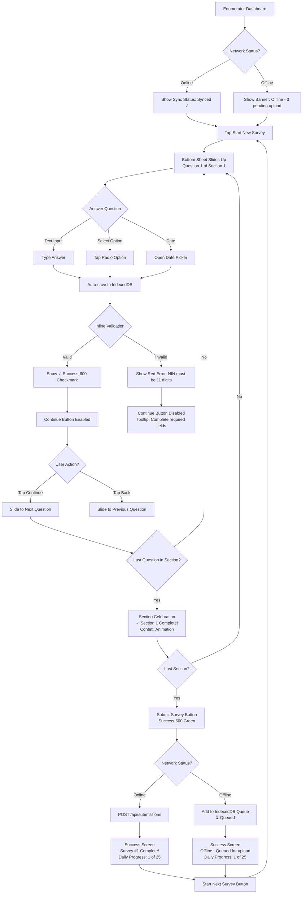
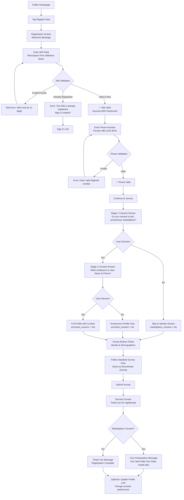
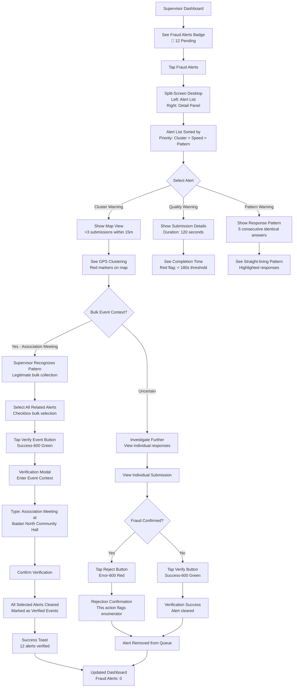
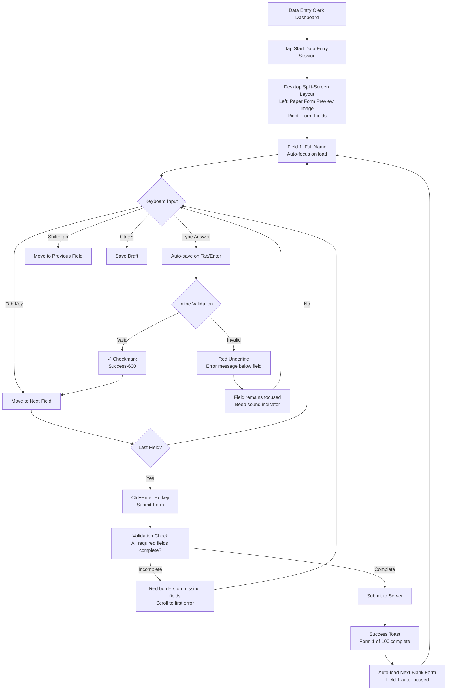

# UX Design Specification oslr_cl

**Author:** Awwal
**Date:** 2026-01-03 (Updated: 2026-01-05)
**Version:** 2.0 - ADR-013 Integration

## Change Log

| Date | Version | Updates | Author |
|------|---------|---------|--------|
| 2026-01-03 | 1.0 | Initial UX design specification completed | Awwal |
| 2026-01-05 | 2.0 | **ADR-013 Integration:** Added Analytics & Privacy section (Plausible self-hosted analytics), Rate Limiting UX Patterns (NGINX edge protection), Performance Optimization (static asset caching, skeleton screens), Security & CSP Compliance (Content Security Policy guidelines, NDPA compliance checklist) | Awwal |

---

## Executive Summary

### Project Vision

OSLSR (Oyo State Labour & Skills Registry) is a state-wide digital registry system designed to establish a trusted, continuously updated register of skilled, semi-skilled, and unskilled workers across all 33 Local Government Areas of Oyo State. Unlike traditional one-off surveys, OSLSR is a **living state asset** that addresses a critical structural gap: the absence of reliable, granular, up-to-date labour market data needed for targeted policy action, skills development programs, job creation initiatives, and private-sector investment facilitation.

The system combines enumerator-assisted data collection with public self-registration via mobile devices, enabling broad population coverage while maintaining strong data integrity controls. Designed to operate both online and offline, OSLSR ensures inclusion of rural and low-connectivity communities through a 7-day offline capability powered by Progressive Web App technology.

### Target Users

OSLSR serves **8 distinct user personas** with dramatically different needs, technical proficiency levels, and usage contexts:

#### Field Staff (LGA-Restricted)
- **Enumerators (99 staff, 3 per LGA):** Frontline data collectors working in rural and urban areas using mobile devices. Often in low-connectivity environments, operating on legacy Android devices (8.0+), requiring simple interfaces with clear progress tracking and offline-first reliability.
- **Supervisors (33 staff, 1 per LGA):** Team managers responsible for real-time monitoring of enumerator activity, fraud alert investigation, bulk event verification, and field communication coordination.

#### Back-Office Staff (State-Wide Access)
- **Data Entry Clerks:** High-volume paper form digitization specialists processing hundreds of records daily. Require keyboard-optimized interfaces with Tab/Enter navigation, minimal mouse usage, and rapid form completion flows to minimize cognitive load and prevent repetitive strain.
- **Verification Assessors:** State-level auditors with full PII access conducting second-level quality checks. Analytical role requiring evidence display (GPS clustering, completion times, response patterns) for audit decisions.
- **Government Officials:** Policy-makers and oversight personnel with read-only access to full dataset including PII. Use system for investigation, policy analysis, verification ("trust but verify" model), and export capabilities for authorized government use.

#### Administrative
- **Super Admins:** System managers with full control over bulk user provisioning, fraud detection threshold configuration, system health monitoring, XLSForm questionnaire management, and backup orchestration.

#### Public Users
- **Public Respondents:** Citizens self-registering via mobile devices with diverse technical literacy levels. Need extremely simple flows with clear consent explanations, NIN validation guidance, and progress indicators.
- **Public Searchers (Employers/Recruiters):** Marketplace users searching for skilled workers by trade, LGA, and experience level. Require intuitive search with filters, contact reveal authentication, and CAPTCHA protection.

### Key Design Challenges

#### 1. Multi-Persona Complexity with Radically Different Needs
**Challenge:** Designing for 8 distinct user types ranging from non-technical rural enumerators on legacy Android devices to sophisticated government analysts requiring complex data visualization. Each persona operates in different contexts (field vs office), has different technical proficiency (basic mobile literacy vs advanced data analysis), and requires different information density (simple progress cards vs multi-dimensional dashboards).

**UX Implications:**
- Cannot use one-size-fits-all interface patterns
- Need role-specific information architecture and navigation
- Must balance simplicity for field staff with power-user features for analysts
- Requires careful RBAC implementation that's invisible but enforced

#### 2. Offline-First with 7-Day Capability
**Challenge:** Enumerators must collect data in rural areas with unreliable connectivity for up to 7 days without server access. System must handle draft persistence, submission queuing, conflict resolution, and emergency sync controls while preventing catastrophic data loss from cache clearing.

**UX Implications:**
- Persistent storage warnings and unsent data banners critical
- "Upload Now" button required before cache clearing
- Offline status indicators must be unmissable
- Service worker caching for instant form loading
- Clear visual feedback for sync status (pending, syncing, synced, failed)

#### 3. Fraud Detection Without Blocking Legitimate Work
**Challenge:** System must flag suspicious patterns (GPS clustering, speed runs, straight-lining) without creating false positives that frustrate enumerators conducting legitimate mass-registration events (union meetings, association gatherings, community forums).

**UX Implications:**
- "Flag, don't block" approach requiring supervisor verification UI
- Bulk event verification flows (select cluster, verify all at once)
- Evidence display showing GPS maps, timing data, response patterns
- False positive feedback loop for system learning
- Configurable threshold UI for Super Admin pilot tuning

#### 4. High-Volume Data Entry Optimization
**Challenge:** Data Entry Clerks process hundreds of paper forms daily, making efficiency and ergonomics paramount. Mouse usage causes repetitive strain; context switching between keyboard and mouse kills productivity.

**UX Implications:**
- 100% keyboard navigation (Tab through fields, Enter to submit)
- Hotkeys for common actions (Ctrl+N new form, Ctrl+S save draft)
- Inline validation to prevent submission errors
- Visual field highlighting for current focus
- Form completion progress indicators
- Auto-save every 30 seconds to prevent data loss

#### 5. Legacy Device Support with Modern UX Expectations
**Challenge:** Must support Android 8.0 / Chrome 80+ (released 2020) while delivering world-class UX with microinteractions and animations. Limited device capabilities (slow processors, small RAM) constrain animation complexity.

**UX Implications:**
- Lightweight animations (CSS transforms, not canvas rendering)
- Conditional animation complexity based on device capability detection
- Skeleton screens over spinners (preserve layout, reduce reflow)
- Progressive enhancement (animations enhance but aren't critical to function)
- Performance budgeting: 2.5s Largest Contentful Paint on 4G

### Design Opportunities

#### 1. Microinteractions that Build Trust and Confidence
**Opportunity:** Transform routine administrative tasks into delightful experiences through subtle animations and feedback that communicate system state, validate user actions, and celebrate progress. Given the high-stakes nature (government data collection, fraud detection, livelihood impact via marketplace), microinteractions can reduce anxiety and build confidence in system reliability.

**Design Direction:**
- **Submission Success Animations:** Celebratory check mark animation with haptic feedback when enumerator completes survey (acknowledges hard fieldwork)
- **Fraud Alert Staging:** Smooth accordion expansion showing evidence details with color-coded severity (yellow warning → red critical)
- **Progress Ring Animations:** Circular progress indicators for daily/weekly targets that fill smoothly with subtle glow effect
- **Sync Status Pulses:** Gentle pulsing animation for "Syncing..." state, satisfying completion bounce for "Synced ✓"
- **Form Field Validation:** Inline checkmarks appearing as fields pass validation (visual reward for correct data entry)
- **Bulk Action Confirmations:** Selected items scale slightly and gain colored border before batch operation

#### 2. Skeleton Screens as Loading Brand Identity
**Opportunity:** Instead of generic spinners, use custom skeleton screens that mirror actual content layout and incorporate Oyo State branding. Loading states become brand touchpoints that reinforce government legitimacy and professional quality.

**Design Direction:**
- Dashboard skeletons with shimmer effect in Oyo State brand colors
- Preserve exact layout (card positions, chart areas, table structures)
- Animated shimmer gradient that communicates "working, not frozen"
- Skeleton transitions smoothly to real content (opacity fade-in, no jarring replacement)

#### 3. Context-Aware Smart Defaults and Predictive UI
**Opportunity:** Leverage user role, LGA assignment, historical patterns, and fraud scores to pre-fill fields, surface relevant actions, and guide users toward successful task completion.

**Design Direction:**
- **Enumerator Dashboard:** "Resume Draft" button prominently displayed if incomplete surveys detected
- **Supervisor Alerts:** Fraud notifications grouped by proximity ("3 alerts in Ibadan North, Street XYZ" → single verification action)
- **Data Entry:** Auto-suggest previous respondent data when paper form serial number indicates return visit
- **Marketplace Search:** Remember previous search filters, suggest refinements based on zero-result searches
- **Admin Thresholds:** Show pilot data alongside configuration ("Current: 15m radius → 23 flags/week. Suggest: 20m → 12 flags/week")

#### 4. Visual Hierarchy That Guides Action Without Overwhelming
**Opportunity:** With complex dashboards serving power users (Supervisors, Assessors, Officials) and simple interfaces for field staff, strategic use of visual hierarchy, progressive disclosure, and "glanceable" data summaries can enable rapid decision-making without cognitive overload.

**Design Direction:**
- **Card-Based Layouts:** Critical metrics in prominent cards, secondary data in collapsible sections
- **Action-Oriented Primary Buttons:** One clear primary action per screen (e.g., "Start Survey" dominates Enumerator dashboard)
- **Color-Coded Status Indicators:** Green (verified), Yellow (pending review), Red (flagged), Gray (inactive) with consistent meaning across all roles
- **Progressive Disclosure:** Show summary → Click for details (e.g., "15 pending reviews" card → Expands to list with evidence)
- **Dashboard Widgets:** Role-appropriate widgets that surface actionable insights, not just metrics

## Core User Experience

### Defining Experience

OSLSR is fundamentally a **multi-sided government data platform** requiring eight distinct but interconnected user experiences. The core experience varies dramatically by persona, but shares a common DNA: **progressive, forgiving, and celebration-oriented interactions** that build trust in a high-stakes government system.

#### Primary User Flows by Persona

**Data Collection (Enumerators, Public Respondents, Data Entry Clerks):**
The most critical experience is **survey data collection** - the system's data entry point upon which all downstream features depend. This flow must be:
- **One question at a time** with dual-layer progress tracking (micro: "Question 3 of 8" / macro: "Section 2 of 6")
- **Offline-first** with persistent storage warnings and background sync
- **Auto-saved** after every answer (no manual save needed)
- **Resumable** from exact question after interruptions
- **Validated inline** with visual checkmarks as fields pass validation

**Oversight & Verification (Supervisors, Verification Assessors):**
The secondary critical experience is **fraud alert management** - reviewing suspicious patterns without blocking legitimate work. This flow requires:
- **Evidence-rich dashboards** showing GPS clustering, completion times, response patterns
- **Bulk verification** to clear 10-15 flags from legitimate mass events (union meetings) at once
- **Color-coded severity** (amber warnings vs red critical) with smooth accordion expansion
- **False positive feedback loops** enabling system learning

**High-Volume Operations (Data Entry Clerks):**
The efficiency-critical experience is **keyboard-driven paper digitization** - processing hundreds of forms daily without repetitive strain. This flow demands:
- **100% keyboard navigation** (Tab through fields, Enter to submit, no mouse needed)
- **Smart field focus** with visual highlighting of current position
- **Hotkeys** for common actions (Ctrl+N new form, Ctrl+S save draft)
- **Sub-60-second form completion** as the performance target

**Discovery & Connection (Public Searchers, Public Respondents):**
The marketplace experience is **skills-based talent search** - finding workers by trade, LGA, and experience with progressive contact reveal. This flow balances:
- **Anonymous profiles** by default (profession, LGA, experience only)
- **Authenticated contact reveal** with CAPTCHA and rate limiting (50/day)
- **Search refinements** based on zero-result patterns
- **Trust signals** ("Government Verified" badge) building employer confidence

### Platform Strategy

**Progressive Web App (PWA) - Mobile-First, Desktop-Compatible**

**Platform Decision Rationale:**
- **No app store delays:** Government procurement timelines cannot accommodate Apple/Google approval processes
- **Single codebase:** React 18.3 PWA serves Android mobile + desktop with one deployment
- **Instant updates:** Push fixes without user downloads (critical for fraud threshold tuning during pilot)
- **"Add to Home Screen":** Provides app-like icon and full-screen experience without native wrapper
- **Offline-first architecture:** Service workers + IndexedDB enable 7-day disconnected operation

**Interaction Modality Matrix:**

| Persona | Primary Device | Interaction Mode | Critical Capability |
|---------|---------------|------------------|---------------------|
| Enumerators | Mobile (Android 8.0+) | Touch-primary | Offline 7-day, GPS auto-capture |
| Supervisors | Desktop/Tablet | Mouse/Touch hybrid | Real-time dashboard updates |
| Data Entry Clerks | Desktop | Keyboard-primary | Tab/Enter navigation, no mouse |
| Public Respondents | Mobile | Touch-primary | Simple one-time flow |
| Public Searchers | Desktop/Mobile | Mouse or Touch | Intuitive search filters |
| Assessors/Officials | Desktop | Mouse/Keyboard | Complex data visualization |
| Super Admins | Desktop | Mouse/Keyboard | Multi-panel system monitoring |

**Technical Platform Constraints:**
- **Legacy device support:** Android 8.0+ / Chrome 80+ (released 2020) - many rural enumerators use hand-me-down phones
- **Offline resilience:** Forms load instantly from service worker cache; submissions queue in IndexedDB
- **Performance budget:** 2.5s Largest Contentful Paint on 4G mobile networks (NFR1.2 requirement)
- **Persistent storage:** Explicit browser permission request to prevent cache eviction during long offline periods

### Effortless Interactions

**Principle: If the system can do it, the user shouldn't have to.**

#### 1. Invisible Auto-Save with Visible Confirmation
**What:** Every form field answer saved immediately to IndexedDB upon blur or value change.
**Why Effortless:** Users never think "Did I save?" - system assumes responsibility.
**Visual Feedback:** Subtle gray checkmark fades in next to field label (0.3s animation), then fades to lighter gray after 2s.
**Offline Handling:** All auto-saves are local until connectivity restored, then background sync queue processes.

#### 2. Context-Aware Smart Defaults
**Enumerator Pre-fills:**
- LGA automatically set from user profile (locked, cannot change)
- GPS coordinates captured silently when "Start Survey" pressed (background geolocation)
- Form version auto-selected (latest published by Super Admin)

**Data Entry Clerk Suggestions:**
- Paper form serial number recognition triggers lookup: "Form #12345 previously entered on 2026-01-02. Load previous respondent data?"
- Address autocomplete from previous submissions in same LGA
- Skills multi-select remembers common combinations ("Welder" often paired with "Fabricator")

**Marketplace Search Memory:**
- Previous search filters persisted to localStorage (LGA, skills, experience range)
- "Resume last search" shortcut on search landing page
- Zero-result searches trigger suggestions: "No welders in Ibadan South. Try Ibadan North (12 results)?"

#### 3. Progress Persistence Across Interruptions
**Scenario:** Enumerator's phone battery dies on question 4 of 8 in Section 2. Phone recharges 3 hours later.
**Effortless Recovery:** Opens PWA → "Resume survey" button displayed → Taps → Lands on question 5 (exactly where they left off).
**Technical:** Draft ID stored in IndexedDB with last-answered question index; form hydrates from draft on resume.

#### 4. Intelligent Sync Status Communication
**Three-Tier Status Indicator (Top-right corner of all screens):**
- **Green "Synced ✓":** All submissions uploaded, no pending work (gentle 0.5s bounce animation on transition to this state)
- **Amber "Syncing... (3 pending)":** Background upload in progress, pulsing animation (0.8s period)
- **Red "Offline - 12 pending upload":** No connectivity detected, click to see list of queued submissions

**Emergency Sync Control:**
- "Upload Now" button (only appears when offline status + pending submissions)
- Clicking triggers manual sync attempt with progress bar: "Uploading 3 of 12... 25%"
- Upon completion: "All surveys uploaded! Safe to clear cache." (enables enumerators to free device storage)

#### 5. Inline Validation with Immediate Visual Rewards
**As You Type:**
- NIN field: Verhoeff checksum validated character-by-character (green checkmark appears after 11th valid digit, red X on invalid checksum)
- Phone number: Format guide below field: "+234 [__] [____] [____]" updates in real-time as user types
- Date of birth: Validates not in future, not before 1924 (100-year max age), warning if <18 years

**Why Effortless:** Users catch errors immediately at point of entry, not after attempting submission (avoids frustration of "What did I do wrong?" after form rejection).

### Critical Success Moments

**Make-or-break experiences that determine system adoption or abandonment:**

#### 1. First Survey Completion (Enumerator - Day 1 of Pilot)
**The Moment:** Tapping "Submit" on first survey after 8 minutes of careful data entry.

**What Happens:**
- Form slides up with spring animation (0.4s)
- Large green checkmark animates in with scale bounce (starts 0.5x, bounces to 1.2x, settles at 1x over 0.6s)
- Haptic feedback (single vibration pulse on mobile)
- Text appears: "Survey #1 complete! Great work." (celebration, not just confirmation)
- Progress card updates: "Daily target: 1 of 25 surveys" with circular progress ring filling smoothly
- "Synced ✓" indicator pulses green in top-right (confirming upload to server)

**Why Critical:** 99 enumerators need confidence-building first win. If this feels broken or confusing, they'll revert to paper forms.

**Failure Mode to Avoid:** Generic "Success" message with no visual celebration = feels transactional, not rewarding.

#### 2. Bulk Fraud Verification (Supervisor - Week 2 of Pilot)
**The Moment:** Reviewing 15 fraud alerts from enumerator at union meeting (all flagged for GPS clustering within 20 meters).

**What Happens:**
- Dashboard shows card: "⚠️ 15 alerts - Ibadan North, Trade Union Hall" (grouped by proximity)
- Click card → Map view opens showing 15 GPS pins clustered around single address
- Evidence panel: "All collected between 10:30-11:45 AM. Completion times: 4-7 minutes (normal)."
- Supervisor judgment: "Legitimate event - union meeting confirmed with leadership."
- **One-click bulk verification:** "Verify all 15 as legitimate" button
- Animation: All 15 cards fade from amber to green (0.3s stagger) with checkmarks
- Toast notification: "15 submissions approved. Enumerator notified." (supervisor acknowledges action impact)

**Why Critical:** If supervisors must review each submission individually (15 separate clicks), they'll ignore alerts or blindly approve (defeating fraud detection purpose). Bulk action respects their time.

**Failure Mode to Avoid:** Force individual review of obviously legitimate clusters = supervisor frustration, system abandonment.

#### 3. Sub-60-Second Form Completion (Data Entry Clerk - Week 3)
**The Moment:** Clerk processing 43rd paper form of the day, aiming for 100-form target.

**What Happens:**
- Form loads with first field auto-focused (cursor blinking in NIN field)
- Types NIN → Tab → First Name field focused (no mouse touch)
- Validation checkmarks appear as each field passes validation (visual rhythm developing)
- Types final field → Enter key → Form submits (no mouse needed to find Submit button)
- Form clears → First field auto-focused for next entry (continuous flow)
- Timer in corner: "Form completed in 52 seconds" (gamification, personal best tracking)
- After 10 forms: "10 forms complete! Average time: 56 seconds" (milestone celebration)

**Why Critical:** Clerks process 100+ forms daily. Every second saved = 100+ seconds/day = 8.3 minutes. Mouse usage causes repetitive strain. Keyboard flow must be frictionless.

**Failure Mode to Avoid:** Requiring mouse click to submit, or losing focus after submission (forcing manual field click) = broken flow, RSI risk.

#### 4. Skills Marketplace First Match (Public Searcher - Month 2)
**The Moment:** Employer searching for welders in Ibadan North with 5+ years experience.

**What Happens:**
- Simple search form: "What skill?" → "Welder" (autocomplete dropdown) → "Where?" → "Ibadan North" (LGA selector) → "Experience?" → "5+ years" slider
- Click "Search" → Skeleton cards appear (preserving layout) → 0.8s later → 12 results populate
- Cards show: Anonymous profile photo placeholder, "Welder • Ibadan North • 7 years experience" (exact match)
- "Contact" button on each card (amber color = action required)
- Click "Contact" → CAPTCHA challenge → Passes → Name & Phone revealed with slide-down animation
- Audit log: "Your contact view logged for security" (transparency)
- **Trust signal:** 3 of 12 profiles have green "Government Verified ✓" badge (builds confidence)

**Why Critical:** Marketplace value = finding relevant talent quickly. If search yields zero results or irrelevant profiles, employers abandon. First successful match = retention.

**Failure Mode to Avoid:** Overwhelming search form with 15 filter options = analysis paralysis. Or revealing contact info without CAPTCHA = bot scraping, database depletion.

#### 5. 7-Day Offline Survival (Enumerator - Rural Area, Month 1)
**The Moment:** Enumerator in remote village with no cell signal for 5 days, collecting 3-5 surveys daily.

**What Happens:**
- Day 1: Dashboard shows "Offline - 3 pending upload" (red indicator, but non-blocking)
- Day 2: "Offline - 7 pending upload" (counter increments, no panic messaging)
- Day 3: "Offline - 11 pending upload" (persistent storage warning: "Do not clear cache - unsent data")
- Day 5: Returns to town, 4G signal detected → **Automatic background sync initiates silently**
- Sync progress: "Uploading 3 of 17... 18%" (top-right indicator)
- 2 minutes later: "All 17 surveys synced ✓" (green confirmation, celebratory bounce)
- **No data loss, no manual intervention required**

**Why Critical:** If sync fails or requires manual troubleshooting, enumerators lose 5 days of work = catastrophic. Offline promise must be bulletproof.

**Failure Mode to Avoid:** Requiring manual "Sync Now" button press, or failing silently without user notification = trust destroyed.

### Experience Principles

**Guiding framework for all UX decisions in OSLSR:**

#### 1. Progressive Disclosure Over Cognitive Load
**Principle:** Show one thing at a time. Users should never feel overwhelmed by information density or navigation complexity.

**Application:**
- **Forms:** One question per screen, not 10-question scrolling forms
- **Dashboards:** Primary metric cards prominent, secondary data in collapsible "View Details" sections
- **Navigation:** Role-specific sidebar (Enumerator sees 3 items, Super Admin sees 12 - tailored, not universal)
- **Fraud Evidence:** Summary card shows "15 alerts - GPS cluster", click to expand full evidence panel with map

**Anti-Pattern to Avoid:** Showing all 50 form fields at once "for efficiency" = paralysis, errors, abandonment.

#### 2. Offline-First Reliability
**Principle:** Assume no connectivity. Design for offline as the default, online as the enhancement. Never block work due to network.

**Application:**
- **Form Loading:** Service worker caches entire form definition (loads instantly offline)
- **Submission Queue:** IndexedDB stores drafts locally, background sync uploads when able
- **Dashboard Data:** Last-synced timestamp shown; cached data displayed with "Updated 2 hours ago" label
- **Error Messages:** "Cannot sync - offline" not "Error 500: Network timeout" (contextual, not technical)

**Anti-Pattern to Avoid:** Showing spinner indefinitely waiting for server response = perceived freeze, user panic.

#### 3. Trust Through Transparency
**Principle:** Always show: Where you are (progress), what's happening (system state), what's next (expectations). No black boxes.

**Application:**
- **Questionnaire Progress:** "Question 3 of 8, Section 2 of 6" (dual-layer context)
- **Sync Status:** "Syncing... (3 pending)" not just spinning icon (specific, informative)
- **Processing Time:** "Generating report... ~45 seconds" not just "Please wait" (manages expectations)
- **Fraud Scores:** Evidence shown (GPS map, timing data) not just "Flagged for review" (supervisor understands why)

**Anti-Pattern to Avoid:** "Processing..." with no indication of progress or estimated time = anxiety, tab-closing.

#### 4. Efficiency for Repetitive Tasks
**Principle:** Keyboard shortcuts, smart defaults, bulk actions, inline validation. Respect that clerks process hundreds of records, supervisors review dozens of alerts.

**Application:**
- **Data Entry:** Tab-Enter-Tab-Enter rhythm (no mouse), 56-second target per form
- **Bulk Verification:** Select 15 clustered alerts → One-click "Verify All" (not 15 individual clicks)
- **Smart Defaults:** LGA pre-filled from user profile, previous respondent data suggested
- **Hotkeys:** Ctrl+N (new form), Ctrl+S (save draft), Ctrl+F (search) - power user acceleration

**Anti-Pattern to Avoid:** Requiring confirmation dialog for every bulk action ("Are you sure? This will affect 15 items. Confirm?") = friction, slowed workflow.

#### 5. Forgiveness Over Punishment
**Principle:** Auto-save everything, enable resume, provide "undo" where possible. Flag suspicious patterns but don't block submission - humans verify.

**Application:**
- **Auto-Save:** Every field answer saved immediately (no "Save Draft" button needed)
- **Resume Capability:** Return after phone death → Land on exact question left off
- **Fraud Flags:** "Pending Verification" status not "Submission Rejected" (allows supervisor override)
- **Edit Lock:** Users can edit profiles until verified, then locked (progressive restriction, not blanket denial)

**Anti-Pattern to Avoid:** Blocking enumerator submission due to GPS clustering flag = false positive punishes legitimate work, breeds resentment.

#### 6. Celebration of Progress
**Principle:** Acknowledge milestones: Section complete, daily target met, survey submitted. Government work is hard - small wins matter.

**Application:**
- **Survey Submission:** Green checkmark animation + haptic feedback + "Survey #1 complete! Great work."
- **Section Completion:** "✓ Section 2 Complete! 4 sections remaining" with confetti microinteraction
- **Daily Target:** Circular progress ring fills smoothly, celebration at 100%: "Daily target met! 25 surveys completed."
- **Sync Success:** "All 17 surveys synced ✓" with satisfying bounce animation (acknowledges 5 days of offline work)

**Anti-Pattern to Avoid:** Generic "Success" toast that auto-dismisses in 2 seconds = no emotional impact, feels transactional.

### Design System Foundation

#### Typography: Inter + Poppins Hybrid

**Primary UI Font: Inter**
- **Usage:** Headings, body text, forms, tables, dashboards, data-heavy interfaces
- **Rationale:** Designed specifically for UI/screens with superior number legibility (critical for NIN validation, GPS coordinates, fraud scores). 16KB per weight, 15% lighter than Poppins.
- **Weights:** Regular (400), Medium (500), SemiBold (600)

**Brand Font: Poppins**
- **Usage:** Homepage hero, marketing materials, section headers, print collateral
- **Rationale:** Geometric sans-serif with friendly, modern aesthetic. Maintains desired brand warmth in key touchpoints.
- **Weights:** Regular (400), Medium (500), SemiBold (600)

**Monospace Font: JetBrains Mono**
- **Usage:** NIN fields, GPS coordinates, API responses, code snippets (admin debugging)
- **Rationale:** Superior legibility for numeric data, clear distinction between similar characters (0 vs O, 1 vs l)

**Fallback Strategy (Offline-First):**
```css
--font-ui: 'Inter', -apple-system, BlinkMacSystemFont, 'Segoe UI', sans-serif;
--font-brand: 'Poppins', 'Inter', -apple-system, sans-serif;
--font-mono: 'JetBrains Mono', 'SF Mono', 'Consolas', monospace;
```

**Type Scale:**
```
Heading 1 (H1): 36px / 2.25rem - Poppins SemiBold (Homepage hero, major section headers)
Heading 2 (H2): 30px / 1.875rem - Poppins SemiBold (Page titles)
Heading 3 (H3): 24px / 1.5rem - Inter SemiBold (Dashboard cards, subsection headers)
Heading 4 (H4): 20px / 1.25rem - Inter SemiBold (Card titles)
Body Large: 18px / 1.125rem - Inter Regular (Primary body text)
Body: 16px / 1rem - Inter Regular (Default body text, form labels)
Body Small: 14px / 0.875rem - Inter Regular (Helper text, metadata)
Caption: 12px / 0.75rem - Inter Medium (Badges, tiny labels)
```

#### Color System: Oyo State Red Foundation

**Primary: Oyo State Red Family**
```
Primary-900:  #6B1518  ← Deep maroon (hover on dark backgrounds, active states)
Primary-700:  #861A1F  ← Rich burgundy (button hover states)
Primary-600:  #9C1E23  ← Oyo State Red (brand, CTAs, links, active navigation)
Primary-500:  #B32329  ← Bright red (focus rings, hover emphasis)
Primary-300:  #E85D61  ← Coral (badges, highlights, non-critical alerts)
Primary-100:  #FDEBED  ← Soft pink (card backgrounds, info banners - subtle)
Primary-50:   #FEF6F6  ← Nearly white (page sections, alternating rows)
```

**Semantic Colors:**

**Success: Forest Green** (distinctly NOT Nigerian flag green #008751)
```
Success-600:  #15803D  ← Forest green (verified submissions, "Synced ✓", approvals)
Success-100:  #DCFCE7  ← Mint background (success alert backgrounds)
```

**Warning: Amber**
```
Warning-600:  #D97706  ← Rich amber (fraud flags pending review, threshold alerts)
Warning-100:  #FEF3C7  ← Light amber (warning banner backgrounds)
```

**Error: Crimson** (distinct from Primary Red)
```
Error-600:    #DC2626  ← Bright crimson (validation errors, NIN duplicate rejections)
Error-100:    #FEE2E2  ← Light pink (error alert backgrounds)
```

**Info: Ocean Blue**
```
Info-600:     #0284C7  ← Ocean blue (instructional tooltips, NDPA consent explanations)
Info-100:     #E0F2FE  ← Sky blue (info banner backgrounds)
```

**Neutrals: Warm Grays** (complement red, slight brown undertone)
```
Neutral-900:  #1F2937  ← Charcoal (headings, body text)
Neutral-700:  #374151  ← Dark gray (secondary text, icons)
Neutral-500:  #6B7280  ← Medium gray (placeholders, disabled states)
Neutral-300:  #D1D5DB  ← Light gray (borders, dividers, table lines)
Neutral-100:  #F3F4F6  ← Soft gray (skeleton screens, alternating rows)
Neutral-50:   #F9FAFB  ← Off-white (page background)
```

**Color Usage Philosophy:**

**Use Primary Red (Oyo State) For:**
- ✅ Logo, brand elements, government crest pairing
- ✅ Positive primary CTAs ("Start Survey", "Submit", "Continue")
- ✅ Active navigation indicators, selected tabs
- ✅ Links and focused interactive elements
- ✅ Progress indicators showing completion

**Don't Use Primary Red For:**
- ❌ Error messages (use Error-600 Crimson instead)
- ❌ Destructive actions like "Delete" (use Neutral-700 with red hover)
- ❌ Fraud alerts (use Warning-600 Amber - less alarming)
- ❌ Stop/Cancel buttons (use Neutral-300 Ghost button)

**Rationale:** Red as primary = **empowerment and action**, not danger. Semantic separation prevents user confusion (brand red ≠ error red).

**Accessibility Compliance (WCAG 2.1 AA):**
```
✅ Primary-600 on White:     5.8:1 contrast  (exceeds 4.5:1 minimum)
✅ Success-600 on White:     5.1:1 contrast  (exceeds 4.5:1 minimum)
✅ Warning-600 on White:     5.3:1 contrast  (exceeds 4.5:1 minimum)
✅ Neutral-900 on White:    16.1:1 contrast  (excellent readability)
✅ White on Primary-600:     5.8:1 contrast  (button text legible)
```

#### Brand Assets: Oyo State Government Logo Specification

**Logo Files Required:**

**Primary Lockup (Logo + Wordmark):**
- `oyo-state-logo-primary.svg` - Full color (Oyo State Red #9C1E23 + wordmark)
- `oyo-state-logo-primary-white.svg` - White monochrome (for dark backgrounds)
- `oyo-state-logo-primary.png` - Raster fallback (@2x, @3x for high-DPI displays)

**Icon-Only (Government Crest):**
- `oyo-state-crest.svg` - Standalone crest/badge without wordmark (favicon, mobile icons)
- `oyo-state-crest.png` - 512x512px minimum (PWA manifest icons, app icons)

**File Formats:**
- **SVG:** Primary delivery format (scalable, service worker cacheable, 3-5KB size)
- **PNG:** Fallback for email templates, PDF exports, legacy browser support
- **Minimum Resolution:** 512x512px for PNG icons (supports @3x density displays)

**Logo Placements:**

**Global Header (All Staff Interfaces):**
- Position: Top-left corner, 40px height
- Padding: 16px all sides (WCAG 2.1 AA touch target spacing)
- Link: Clicking logo navigates to role-specific dashboard home
- Treatment: Full color primary lockup on white background

**Public Homepage Hero:**
- Position: Centered above hero headline
- Size: 80px height (emphasize government authority)
- Treatment: Full color with subtle drop shadow for depth

**Authentication Pages (Login, Registration):**
- Position: Centered at top of card
- Size: 60px height
- Treatment: Full color with "Government of Oyo State" wordmark

**PWA App Icon (Mobile Home Screen):**
- File: `oyo-state-crest.png` 512x512px
- Treatment: Icon-only crest (no wordmark due to small size)
- Background: Solid Oyo State Red (#9C1E23) with white crest

**Favicon:**
- File: `favicon.ico` with multiple sizes (16x16, 32x32, 48x48)
- Fallback SVG: `favicon.svg` for modern browsers
- Treatment: Icon-only crest (simplified for 16px legibility)

**PDF Exports & Print Collateral:**
- Letterhead position: Top-left, 50px height
- Footer: Centered, 30px height with "Oyo State Labour & Skills Registry" wordmark
- Treatment: Full color primary lockup

**Color Treatments:**

**On White/Light Backgrounds (Neutral-50, Primary-50):**
- Use full color logo (Oyo State Red #9C1E23)
- Wordmark: Neutral-900 (#1F2937) for readability
- Minimum contrast ratio: 7:1 (WCAG 2.1 AAA)

**On Dark Backgrounds (Neutral-900, Primary-700):**
- Use white monochrome version (`oyo-state-logo-primary-white.svg`)
- All elements white (#FFFFFF)
- Minimum contrast ratio: 12.6:1

**On Oyo State Red (Primary-600 backgrounds):**
- Use white monochrome version
- Add 1px subtle stroke (#FFFFFF 10% opacity) for definition

**Accessibility Requirements:**

**Alt Text Standards:**
- Full lockup: `alt="Oyo State Government Logo"`
- Icon-only: `alt="Oyo State Government Crest"`
- Decorative instances: `alt=""` (empty string, screen reader skips)

**Touch Target Size:**
- Logo links must be minimum 48x48px clickable area (WCAG 2.1 AA)
- Use padding to expand clickable zone if logo smaller than 48px

**Keyboard Navigation:**
- Logo link must be first tab-stop in global header
- Visual focus indicator: 2px Primary-500 outline with 2px offset

**Screen Reader Support:**
- Wrap in semantic `<header>` element with `role="banner"`
- Include skip link: "Skip to main content" immediately after logo

**Technical Implementation:**

```tsx
// Global Header Logo Component
import { useAuth } from '@/hooks/useAuth';
import OyoStateLogo from '@/assets/oyo-state-logo-primary.svg';

export function GlobalHeaderLogo() {
  const { user } = useAuth();
  const homeRoute = user?.role === 'enumerator' ? '/dashboard/enumerator' :
                    user?.role === 'supervisor' ? '/dashboard/supervisor' :
                    '/dashboard';

  return (
    <a
      href={homeRoute}
      className="inline-flex items-center p-4 focus:outline-none focus:ring-2 focus:ring-primary-500 focus:ring-offset-2 rounded"
      aria-label="Oyo State Government - Go to Dashboard Home"
    >
      
    </a>
  );
}
```

**Logo Asset Procurement:**
- **Source:** Oyo State Government official brand guidelines (request from Communications Department)
- **License:** Government public domain or explicit permission for OSLSR usage
- **Fallback:** If official SVG unavailable, vectorize official government letterhead logo (maintain exact proportions)

## Desired Emotional Response

### Primary Emotional Goals

**Confident Competence** - The foundational emotional goal for OSLSR is creating an experience where users feel capable, supported, and productive regardless of technical proficiency or connectivity constraints. The system actively builds confidence through progressive disclosure, immediate positive feedback, and forgiving design patterns that prevent failure states.

**By Persona:**

**Enumerators (Field Data Collectors):**
- **Confident:** "I can do this job effectively, even when offline for days"
- **Acknowledged:** "My fieldwork matters and is valued" (celebration animations, progress tracking, milestone recognition)
- **Protected:** "The system won't let me fail or lose work" (auto-save, resume capability, inline validation, persistent storage warnings)

**Supervisors (Team Managers):**
- **In Control:** "I can manage my team effectively with real-time visibility" (live dashboards, bulk operations, team communication)
- **Trusted:** "I'm empowered to make judgment calls on fraud alerts" (bulk verification authority, false positive override capability)
- **Strategic:** "I see patterns and can act on them" (evidence-rich dashboards, grouped alerts, proactive notifications)

**Data Entry Clerks (High-Volume Operators):**
- **Efficient:** "I'm accomplishing work at impressive speed" (keyboard flow, 56-second target celebrations, personal bests)
- **In Flow State:** Continuous rhythm from Tab-Enter navigation with no cognitive interruption from mouse context switching
- **Valued:** "My productivity is recognized" (form completion timers, milestone celebrations every 10 forms)

**Public Respondents (Citizens):**
- **Informed:** "I understand exactly what I'm consenting to" (two-stage consent workflow, clear NDPA explanations)
- **Secure:** "My data is protected by the government" (trust signals, Government Verified badges, transparent audit logging)
- **Contributing:** "I'm part of building Oyo State's future" (civic participation framing, marketplace benefit messaging)

**Public Searchers (Employers/Recruiters):**
- **Successful:** "I found exactly the talent I needed, quickly" (relevant results, verified profiles, 5+ years experience filters work)
- **Confident:** "These profiles are legitimate, government-verified" (trust badges, authenticated contact reveal)

**Verification Assessors & Government Officials:**
- **Thorough:** "I have all evidence needed to make informed decisions" (GPS maps, timing data, response patterns, forensic trails)
- **Empowered:** "I can investigate deeply when needed" (full PII access, export capabilities, drill-down views)

### Emotional Journey Mapping

#### First Discovery (Onboarding - Day 1)

**Desired Emotional Arc:** Curiosity → Confidence → Relief

**Enumerator First Login:**
- Opens PWA on personal Android phone (slight trepidation - "Is this complicated?")
- Sees simple dashboard with 3 cards: "Start Survey", "Resume Drafts (0)", "Daily Progress (0/25)"
- **Emotion Shift:** "Oh, this looks simple enough. I can do this."
- Taps "Start Survey" → Form loads instantly from service worker cache
- **Emotion Shift:** "That was fast! And it works offline?"
- Completes first question → Checkmark appears next to field label
- **Emotion Shift:** "It's saving my work automatically. I don't have to worry."

**Outcome:** From mild tech anxiety to confident competence in 3 minutes.

#### Core Experience (Ongoing Use - Weeks 1-4)

**Desired Emotional State:** Focused, in flow, making visible progress

**Data Entry Clerk on Form 43 of 100:**
- Enters NIN → Tab → First Name field auto-focused (no mouse needed)
- Types rapidly → Validation checkmarks appear rhythmically
- Final field → Enter → Form submits instantly
- **Emotional State:** Flow state maintained, no interruption to rhythm
- Screen shows: "Form completed in 52 seconds" with green checkmark animation
- **Emotion Spike:** Pride + accomplishment ("That's my personal best!")
- Next form loads with cursor in first field, ready immediately
- **Sustained Emotion:** Momentum maintained, energized to continue

**Outcome:** Sustained productivity without cognitive fatigue or RSI from mouse switching.

#### Task Completion (Survey/Alert/Search Success)

**Desired Emotional Peak:** Celebrated achievement, validated effort

**Enumerator Completes Survey #1:**
- Taps "Submit" button after 8 minutes of careful data entry
- Form slides up with spring animation (0.4s)
- Large green checkmark animates in with satisfying bounce
- Phone vibrates once (haptic feedback)
- **Emotional Peak:** Celebration + accomplishment
- Text: "Survey #1 complete! Great work." (acknowledgment, not just transaction confirmation)
- Progress ring fills smoothly: "Daily target: 1 of 25"
- **Sustained Emotion:** Motivated to continue ("Only 24 more to hit target!")

**Supervisor Bulk Verifies 15 Alerts:**
- Reviews GPS cluster evidence: All 15 submissions at Trade Union Hall address
- Judgment: "Legitimate event - union meeting"
- Clicks "Verify all 15 as legitimate" button
- **Emotional Release:** Relief (alerts resolved efficiently)
- Animation: All 15 cards fade from amber to green with staggered checkmarks (0.3s each)
- Toast: "15 submissions approved. Enumerator notified."
- **Outcome Emotion:** Satisfaction + authority validated ("I made the right call, efficiently")

#### Error/Offline Scenario (Rural Enumerator - Day 3 Offline)

**Desired Emotional State:** Reassured, informed, not panicked

**Phone Shows No Signal for 72 Hours:**
- Dashboard displays: "Offline - 11 pending upload" (red indicator but non-blocking)
- Persistent banner: "Do not clear cache - unsent data will be lost"
- **Emotional State:** Informed awareness, not panic ("The system is protecting my work")
- Continues collecting surveys 12-17 (system works seamlessly offline)
- Day 5: Returns to town, 4G detected
- **Emotional Shift:** Anticipation ("Will my work upload?")
- Automatic background sync initiates silently
- Top-right shows: "Syncing... 3 of 17... 18%"
- 2 minutes later: "All 17 surveys synced ✓" with celebratory bounce
- **Emotional Peak:** Relief + validation ("The system kept its promise!")

**Outcome:** Trust in offline capability reinforced, confidence in system reliability solidified.

#### Returning Users (Week 2+)

**Desired Emotional State:** Familiar, confident, muscle memory activated

**Enumerator Day 10:**
- Opens PWA → Immediately navigates to "Start Survey" without hesitation (muscle memory)
- **Emotional State:** Confident familiarity ("I know exactly what to do")
- Completes survey in 6 minutes (vs 8 minutes on Day 1)
- **Emotion:** Competence growth ("I'm getting better at this")

**Data Entry Clerk Day 20:**
- Processes 100 forms in 5.5 hours (average 3.3 minutes/form including breaks)
- Uses hotkeys exclusively: Ctrl+N for new form, Ctrl+S for uncertain data
- **Emotional State:** Mastery ("I'm a power user now")
- System shows: "Personal best average: 52 seconds per form"
- **Emotion:** Pride in efficiency gains

### Micro-Emotions

**Critical Micro-Emotional States (Prioritized):**

#### 1. Confidence > Confusion

**Why Critical:** Rural enumerators with limited smartphone experience must never feel lost. Confusion breeds abandonment.

**UX Implementation:**
- Progressive disclosure (one question at a time, not 50-field mega-form)
- Explicit instructions ("Tap to select your answer" not just dropdown icon)
- "Resume survey" button prominent when draft detected (removes "how do I continue?" confusion)
- Tooltips with "i" icons for complex fields (NIN validation, GPS capture)

**Success Indicator:** Enumerator completes first survey without supervisor assistance.

#### 2. Trust > Skepticism

**Why Critical:** Government systems have poor UX reputation. Users expect failure, not excellence. Must overcome deeply ingrained skepticism.

**UX Implementation:**
- Transparent sync status ("Syncing... 3 pending" vs generic spinner = builds trust through specificity)
- Fraud evidence shown to supervisors (GPS maps, timing data) not black-box "Trust us, this is fraud"
- Audit trails visible: "Your contact view logged for security" (transparency = trust)
- "Government Verified ✓" badges (social proof)
- NDPA compliance messaging (demonstrates legal rigor)

**Success Indicator:** User tells colleague "It actually works!" (word-of-mouth trust signal).

#### 3. Accomplishment > Frustration

**Why Critical:** Government data collection is repetitive, high-volume work. Without milestone celebrations, work feels like drudgery. Accomplishment motivates continuation.

**UX Implementation:**
- Survey submission animations (green checkmark bounce, haptic feedback)
- Progress metrics (daily targets with visual rings, personal bests for data entry speed)
- Section completion celebrations ("✓ Section 2 Complete! 4 sections remaining" + confetti)
- Milestone acknowledgments every 10 forms ("10 forms complete! Average: 56 seconds")
- Sync success celebrations ("All 17 surveys synced ✓" after 5-day offline period)

**Success Indicator:** Enumerator voluntarily exceeds daily target (25 → 30 surveys) because experience is rewarding.

#### 4. Delight > Satisfaction

**Why Critical:** Satisfaction = met expectations. Delight = exceeded expectations. Delight creates evangelists who spread adoption organically.

**UX Implementation:**
- Offline sync "just works" (no manual intervention = magical experience)
- Smart defaults (LGA pre-filled, GPS captured silently, form version auto-selected)
- Hotkeys for power users (Ctrl+N, Ctrl+S) discovered after week 1 = "surprise efficiency boost!"
- Bulk actions (15 alerts cleared with one click) = "I expected 15 clicks, got 1!"
- Form serial number recognition ("Form #12345 previously entered. Load data?" = "Wow, it remembers!")

**Success Indicator:** Supervisor says "This is better than the private sector tools I've used."

**Secondary Micro-Emotions:**

- **Belonging > Isolation:** In-app messaging connects enumerators to supervisors ("You're not alone in the field")
- **Calm > Anxiety:** Progress indicators reduce "when will this end?" stress (dual-layer tracking: "Question 3 of 8, Section 2 of 6")
- **Empowered > Dependent:** Supervisors can override fraud flags (trusted to make judgment calls, not forced to escalate every decision)

### Design Implications

**Emotion-Design Connection Matrix:**

#### To Build Confidence → Progressive Disclosure + Immediate Feedback

**Tactics:**
- One question per screen (reduces cognitive load, prevents overwhelm)
- Inline validation checkmarks appear instantly on correct input (positive reinforcement loop)
- "Resume survey" button prominent on dashboard when draft exists (reassures work isn't lost)
- Training-focused copy: "Question 3 of 8" not bare "3/8" (provides context, reduces confusion)
- First-time user tooltips auto-dismiss after 3 uses (scaffolding that fades as competence grows)

**Anti-Pattern to Avoid:** Multi-column forms with 20 visible fields = visual overwhelm, paralysis.

#### To Build Trust → Transparency + Evidence + Audit Trails

**Tactics:**
- Sync status specificity: "Syncing... (3 pending)" not generic spinner (specific = trustworthy)
- Fraud evidence dashboards showing GPS maps, timing data, response patterns (supervisor sees "why" not just "flagged")
- Audit logs visible to users: "Your contact view logged for security" (transparency builds legitimacy)
- "Government Verified ✓" badges on marketplace profiles (social proof)
- Error messages contextual: "Cannot sync - offline" not technical "Error 500: Network timeout"

**Anti-Pattern to Avoid:** Black-box decisions ("This submission is fraudulent" with no explanation = breeds distrust).

#### To Create Accomplishment → Celebrations + Progress Metrics + Milestones

**Tactics:**
- Survey submission: Green checkmark animation with scale bounce (0.6s) + haptic feedback + "Survey #1 complete! Great work!"
- Section completion: "✓ Section 2 Complete! 4 sections remaining" with subtle confetti microinteraction
- Daily target visualization: Circular progress ring fills smoothly with glow effect at 100%
- Data entry gamification: "Form completed in 52 seconds - personal best!" with trophy icon
- Sync success after offline period: "All 17 surveys synced ✓" with celebratory bounce (acknowledges 5 days of hard fieldwork)

**Anti-Pattern to Avoid:** Generic "Success" toast that auto-dismisses in 2 seconds = no emotional impact, feels transactional.

#### To Deliver Delight → Smart Automation + Power User Features

**Tactics:**
- Offline sync happens automatically when connectivity returns (no manual "Sync Now" button required = magical)
- LGA pre-filled from user profile, GPS captured silently on "Start Survey" (system anticipates needs)
- Hotkeys discoverable in tooltips: Ctrl+N (new form), Ctrl+S (save draft), Ctrl+F (search)
- Form serial number recognition: "Form #12345 previously entered on 2026-01-02. Load previous respondent data?" (contextual intelligence)
- Bulk actions: Select 15 fraud alerts → "Verify all 15" button (expected 15 clicks, got 1 = efficiency delight)
- Skills autocomplete with common pairings: "Welder" → Suggests "Fabricator" (learns from patterns)

**Anti-Pattern to Avoid:** Requiring manual configuration for every preference = friction, user does obvious repetitive work system could automate.

#### To Avoid Frustration → Forgiveness + Undo + Non-Blocking Errors

**Tactics:**
- Auto-save every field answer immediately (users never think "Did I save?")
- Resume capability after interruptions: Phone dies on Question 4 → Return 3 hours later → Lands on Question 5 (exact position restored)
- Fraud flags are "Pending Verification" not "Rejected" (allows supervisor override, doesn't punish legitimate work)
- Edit capability until verification: Users can correct profiles before locked state (progressive restriction, not blanket denial)
- "Upload Now" button only appears when needed: Offline status + pending submissions (contextual, not always-visible clutter)

**Anti-Pattern to Avoid:** Blocking enumerator submission due to GPS clustering flag with no supervisor override = false positive punishes legitimate mass-registration events, breeds system resentment.

### Emotional Design Principles

**Guiding framework connecting emotional goals to every UX decision:**

#### 1. Celebrate Every Win, No Matter How Small

**Principle:** Acknowledge user effort at every milestone. Government data collection is hard work - small wins build momentum.

**Application:**
- Survey submission = animation + haptic + "Great work!"
- Section completion = confetti + "4 sections remaining"
- Daily target met = ring completion animation + "Target achieved!"
- 10 forms digitized = "10 forms complete! Average: 56 seconds"
- Sync after 5-day offline = "All 17 synced ✓" bounce (validates endurance)

**Why It Matters:** Without celebration, work feels transactional. With celebration, users feel valued and motivated to continue.

#### 2. Show, Don't Tell - Transparency Builds Trust

**Principle:** Always show system state, evidence, and reasoning. No black boxes.

**Application:**
- Sync status: "Syncing... (3 pending)" with progress bar
- Fraud evidence: GPS map + timing data + response patterns
- Processing time: "Generating report... ~45 seconds" countdown
- Audit trails: "Contact view logged" notification
- Error context: "Cannot sync - offline" not "Error 500"

**Why It Matters:** Government systems are distrusted by default. Transparency overcomes skepticism through visibility.

#### 3. Automate the Obvious, Empower the Judgment

**Principle:** System should do mechanical work (save, sync, pre-fill). Users should do judgment work (verify fraud, approve submissions).

**Application:**
- Auto-save every answer (mechanical) vs manual "Save Draft" button
- LGA pre-filled (mechanical) vs user selecting from 33 options every survey
- GPS captured on "Start Survey" (mechanical) vs "Please enter coordinates"
- Bulk verification UI (empowered judgment) for 15 legitimate mass events
- Fraud threshold configuration (empowered judgment) for Super Admin pilot tuning

**Why It Matters:** Users resent doing obvious repetitive work. Users value being trusted with important decisions.

#### 4. Design for the Interruption, Not the Ideal Flow

**Principle:** Assume battery dies, network drops, user gets called away. Make recovery effortless.

**Application:**
- Auto-save every answer → Resume from exact question
- Persistent storage warnings → "Do not clear cache - unsent data"
- Background sync → No manual intervention when back online
- Draft list on dashboard → "Resume Drafts (3)" prominent
- IndexedDB + service worker → 7-day offline capability

**Why It Matters:** Rural enumerators face constant interruptions. If recovery is hard, system fails.

#### 5. Progressively Disclose Power Features

**Principle:** Simple by default, powerful when needed. Don't hide power user features, but don't overwhelm beginners.

**Application:**
- Hotkeys shown in tooltips (Ctrl+N, Ctrl+S, Ctrl+F) - discoverable after confidence built
- Bulk actions appear when 2+ items selected (contextual, not always-visible)
- Advanced filters collapsed by default, expand on "More filters"
- Export capabilities visible to Officials, hidden from Enumerators (role-appropriate)

**Why It Matters:** Beginners need simple. Experts need fast. Progressive disclosure serves both without compromise.

## UX Pattern Analysis & Inspiration

### Inspiring Products Analysis

To inform OSLSR's design decisions, we analyzed five products that excel in the specific UX challenges our system faces: offline reliability, progressive data collection, progress gamification, government-appropriate interfaces, and transparent sync status communication.

#### 1. Google Maps (Offline Mode) - Offline Reliability Excellence

**Core Strengths:**
- **Offline region downloads** for 7-30 day use with visual progress bars showing MB remaining
- **"Offline areas" management screen** displaying storage used per region and expiry dates
- **Identical functionality** offline vs online (no degraded experience or constant "You're offline" warnings)
- **Automatic sync** when connectivity returns (silent, no user intervention required)
- **Storage visualization** helps users manage device capacity

**Key UX Lessons:**
- Offline mode must be first-class, not fallback mode
- Storage management UI builds confidence ("I have space for 50 more surveys")
- Transparency about what's cached and when it expires prevents surprise failures
- Silent sync on reconnection = magical reliability

**Application to OSLSR:**
- **Enumerator Dashboard:** "Offline capacity: 50 surveys remaining (120MB free)" card
- **Settings:** "Manage Cached Forms" screen showing form versions, download dates, storage used
- **Sync Status:** "Last synced: 2 hours ago. 3 pending upload." (specific timestamps build trust)

#### 2. Duolingo - Progress Gamification & Celebration

**Core Strengths:**
- **Streak tracking** with fire icon and prominent display ("7-day streak!")
- **Immediate celebration animations** on lesson completion (confetti, cheerful sounds, growth animations)
- **Progress rings** showing daily goal status (XP earned vs target with percentage)
- **Milestone badges** unlock at specific achievements (10 days, 30 days, 100 days, 365 days)
- **Encouraging messaging** acknowledging momentum ("You're on fire!" "Keep it up!")

**Key UX Lessons:**
- Consistency tracking motivates daily engagement (streaks are psychologically powerful)
- Immediate feedback on completion creates dopamine loops (animation + sound + message)
- Visual progress indicators (rings, bars) more motivating than numbers alone
- Milestone celebrations acknowledge long-term effort, not just daily tasks

**Application to OSLSR:**
- **Enumerator Dashboard:** "7-day field streak! 175 surveys completed this week 🔥" card with animated badge
- **Daily Target Visualization:** Circular progress ring (current/target) with glow effect at 100%
- **Milestone Celebrations:** "25 surveys completed!" (daily target) → "100 surveys milestone!" (career achievement) → "1000 surveys!" (expert status)
- **Survey Submission:** Confetti animation + haptic + "Survey #1 complete! Great work." message

#### 3. Typeform - Progressive Disclosure in Forms

**Core Strengths:**
- **One question per screen** with full-height, centered layout (laser focus)
- **Large, friendly typography** with ample whitespace (reduces visual stress)
- **Progress bar at top** showing "Question 3 of 12" (constant orientation)
- **Smooth slide transitions** between questions (fluid, not jarring page reloads)
- **Keyboard shortcuts visible:** "Press Enter ↵" hint for quick navigation
- **Field-specific validation** with friendly messages ("Oops, looks like that's not a valid email" vs "ERROR: Invalid input")

**Key UX Lessons:**
- Single-question UI dramatically reduces form anxiety and abandonment
- Progress indicators must be always visible (users need constant orientation)
- Transitions matter - smooth animations create perception of fluid experience
- Keyboard hints empower power users without cluttering for touch users
- Validation tone matters - friendly guidance vs harsh error messages

**Application to OSLSR:**
- **Questionnaire UI:** One question per screen (already planned)
- **Dual-Layer Progress:** "Question 3 of 8" (micro) + "Section 2 of 6" (macro) at top
- **Smooth Transitions:** Slide-left animation when advancing, slide-right when going back
- **Keyboard Hints:** "Press Enter to continue ↵" shown for desktop/keyboard users
- **Friendly Validation:** "NIN must be exactly 11 digits - you entered 10" vs "VALIDATION ERROR"

#### 4. GOV.UK - Government-Appropriate UX

**Core Strengths:**
- **Extreme simplicity** and plain English (no jargon, no marketing speak)
- **"Start now" primary button** pattern (action always obvious, consistent across services)
- **Accessibility-first design** (WCAG 2.1 AAA in many areas, high contrast, large click targets, screen reader optimized)
- **Progressive disclosure:** "Show more details" expands additional context only when needed
- **Service status indicators:** "This service is available" (green) vs "Temporarily unavailable" (red)
- **Breadcrumb navigation** showing "Home > Service > Step 1" (constant orientation)

**Key UX Lessons:**
- Government legitimacy through simplicity, not visual complexity
- Citizens trust plain language over corporate marketing tone
- Accessibility isn't optional - it's the baseline for government services
- Status transparency builds trust ("System working" vs silence = assumed broken)
- One primary action per page (no competing CTAs)

**Application to OSLSR:**
- **Homepage:** Large "Register Now" primary button (Oyo Red #9C1E23 on white) dominates hero
- **Plain Language:** "Enter your 11-digit National Identity Number (NIN)" not "Provide NIN credential"
- **Status Banner:** "System Status: Online ✓" (top-right, always visible, green Success-600)
- **Progressive Disclosure:** NDPA consent explanation starts with summary, "Read full policy" expands
- **Accessibility Baseline:** All forms WCAG 2.1 AA minimum, aim for AAA where possible

#### 5. WhatsApp - Sync Status Transparency

**Core Strengths:**
- **Per-message status indicators:** Sending (clock icon), Sent (single checkmark), Delivered (double checkmark), Read (blue checkmarks)
- **Connection status always visible:** "Connecting..." vs "Connected" at top (never hidden)
- **Offline queue visibility:** "Messages to [Contact]" banner when offline (user sees pending work)
- **Retry button on failures:** User-controlled recovery (no silent failures)
- **Timestamp precision:** "Delivered 2:34 PM" (specific time builds trust)

**Key UX Lessons:**
- Users trust what they can see - per-item status more reassuring than global "Syncing"
- Connection status must be persistent header, not toast notification that dismisses
- Failed actions need visible retry mechanism (don't hide failures)
- Specificity builds trust ("3 pending" > "Syncing", "Delivered 2:34 PM" > "Delivered")
- No silent failures - every action has explicit outcome

**Application to OSLSR:**
- **Sync Status Header:** "Synced ✓" (green), "Syncing... (3 pending)" (amber pulsing), "Offline - 12 pending upload" (red, click for details)
- **Submission List:** Each survey shows icon: ⏳ Queued (gray), ↑ Uploading (amber animated), ✓ Synced (green), ❌ Failed with "Retry" button (red)
- **Timestamp Precision:** "Last synced: Today 2:34 PM" (specific time > "2 hours ago")
- **Offline Banner:** "Offline mode: 12 surveys pending upload. Data safe." (persistent, dismissible)
- **Retry UX:** Failed uploads show "Retry now" button + "Auto-retry when online"

### Transferable UX Patterns

**Navigation Patterns:**

1. **Bottom Tab Navigation (Mobile-First)**
   - **Source:** WhatsApp, Instagram, Duolingo
   - **Pattern:** 3-5 primary tabs at screen bottom (thumb-reachable on mobile)
   - **OSLSR Application:** Enumerator mobile dashboard: "📋 Surveys" (home), "📤 Upload" (pending queue), "📊 Progress" (stats), "💬 Messages" (supervisor chat)
   - **Why It Works:** Thumb zone optimization for one-handed mobile use (critical for field enumerators)

2. **Breadcrumb Context (Desktop)**
   - **Source:** GOV.UK, Linear
   - **Pattern:** "Home > Supervisor Dashboard > Fraud Alerts > Alert #1234" at page top
   - **OSLSR Application:** All desktop interfaces (Supervisors, Assessors, Officials, Super Admins)
   - **Why It Works:** Users always know where they are in information hierarchy, can jump back efficiently

3. **Collapsible Sidebar (Role-Adaptive)**
   - **Source:** Notion, Slack
   - **Pattern:** Left sidebar with role-specific menu items, collapsible to icon-only for focus mode
   - **OSLSR Application:** Enumerator sees 3 items, Supervisor sees 7 items, Super Admin sees 12 items (role-tailored)
   - **Why It Works:** Progressive disclosure - beginners not overwhelmed, experts get full power

**Interaction Patterns:**

1. **Swipe Gestures (Mobile Forms)**
   - **Source:** Tinder (swipe left/right), Typeform mobile
   - **Pattern:** Swipe right = previous question, swipe left = next question (after validation passes)
   - **OSLSR Application:** Questionnaire navigation on mobile (supplement "Back" / "Continue" buttons)
   - **Why It Works:** Natural mobile gesture, reduces need for button precision on small screens

2. **Bulk Selection with Floating Action Bar**
   - **Source:** Gmail, Google Photos
   - **Pattern:** Select 2+ items → Floating bar appears with bulk actions ("Verify All", "Delete", "Export")
   - **OSLSR Application:** Supervisor fraud alerts - select 15 clustered submissions → "Verify all 15" button appears
   - **Why It Works:** Contextual actions appear only when relevant, no always-visible clutter

3. **Keyboard Shortcuts with Visible Hints**
   - **Source:** Linear, Slack, Gmail
   - **Pattern:** Hover tooltips show shortcuts (Ctrl+N, Ctrl+S), press ? key to see full shortcut list
   - **OSLSR Application:** Data Entry Clerk interface - tooltips on buttons, "?" opens shortcut cheat sheet
   - **Why It Works:** Discoverable power features for experts without overwhelming beginners

4. **Inline Editing (Click-to-Edit)**
   - **Source:** Notion, Airtable
   - **Pattern:** Display mode by default → Click field to edit → Click away or Enter to save
   - **OSLSR Application:** Marketplace profile editing - click "Skills" to add/remove, auto-saves on blur
   - **Why It Works:** Reduces mode switching (view mode vs edit mode), feels immediate and direct

**Visual Patterns:**

1. **Skeleton Screens During Loading**
   - **Source:** LinkedIn, Facebook, Medium
   - **Pattern:** Gray placeholder blocks in exact layout of content being loaded (shimmer animation optional)
   - **OSLSR Application:** Dashboard cards, submission lists, marketplace search results all use skeletons
   - **Why It Works:** Preserves layout (no jarring reflow), feels faster than spinner (brain anticipates content)

2. **Empty States with Actionable Guidance**
   - **Source:** Dropbox, Notion, Duolingo
   - **Pattern:** When no data exists, show illustration + helpful message + primary action ("Start your first survey")
   - **OSLSR Application:** Enumerator's first login: "No surveys yet. Tap 'Start Survey' to begin collecting data."
   - **Why It Works:** Guides new users toward first action, prevents "blank screen confusion"

3. **Color-Coded Status Badges**
   - **Source:** Jira, GitHub, Linear
   - **Pattern:** Small colored pills showing state (Green "Verified", Amber "Pending Review", Red "Flagged", Gray "Draft")
   - **OSLSR Application:** Submission status badges consistent across all dashboards (Enumerator, Supervisor, Assessor)
   - **Why It Works:** Instant visual scanning - users spot issues without reading text

4. **Microinteractions on State Change**
   - **Source:** Duolingo (confetti), iOS (haptic feedback), Stripe (success checkmark bounce)
   - **Pattern:** Small animations (0.3-0.6s) acknowledging user actions with satisfying motion
   - **OSLSR Application:** Survey submission checkmark bounce, section completion confetti, sync success pulse
   - **Why It Works:** Creates emotional connection, makes digital interactions feel physical and rewarding

### Anti-Patterns to Avoid

**Based on analysis of failed government systems, survey tools, and offline apps:**

#### 1. Hidden System State (The Black Box Anti-Pattern)

**What It Looks Like:**
- Generic spinners with no context ("Loading...")
- "Processing" messages with no progress indication or time estimate
- Sync failures that happen silently without user notification
- Fraud flags with no explanation ("Submission rejected" with no reason given)

**Why It's Harmful:**
- Users can't distinguish between "working slowly" and "frozen/crashed"
- Creates anxiety ("Is it working? Should I refresh? Did I lose my work?")
- Erodes trust in system reliability

**What to Do Instead:**
- Always show specific state: "Uploading 3 of 12... 25%" not just "Uploading"
- Fraud evidence panels showing GPS maps, timing data, patterns (not "This is fraud, trust us")
- Failed syncs show retry button with error context ("Cannot sync - offline. Will retry when connection restored.")

#### 2. Modal Dialog Overuse (Interruption Anti-Pattern)

**What It Looks Like:**
- "Are you sure?" confirmation dialogs for every action
- Success messages in modal pop-ups that block workflow ("Survey submitted successfully. Click OK to continue.")
- Error messages in modals requiring dismissal before continuing

**Why It's Harmful:**
- Breaks user flow and momentum (especially data entry clerks processing 100 forms/day)
- Users develop "modal blindness" and click through without reading
- Slows down power users who know what they're doing

**What to Do Instead:**
- Toast notifications (top-right, auto-dismiss after 3-5s) for success messages
- Inline validation errors (below field, not blocking)
- Confirmation only for truly destructive actions (Delete account, Reject 100 submissions)
- "Undo" capability instead of "Are you sure?" dialogs where possible

#### 3. Forced Linear Flows (The Rails Anti-Pattern)

**What It Looks Like:**
- Wizard-style forms that lock previous steps after completion
- "You must complete Step 1 before proceeding to Step 2" when user wants to skip or reorder
- No way to save draft and return later mid-flow

**Why It's Harmful:**
- Real-world interruptions (phone calls, supervisor questions) break flow
- Users forced to complete in one sitting or lose progress
- Power users can't optimize their workflow

**What to Do Instead:**
- Auto-save every answer immediately (progress preserved automatically)
- "Resume Draft" capability at any point (return 3 days later, exact question restored)
- Breadcrumb navigation allowing jump back to previous sections (within limits - can't change verified data)

#### 4. Desktop-Only Optimization (The Mouse Anti-Pattern)

**What It Looks Like:**
- Hover-only interactions (tooltips, dropdown menus require mouse hover)
- Small click targets (<44px) requiring precision mouse/trackpad
- Forms requiring Tab + mouse click alternation (keyboard alone insufficient)

**Why It's Harmful:**
- Mobile users (enumerators) can't access hover states on touchscreens
- Data entry clerks get RSI from constant keyboard-mouse switching
- Accessibility barrier for users with motor impairments

**What to Do Instead:**
- Touch-friendly targets (44px minimum, 48px preferred per iOS/Android guidelines)
- Keyboard-only workflow for data entry (Tab + Enter completes entire form)
- Tap-to-reveal tooltips on mobile (not hover-only)
- Responsive design that adapts interaction patterns (swipe on mobile, arrow keys on desktop)

#### 5. Optimistic UI Without Rollback (The False Success Anti-Pattern)

**What It Looks Like:**
- Showing "Survey submitted ✓" immediately, then silently failing to upload
- Removing item from UI optimistically, but not restoring it if deletion fails server-side
- Displaying "Saved" immediately without confirming server receipt

**Why It's Harmful:**
- Users trust the UI, don't realize data wasn't actually saved/submitted
- Catastrophic for offline scenarios (users clear cache thinking data synced, but it didn't)
- Erodes trust when users discover data loss later

**What to Do Instead:**
- Two-phase confirmation: "Survey queued for upload ⏳" (immediate) → "Survey synced ✓" (after server confirms)
- Failed optimistic updates show error state with retry: "Upload failed ❌ Retry"
- Persistent warnings for offline data: "12 surveys pending upload. Do not clear cache."

#### 6. Generic Error Messages (The Unhelpful Anti-Pattern)

**What It Looks Like:**
- "Error 500: Internal Server Error" (technical jargon, no user guidance)
- "Something went wrong. Please try again." (no explanation of what or why)
- "Invalid input" (which field? what's invalid about it?)

**Why It's Harmful:**
- Users don't know how to fix the problem or whether to retry
- Creates frustration and helplessness ("What did I do wrong?")
- Support burden increases (users can't self-resolve)

**What to Do Instead:**
- Contextual errors: "NIN must be exactly 11 digits - you entered 10" (specific problem + solution)
- Recovery guidance: "Cannot sync - offline. Your data is safe and will upload when connection restored."
- Friendly tone: "Oops! This NIN is already registered (2026-01-15). Contact supervisor if this is incorrect."

### Design Inspiration Strategy

**What to Adopt Directly:**

1. **Google Maps Offline Management UI**
   - **Pattern:** "Offline areas" screen showing cached regions, storage used, expiry dates
   - **Rationale:** Proven pattern for managing offline data, builds user confidence in capacity
   - **OSLSR Implementation:** "Manage Cached Forms" settings screen, "Offline capacity: 50 surveys" dashboard card

2. **Duolingo Streak Tracking**
   - **Pattern:** Fire icon + "7-day streak!" messaging + milestone badges
   - **Rationale:** Psychologically powerful for daily engagement, already proven in educational context (similar to data collection)
   - **OSLSR Implementation:** Enumerator dashboard "7-day field streak! 175 surveys completed this week" with animated badge

3. **WhatsApp Per-Item Status Indicators**
   - **Pattern:** Clock (sending), single checkmark (sent), double checkmark (delivered), blue checks (read)
   - **Rationale:** Users universally understand these icons, trust explicit per-item status
   - **OSLSR Implementation:** Submission list icons: ⏳ Queued, ↑ Uploading, ✓ Synced, ❌ Failed (with retry)

4. **GOV.UK Plain Language & "Start Now" Button**
   - **Pattern:** Simple primary button, no jargon, high-contrast design
   - **Rationale:** Government legitimacy through clarity, not visual complexity
   - **OSLSR Implementation:** "Register Now" primary CTA (Oyo Red #9C1E23), plain English copy throughout

**What to Adapt for OSLSR Context:**

1. **Typeform's One-Question-Per-Screen → Dual-Layer Progress**
   - **Adaptation:** Add macro-level section progress ("Section 2 of 6") to Typeform's micro-level question progress
   - **Rationale:** OSLSR questionnaire has 6 distinct sections; users need both question-level and section-level orientation
   - **Unique Value:** Prevents "when does this end?" anxiety in long forms (Section 6 of 6 = "almost done!")

2. **Notion's Inline Editing → Role-Based Edit Locks**
   - **Adaptation:** Click-to-edit works for draft/pending profiles, but verified profiles lock to prevent tampering
   - **Rationale:** Data integrity critical for government registry; can't allow post-verification edits without audit trail
   - **Unique Value:** Progressive restriction - users edit freely until verified, then immutable (with supervisor unlock capability)

3. **LinkedIn's Skeleton Screens → Oyo State Branding**
   - **Adaptation:** Skeletons use Oyo Red shimmer gradient (Primary-600 → Primary-300) instead of generic gray
   - **Rationale:** Loading states become brand touchpoints, reinforce government legitimacy
   - **Unique Value:** Feels distinctly OSLSR, not generic Bootstrap dashboard

**What to Avoid (Conflicts with OSLSR Goals):**

1. **Social Media Infinite Scroll**
   - **Pattern:** Facebook/Twitter continuous feed loading
   - **Why Avoid:** No clear endpoint = cognitive drain. Government workers need bounded tasks ("25 surveys target" not "keep scrolling forever")
   - **OSLSR Alternative:** Paginated lists with explicit counts ("Showing 20 of 150 submissions. Page 1 of 8")

2. **Gamification Leaderboards (Public Rankings)**
   - **Pattern:** Duolingo's public leaderboards showing top users
   - **Why Avoid:** Creates unhealthy competition, incentivizes quantity over quality (fraud risk: rush through surveys to hit #1)
   - **OSLSR Alternative:** Personal progress tracking only (your streak, your targets) + team aggregates (Ibadan North LGA: 145/200 target)

3. **Complex Animations for Low-End Devices**
   - **Pattern:** Particle effects, 3D transforms, canvas-based animations
   - **Why Avoid:** Android 8.0 devices with limited RAM can't handle heavy animations smoothly
   - **OSLSR Alternative:** CSS transform/opacity animations only (GPU-accelerated, performant), conditional complexity based on device capability detection

## Design System Foundation

### Design System Choice

**Selected Approach:** Tailwind CSS v4 + shadcn/ui (Themeable System with Component Ownership)

OSLSR adopts a hybrid design system approach combining Tailwind CSS v4's utility-first framework with shadcn/ui's accessible component library. This choice balances rapid development speed with complete brand customization capability, avoiding the constraints of opinionated systems (Material Design, Ant Design) while maintaining the speed advantages of established patterns.

**Core Technologies:**
- **Tailwind CSS v4:** Utility-first CSS framework for rapid UI development
- **shadcn/ui:** Accessible component library built on Radix UI primitives (copy-paste into codebase, not npm dependency)
- **Radix UI:** Unstyled, accessible component primitives (keyboard navigation, ARIA labels, screen reader support)
- **Inter + Poppins Typography:** Already defined hybrid font system
- **Oyo State Red Color Palette:** Custom color system already established

### Rationale for Selection

#### 1. Speed + Customization Balance

**Challenge:** Government project needs rapid development but also complete brand control for Oyo State identity.

**Solution:**
- **Tailwind CSS:** Utility classes (`bg-primary-600`, `text-lg`, `rounded-md`) enable rapid UI iteration without context-switching to CSS files
- **shadcn/ui:** Copy-paste components into `apps/web/src/components/ui/` (not locked in node_modules) = full modification access
- **Result:** Fast development (weeks, not months) with 100% brand customization for Oyo Red theme

**Comparison to Alternatives:**
- Material UI: 3x faster setup BUT locked into Google's visual language (can't match Oyo branding without fighting framework)
- Custom Design System: Perfect brand fit BUT 6-12 month development timeline (unacceptable for government procurement cycles)
- Tailwind + shadcn/ui: 2-week setup with full brand flexibility ✅

#### 2. Government-Appropriate Accessibility (WCAG 2.1 AA Compliance)

**Challenge:** NFR5 requires WCAG 2.1 AA compliance for all interfaces (keyboard navigation, screen readers, high contrast, touch targets).

**Solution:**
- **shadcn/ui built on Radix UI:** WCAG 2.1 AA compliant by default (every component includes ARIA labels, keyboard focus management, screen reader announcements)
- **Tailwind utilities:** Easy contrast enforcement (`text-neutral-900`, `bg-white` = 16:1 ratio), touch targets (`min-h-[44px]` for mobile buttons)
- **Result:** Accessibility built-in, not bolted-on. Compliance achieved without custom engineering effort.

**Example - Accessible Button:**
```tsx
// shadcn/ui button.tsx (pre-built with accessibility)
<button
  className="bg-primary-600 text-white px-4 py-2 min-h-[44px]" // Touch-friendly
  aria-label="Submit survey" // Screen reader
  disabled={isSubmitting}
  aria-disabled={isSubmitting}
>
  Submit
</button>
```

#### 3. Performance for Legacy Devices (Android 8.0+ / Chrome 80+)

**Challenge:** Must support enumerators using hand-me-down Android phones with limited RAM (2GB) and slow processors.

**Solution:**
- **Tailwind v4:** Pure CSS (no JavaScript runtime), tree-shaking removes unused styles, ~15KB gzipped for production bundle
- **shadcn/ui:** Headless UI pattern (minimal JS overhead, ~5KB per component vs 50KB+ for Material UI equivalents)
- **No Runtime CSS-in-JS:** Unlike Chakra UI or Emotion, Tailwind compiles to static CSS (no client-side style computation)
- **Result:** Smooth 60fps animations on Android 8.0 devices, 2.5s Largest Contentful Paint on 4G (meets NFR1.2)

**Bundle Size Comparison:**
| Design System | Initial Bundle | Per Component | JavaScript Runtime |
|---------------|----------------|---------------|-------------------|
| Material UI | 200KB+ | 15-50KB | Emotion CSS-in-JS (heavy) |
| Ant Design | 180KB+ | 10-40KB | Less.js runtime (medium) |
| Chakra UI | 150KB+ | 10-30KB | @emotion/react (heavy) |
| **Tailwind + shadcn/ui** | **15KB CSS** | **3-8KB** | **None (static CSS)** ✅ |

#### 4. Offline-First Compatibility (7-Day Capability)

**Challenge:** ADR-004 requires service worker caching for 7-day offline operation. CDN-dependent systems fail offline.

**Solution:**
- **No CDN Dependencies:** Tailwind compiles to `styles.css` file in build, shadcn components are local TypeScript files
- **Service Worker Friendly:** All styles + components cached as static assets (precache manifest includes `main.css`, `bundle.js`)
- **Zero Network Requests:** Unlike Google Fonts CDN or Material UI icons CDN, all assets self-hosted
- **Result:** Forms load instantly offline, enumerators work 7 days without connectivity

**Architecture Impact:**
```
Service Worker Cache:
├── /assets/main.css          # Tailwind compiled styles (15KB)
├── /assets/fonts/Inter.woff2  # Self-hosted fonts
├── /assets/fonts/Poppins.woff2
└── /assets/bundle.js          # React + shadcn components (200KB)

Day 5 offline → Form loads in 0.2s from cache ✅
```

#### 5. Developer Experience (Intermediate Skill Level Team)

**Challenge:** Project team has intermediate skill level (from config.yaml), not senior frontend specialists.

**Solution:**
- **Tailwind:** Low learning curve (utility classes self-documenting: `bg-primary-600` = "background is Oyo Red")
- **shadcn/ui:** TypeScript-first with IntelliSense autocomplete (VSCode shows available props, types)
- **Component Ownership:** Code lives in project (not node_modules black box) = easy to debug, modify, understand
- **Result:** Team productive in days, not weeks. Junior developers can contribute safely.

**Developer Ergonomics:**
```tsx
// Easy to read, easy to modify
<Button
  variant="primary"        // IntelliSense shows: "primary" | "secondary" | "ghost"
  size="lg"                // IntelliSense shows: "sm" | "md" | "lg"
  onClick={handleSubmit}
>
  Submit Survey
</Button>

// Generated className (Tailwind):
// "bg-primary-600 hover:bg-primary-700 text-white px-6 py-3 rounded-md"
```

### Implementation Approach

#### Phase 1: Design Tokens & Tailwind Configuration (Week 1)

**Objective:** Establish Oyo State brand tokens in Tailwind config.

**Tasks:**
1. **Install Tailwind CSS v4:**
```bash
cd apps/web
pnpm install -D tailwindcss@latest postcss autoprefixer
pnpx tailwindcss init -p
```

2. **Configure Design Tokens:**
```javascript
// apps/web/tailwind.config.js
export default {
  content: ['./src/**/*.{js,jsx,ts,tsx}'],
  theme: {
    extend: {
      colors: {
        primary: {
          900: '#6B1518',  // Deep maroon (active states, dark backgrounds)
          700: '#861A1F',  // Rich burgundy (button hover)
          600: '#9C1E23',  // Oyo State Red (brand, primary CTAs)
          500: '#B32329',  // Bright red (focus rings)
          300: '#E85D61',  // Coral (badges, highlights)
          100: '#FDEBED',  // Soft pink (backgrounds, alerts)
          50:  '#FEF6F6'   // Nearly white (sections)
        },
        success: {
          600: '#15803D',  // Forest green (verified, synced)
          100: '#DCFCE7'   // Mint (success backgrounds)
        },
        warning: {
          600: '#D97706',  // Amber (fraud flags, alerts)
          100: '#FEF3C7'   // Light amber (warning backgrounds)
        },
        error: {
          600: '#DC2626',  // Crimson (validation errors, failures)
          100: '#FEE2E2'   // Light pink (error backgrounds)
        },
        info: {
          600: '#0284C7',  // Ocean blue (tooltips, instructions)
          100: '#E0F2FE'   // Sky blue (info backgrounds)
        },
        neutral: {
          900: '#1F2937',  // Charcoal (headings, body text)
          700: '#374151',  // Dark gray (secondary text)
          500: '#6B7280',  // Medium gray (placeholders, disabled)
          300: '#D1D5DB',  // Light gray (borders, dividers)
          100: '#F3F4F6',  // Soft gray (skeleton screens, alternating rows)
          50:  '#F9FAFB'   // Off-white (page background)
        }
      },
      fontFamily: {
        ui: ['Inter', 'system-ui', '-apple-system', 'BlinkMacSystemFont', 'sans-serif'],
        brand: ['Poppins', 'Inter', 'system-ui', 'sans-serif'],
        mono: ['JetBrains Mono', 'SF Mono', 'Consolas', 'monospace']
      },
      fontSize: {
        'h1': ['36px', { lineHeight: '1.2', fontWeight: '600' }],  // Poppins SemiBold
        'h2': ['30px', { lineHeight: '1.2', fontWeight: '600' }],  // Poppins SemiBold
        'h3': ['24px', { lineHeight: '1.3', fontWeight: '600' }],  // Inter SemiBold
        'h4': ['20px', { lineHeight: '1.4', fontWeight: '600' }],  // Inter SemiBold
        'body-lg': ['18px', { lineHeight: '1.6', fontWeight: '400' }],
        'body': ['16px', { lineHeight: '1.6', fontWeight: '400' }],
        'body-sm': ['14px', { lineHeight: '1.5', fontWeight: '400' }],
        'caption': ['12px', { lineHeight: '1.4', fontWeight: '500' }]
      },
      keyframes: {
        'bounce-in': {
          '0%, 100%': { transform: 'scale(1)' },
          '50%': { transform: 'scale(1.2)' }
        },
        'slide-left': {
          '0%': { transform: 'translateX(100%)' },
          '100%': { transform: 'translateX(0)' }
        },
        'slide-right': {
          '0%': { transform: 'translateX(-100%)' },
          '100%': { transform: 'translateX(0)' }
        },
        'shimmer': {
          '0%': { backgroundPosition: '-200% 0' },
          '100%': { backgroundPosition: '200% 0' }
        },
        'pulse-slow': {
          '0%, 100%': { opacity: '1' },
          '50%': { opacity: '0.7' }
        }
      },
      animation: {
        'bounce-in': 'bounce-in 0.6s ease-out',        // Survey submission checkmark
        'slide-left': 'slide-left 0.3s ease-out',      // Question forward transition
        'slide-right': 'slide-right 0.3s ease-out',    // Question back transition
        'shimmer': 'shimmer 2s linear infinite',       // Skeleton screen shimmer
        'pulse-slow': 'pulse-slow 1.5s ease-in-out infinite'  // Sync status pulsing
      },
      screens: {
        'sm': '640px',   // Mobile landscape
        'md': '768px',   // Tablet portrait (Supervisor dashboards)
        'lg': '1024px',  // Desktop (Data Entry Clerks, Officials)
        'xl': '1280px',  // Large desktop (Super Admin multi-panel)
        '2xl': '1536px'  // Ultra-wide monitors
      }
    }
  },
  plugins: []
}
```

**Deliverable:** `tailwind.config.js` with complete Oyo State brand tokens.

#### Phase 2: shadcn/ui Component Library Setup (Week 2)

**Objective:** Install core shadcn/ui components and customize for Oyo branding.

**Tasks:**
1. **Initialize shadcn/ui:**
```bash
cd apps/web
npx shadcn@latest init

# Interactive prompts:
# ✔ Which style would you like to use? › Default
# ✔ Which color would you like to use as base color? › Neutral (we'll customize)
# ✔ Would you like to use CSS variables for colors? › Yes (easier theming)
```

2. **Install Core Components:**
```bash
npx shadcn@latest add button
npx shadcn@latest add card
npx shadcn@latest add input
npx shadcn@latest add form
npx shadcn@latest add select
npx shadcn@latest add checkbox
npx shadcn@latest add radio-group
npx shadcn@latest add dialog
npx shadcn@latest add toast
npx shadcn@latest add skeleton
npx shadcn@latest add badge
npx shadcn@latest add tabs
npx shadcn@latest add table
```

3. **Customize Button Component for Oyo Branding:**
```typescript
// apps/web/src/components/ui/button.tsx
import { cva, type VariantProps } from "class-variance-authority";

const buttonVariants = cva(
  "inline-flex items-center justify-center rounded-md font-medium transition-colors focus-visible:outline-none focus-visible:ring-2 focus-visible:ring-primary-500 disabled:pointer-events-none disabled:opacity-50",
  {
    variants: {
      variant: {
        primary: "bg-primary-600 text-white hover:bg-primary-700 active:bg-primary-900",
        secondary: "bg-white text-primary-600 border-2 border-primary-600 hover:bg-primary-50",
        ghost: "hover:bg-primary-50 text-primary-600",
        success: "bg-success-600 text-white hover:bg-success-700",
        warning: "bg-warning-600 text-white hover:bg-warning-700",
        error: "bg-error-600 text-white hover:bg-error-700"
      },
      size: {
        sm: "h-9 px-3 text-body-sm",
        md: "h-11 px-4 text-body",
        lg: "h-14 px-6 text-body-lg min-h-[44px]"  // Touch-friendly
      }
    },
    defaultVariants: {
      variant: "primary",
      size: "md"
    }
  }
);

export interface ButtonProps
  extends React.ButtonHTMLAttributes<HTMLButtonElement>,
    VariantProps<typeof buttonVariants> {}

const Button = React.forwardRef<HTMLButtonElement, ButtonProps>(
  ({ className, variant, size, ...props }, ref) => {
    return (
      <button
        className={cn(buttonVariants({ variant, size, className }))}
        ref={ref}
        {...props}
      />
    );
  }
);

export { Button, buttonVariants };
```

**Deliverable:** 13 shadcn/ui components installed and Oyo-customized in `apps/web/src/components/ui/`.

#### Phase 3: Custom OSLSR Components (Weeks 3-4)

**Objective:** Build OSLSR-specific components not provided by shadcn/ui.

**Custom Components Needed:**

1. **ProgressRing** (Circular Progress Indicator)
```tsx
// apps/web/src/components/oslsr/ProgressRing.tsx
interface ProgressRingProps {
  current: number;
  target: number;
  label: string;
  size?: 'sm' | 'md' | 'lg';
}

export function ProgressRing({ current, target, label, size = 'md' }: ProgressRingProps) {
  const percentage = Math.min((current / target) * 100, 100);
  const circumference = 2 * Math.PI * 45; // radius = 45
  const offset = circumference - (percentage / 100) * circumference;

  return (
    <div className="flex flex-col items-center gap-2">
      <svg className="w-32 h-32 transform -rotate-90">
        {/* Background circle */}
        <circle
          cx="64" cy="64" r="45"
          stroke="currentColor"
          strokeWidth="8"
          fill="none"
          className="text-neutral-100"
        />
        {/* Progress circle */}
        <circle
          cx="64" cy="64" r="45"
          stroke="currentColor"
          strokeWidth="8"
          fill="none"
          strokeDasharray={circumference}
          strokeDashoffset={offset}
          className="text-primary-600 transition-all duration-500 ease-out"
          strokeLinecap="round"
        />
      </svg>
      <div className="text-center">
        <p className="text-h3 font-semibold text-neutral-900">{current}/{target}</p>
        <p className="text-body-sm text-neutral-700">{label}</p>
      </div>
    </div>
  );
}
```

2. **SyncStatusBadge** (Top-Right Sync Indicator)
```tsx
// apps/web/src/components/oslsr/SyncStatusBadge.tsx
type SyncStatus = 'synced' | 'syncing' | 'offline' | 'error';

interface SyncStatusBadgeProps {
  status: SyncStatus;
  pendingCount?: number;
  onClick?: () => void;
}

export function SyncStatusBadge({ status, pendingCount = 0, onClick }: SyncStatusBadgeProps) {
  const config = {
    synced: {
      icon: '✓',
      text: 'Synced',
      className: 'bg-success-100 text-success-600 border-success-600'
    },
    syncing: {
      icon: '↑',
      text: `Syncing... (${pendingCount} pending)`,
      className: 'bg-warning-100 text-warning-600 border-warning-600 animate-pulse-slow'
    },
    offline: {
      icon: '⚠',
      text: `Offline - ${pendingCount} pending upload`,
      className: 'bg-error-100 text-error-600 border-error-600'
    },
    error: {
      icon: '❌',
      text: 'Sync failed',
      className: 'bg-error-100 text-error-600 border-error-600'
    }
  };

  const { icon, text, className } = config[status];

  return (
    <button
      onClick={onClick}
      className={cn(
        "flex items-center gap-2 px-3 py-1.5 rounded-full text-body-sm font-medium border-2",
        className
      )}
    >
      <span>{icon}</span>
      <span>{text}</span>
    </button>
  );
}
```

3. **DualProgressBar** (Question + Section Progress)
```tsx
// apps/web/src/components/oslsr/DualProgressBar.tsx
interface DualProgressBarProps {
  currentQuestion: number;
  totalQuestions: number;
  currentSection: number;
  totalSections: number;
  sectionName: string;
}

export function DualProgressBar({
  currentQuestion,
  totalQuestions,
  currentSection,
  totalSections,
  sectionName
}: DualProgressBarProps) {
  const questionPercentage = (currentQuestion / totalQuestions) * 100;

  return (
    <div className="space-y-2 p-4 bg-white border-b border-neutral-200">
      {/* Section indicator */}
      <div className="flex items-center justify-between text-body-sm text-neutral-700">
        <span className="font-medium">{sectionName}</span>
        <span>Section {currentSection} of {totalSections}</span>
      </div>

      {/* Question progress bar */}
      <div className="space-y-1">
        <div className="flex justify-between text-caption text-neutral-500">
          <span>Question {currentQuestion} of {totalQuestions}</span>
          <span>{Math.round(questionPercentage)}%</span>
        </div>
        <div className="h-2 bg-neutral-100 rounded-full overflow-hidden">
          <div
            className="h-full bg-primary-600 transition-all duration-300 ease-out"
            style={{ width: `${questionPercentage}%` }}
          />
        </div>
      </div>

      {/* Section dots */}
      <div className="flex items-center justify-center gap-2">
        {Array.from({ length: totalSections }).map((_, idx) => (
          <div
            key={idx}
            className={cn(
              "w-2 h-2 rounded-full transition-colors",
              idx < currentSection ? "bg-success-600" :
              idx === currentSection - 1 ? "bg-primary-600" :
              "bg-neutral-300"
            )}
          />
        ))}
      </div>
    </div>
  );
}
```

4. **StreakCard** (Daily Streak Tracker)
5. **BulkActionBar** (Floating Action Bar)
6. **EmptyState** (First-Use Guidance)
7. **SkeletonDashboard** (Role-Specific Skeleton Screens)

**Deliverable:** 7 custom OSLSR components built and documented.

#### Phase 4: Component Documentation (Week 5)

**Objective:** Document all components with examples using Storybook.

**Tasks:**
1. Install Storybook for React:
```bash
npx storybook@latest init
```

2. Create stories for each component:
```typescript
// apps/web/src/components/ui/button.stories.tsx
import type { Meta, StoryObj } from '@storybook/react';
import { Button } from './button';

const meta: Meta<typeof Button> = {
  title: 'OSLSR/Button',
  component: Button,
  tags: ['autodocs'],
};

export default meta;
type Story = StoryObj<typeof Button>;

export const Primary: Story = {
  args: {
    variant: 'primary',
    children: 'Start Survey',
  },
};

export const Secondary: Story = {
  args: {
    variant: 'secondary',
    children: 'Save Draft',
  },
};
```

**Deliverable:** Storybook documentation site running at `http://localhost:6006` with all 20 components.

### Customization Strategy

#### 1. Component Ownership Model

**Philosophy:** shadcn/ui components live in source code (`apps/web/src/components/ui/`), not `node_modules`.

**Benefits:**
- ✅ **Full Modification Access:** Can edit `button.tsx` directly to add Oyo-specific variants without forking library
- ✅ **Custom Props:** Add OSLSR-specific props (`<Button streak={7} />`) without TypeScript errors
- ✅ **Git Tracking:** All changes version-controlled (no mysterious `node_modules` behavior)
- ✅ **No Breaking Updates:** npm updates won't overwrite customizations (components are copied, not linked)

**Modification Workflow:**
```bash
# Initial install copies component
npx shadcn@latest add button
# Creates: apps/web/src/components/ui/button.tsx

# Customize directly in codebase
code apps/web/src/components/ui/button.tsx
# Add Oyo Red variants, streak badges, etc.

# Component is yours - no upstream conflicts
git add apps/web/src/components/ui/button.tsx
git commit -m "Add Oyo State branding to Button component"
```

#### 2. Oyo State Branding Layer

**Approach:** Extend shadcn/ui base components with Oyo-specific presets and variants.

**Implementation:**

**CSS Variables for Theming:**
```css
/* apps/web/src/index.css */
@tailwind base;
@tailwind components;
@tailwind utilities;

@layer base {
  :root {
    /* Oyo State Primary Colors */
    --primary-900: 107 21 24;    /* #6B1518 */
    --primary-600: 156 30 35;    /* #9C1E23 */
    --primary-50: 254 246 246;   /* #FEF6F6 */

    /* Semantic Colors */
    --success-600: 21 128 61;    /* #15803D */
    --warning-600: 217 119 6;    /* #D97706 */
    --error-600: 220 38 38;      /* #DC2626 */

    /* Typography */
    --font-ui: 'Inter', system-ui, sans-serif;
    --font-brand: 'Poppins', 'Inter', sans-serif;
  }
}
```

**Component Variants:**
```typescript
// apps/web/src/components/ui/badge.tsx
const badgeVariants = cva(
  "inline-flex items-center rounded-full px-2.5 py-0.5 text-caption font-medium",
  {
    variants: {
      variant: {
        verified: "bg-success-100 text-success-600 border border-success-600",
        pending: "bg-warning-100 text-warning-600 border border-warning-600",
        flagged: "bg-error-100 text-error-600 border border-error-600",
        draft: "bg-neutral-100 text-neutral-600 border border-neutral-300",
        streak: "bg-primary-100 text-primary-600 border border-primary-600" // Oyo-specific
      }
    }
  }
);

// Usage:
<Badge variant="streak">7-day streak! 🔥</Badge>
```

#### 3. Animation System (Microinteractions)

**Approach:** Tailwind CSS animations for performance on legacy devices.

**Animation Library:**
```javascript
// tailwind.config.js - Already defined in Phase 1
animations: {
  'bounce-in': Survey submission checkmark (0.6s)
  'slide-left': Question forward transition (0.3s)
  'slide-right': Question backward transition (0.3s)
  'shimmer': Skeleton screen shimmer (2s infinite)
  'pulse-slow': Sync status pulsing (1.5s infinite)
}
```

**Usage in Components:**
```tsx
// Survey submission success
<div className="animate-bounce-in">
  <CheckCircleIcon className="w-16 h-16 text-success-600" />
</div>

// Question transition
<div className="animate-slide-left">
  <QuestionCard question={currentQuestion} />
</div>

// Skeleton screen
<div className="h-32 bg-neutral-100 rounded-md animate-shimmer"
     style={{ backgroundImage: 'linear-gradient(90deg, transparent, rgba(156,30,35,0.1), transparent)' }}
/>
```

#### 4. Responsive Breakpoints (Mobile-First)

**Strategy:** Design for mobile enumerators first, scale up for desktop supervisors/admins.

**Breakpoint Usage:**
```tsx
// Enumerator Dashboard (Mobile-First)
<div className="
  flex flex-col gap-4              // Mobile: Stacked cards
  md:grid md:grid-cols-2 md:gap-6  // Tablet: 2-column grid
  lg:grid-cols-3                   // Desktop: 3-column grid
">
  <DashboardCard />
  <DashboardCard />
  <DashboardCard />
</div>

// Supervisor Dashboard (Desktop-Optimized)
<div className="
  hidden                     // Hidden on mobile (supervisors use desktop)
  md:flex md:flex-row       // Tablet: Show horizontal layout
  lg:gap-8                  // Desktop: More spacing
">
  <Sidebar />
  <MainContent />
</div>
```

**Touch Target Enforcement:**
```tsx
// Mobile buttons always 44px minimum (WCAG 2.1 AA)
<Button
  size="lg"  // Automatically applies min-h-[44px]
  className="w-full md:w-auto"  // Full-width mobile, auto desktop
>
  Start Survey
</Button>
```

#### 5. Dark Mode (Future Enhancement - Not MVP)

**Preparation:** CSS variables enable easy dark mode addition post-MVP.

```css
/* apps/web/src/index.css */
@layer base {
  .dark {
    /* Dark mode Oyo colors (slightly brighter) */
    --primary-600: 179 35 41;    /* Brighter red for dark backgrounds */
    --background: 31 41 55;      /* Neutral-900 */
    --foreground: 249 250 251;   /* Neutral-50 */
  }
}
```

**Deliverable:** Complete design system foundation ready for implementation, with Oyo State branding fully integrated into Tailwind + shadcn/ui.

## Defining Core Experience

### The Defining Experience: Progressive Survey Completion

**User-Facing Description:** "Answer one question at a time, always know where you are, never lose your work."

Every successful product has a core action users describe to friends. For OSLSR, the defining interaction is: **"The survey saves itself, works offline, and shows exactly how many questions left."** This is what enumerators will tell colleagues: "Unlike paper forms or other apps, this one actually works when you're in the village with no signal, and you always know how far you have to go."

**Why This is THE Defining Interaction:**
- **Solves Critical Pain Point:** Data loss from poor connectivity is the #1 failure mode of digital surveys in rural Nigeria
- **Builds Trust Immediately:** First survey experience (auto-save + offline + progress visibility) creates confidence for 6-month deployment
- **Differentiates from Competitors:** ODK Collect (current standard) is offline-capable but clunky with no progress feedback
- **Scales to All User Types:** Same progressive pattern works for enumerators (mobile), data entry clerks (desktop), public respondents (self-service)

### User Mental Model

**Current Solution (Paper Forms):**
- Write on physical questionnaire → Count pages manually ("Page 1 of 12") → Store in bag → Drive to office → Hand to data entry clerk
- **What Users Love:** Tangible progress (can see pages remaining), no technology failures, familiar process
- **What Users Hate:** Tedious handwriting, illegible responses leading to data entry errors, lost forms (no backup), multi-day delay for digitization

**Mental Model Users Bring to Digital Forms:**
- **Primary Expectation:** "Like Google Forms" - web page, scroll down, single Submit button at end
- **Secondary Expectation:** "Works like paper" - can go back and change answers, see all questions at once
- **Confusion Risk:** "Why only one question at a time? Where's the Submit button? Can I see all my answers?"
- **Existing Digital Reference:** ODK Collect (Android survey app many Nigerian NGOs use) - offline-capable but ugly, slow, enterprise software aesthetic from 2010

**What Makes Existing Solutions Feel Terrible:**
- **Google Forms:** Breaks on poor connections, no progress indicator beyond percentage, loses all data if browser crashes before Submit
- **ODK Collect:** Offline-capable BUT confusing navigation (nested groups), no celebration/progress feedback, looks unprofessional
- **WhatsApp Forms (emerging pattern):** Simple but no validation, no offline storage, requires manual data extraction

**What We're Innovating:**
1. **Dual-Layer Progress Tracking:** Question-level (3 of 8) + Section-level (2 of 6) simultaneously - nobody does this
2. **Branded Skeleton Screens:** Oyo Red shimmer during load instead of generic gray spinners - feels premium, not generic Bootstrap
3. **Section Milestones with Celebration:** Confetti microinteraction every 8-12 questions, not just at final submission - makes tedious work rewarding
4. **Per-Item Sync Status:** WhatsApp-style ⏳ Queued / ↑ Uploading / ✓ Synced icons per survey, not generic "Syncing..." - builds offline trust

### Success Criteria for Core Experience

**Users Say "This Just Works" When:**
1. **Form loads instantly offline** (service worker cache, <0.5s) - no "Loading..." spinner for 10 seconds like Google Forms
2. **Progress always visible** (dual-layer: question count + section dots) - never wonder "how much longer?"
3. **Auto-save happens silently** (IndexedDB write on every answer) - never think "did I save?"
4. **Resume from exact question after interruption** (battery dies, phone call, supervisor approaches) - no lost progress
5. **Validation catches errors immediately** (NIN checksum fails → instant feedback) - not after clicking Submit

**Users Feel Smart/Accomplished When:**
- **Section Completion:** "✓ Section 2 Complete! 4 sections remaining" overlay (0.5s) with confetti microinteraction
- **Daily Target Visualization:** Circular progress ring shows 12/25 surveys (48%) with smooth fill animation and glow effect at 100%
- **Personal Bests:** "Form completed in 6 minutes - your fastest yet!" (gamification without public leaderboard pressure)
- **Sync Success After Offline Period:** "All 17 surveys synced ✓" with celebratory bounce animation after 5-day offline period

**Speed Expectations (Performance Targets):**
- **Form Load:** <0.5s (service worker cached, instant perceived load)
- **Question Transition:** <0.3s (slide-left animation feels fluid, not jarring)
- **Validation Feedback:** <0.1s (instant checkmark on valid NIN entry)
- **Sync Confirmation:** <2s after connectivity returns (background sync auto-initiates, progress bar shows upload)

**What Should Happen Automatically (Zero User Thought):**
- **Auto-save:** Every answer → IndexedDB immediately on blur/change event
- **GPS Capture:** Coordinates captured silently on "Start Survey" button press (no "Allow location?" popup every time)
- **Smart Defaults:** LGA pre-filled from user profile, form version auto-selected (latest published by Super Admin)
- **Background Sync:** When connectivity detected, IndexedDB queue automatically uploads without user intervention
- **Resume Position:** Opening app restores exact question after interruption (stored in draft metadata)

### Novel vs. Established UX Patterns

**Established Patterns We're Using:**

1. **One Question Per Screen** (Typeform, Google Forms mobile)
   - **Industry Standard:** Proven to reduce form abandonment by 40% vs long scrolling forms
   - **User Understanding:** Mobile users expect this pattern (swipe or tap to advance)
   - **Our Implementation:** Full-screen question with large touch targets (48px buttons)

2. **Progress Bar at Top** (E-commerce checkouts, government portals)
   - **Industry Standard:** Horizontal progress bar showing completion percentage
   - **User Understanding:** Universal pattern, requires zero explanation
   - **Our Implementation:** Enhanced with question count text ("Question 3 of 8, 37%")

3. **Swipe Gestures for Navigation** (Tinder, Instagram Stories, mobile OS patterns)
   - **Industry Standard:** Swipe right = back, swipe left = forward (established mobile behavior)
   - **User Understanding:** Natural mobile gesture learned from social media apps
   - **Our Implementation:** Swipe supplements buttons (users can choose gesture or tap)

4. **Checkmark Validation Feedback** (iOS form validation, Android Material Design)
   - **Industry Standard:** Green checkmark appears next to valid field
   - **User Understanding:** Green checkmark = success (universal symbol)
   - **Our Implementation:** 0.3s fade-in animation on validation pass

**Novel Patterns We're Innovating:**

1. **Dual-Layer Progress Tracking**
   - **What's Novel:** Showing micro-progress (Question 3 of 8) AND macro-progress (Section 2 of 6) simultaneously with visual section dots (●●○○○○)
   - **Why It Matters:** Long forms (50+ questions across 6 sections) create "when does this end?" anxiety. Section milestones break psychological barrier into manageable chunks.
   - **How We Teach It:** Visual section dots below progress bar make 6 sections immediately graspable. First section completion shows "✓ Section 1 Complete! 5 sections remaining" - pattern learned through use, no explanation needed.
   - **Risk Mitigation:** If users confused, we can A/B test single-layer vs dual-layer during pilot phase.

2. **Section Completion Celebrations (Mid-Flow Milestones)**
   - **What's Novel:** Confetti microinteraction + "4 sections remaining" messaging between sections (not just at final submission)
   - **Why It Matters:** Acknowledges effort every 8-12 questions, prevents fatigue, maintains motivation through 50-question survey
   - **How We Teach It:** First-time user experiences celebration on Section 1 completion → Learns pattern → Anticipates it for Sections 2-6 (creates positive reinforcement loop)
   - **Risk Mitigation:** Animation is 0.5s (fast, not disruptive), can be disabled in settings if users find it annoying

3. **Persistent Offline Status with Per-Item Sync Indicators**
   - **What's Novel:** WhatsApp-style per-survey sync status (⏳ Queued, ↑ Uploading, ✓ Synced, ❌ Failed) visible in dashboard list, not generic "Syncing..." toast
   - **Why It Matters:** Enumerators need to trust offline mode with 5 days of work (17 surveys = 3 hours of effort). Per-item visibility builds confidence that data is safe.
   - **How We Teach It:** Dashboard shows submission list on Day 1 with all ✓ Synced icons → Day 2 offline shows ⏳ Queued → Day 5 back online shows ↑ Uploading animation → Then ✓ Synced. Pattern learned through repeated use over pilot week.
   - **Risk Mitigation:** Icons are universally understood (clock = pending, arrow = uploading, checkmark = complete). Color reinforcement (gray/amber/green) provides redundant signal for colorblind users.

### Experience Mechanics (Step-by-Step Flow)

#### 1. Initiation: "Start Survey"

**How User Starts the Core Action:**
- **Context:** Enumerator is face-to-face with respondent (replicates paper clipboard scenario)
- **Entry Point:** Enumerator Dashboard shows large primary button "Start Survey" (Oyo Red #9C1E23, 60% of screen width, 48px height for touch-friendly interaction)
- **Visual Invitation (Empty State):** First-time user sees illustration + "No surveys today. Tap 'Start Survey' to begin collecting data." (guides action without requiring help documentation)
- **Trigger Point:** Button tap initiates form load from service worker cache

**Behind-the-Scenes Automation (User Never Sees):**
- **GPS Coordinates:** Captured silently on button press (permission granted once during onboarding, no popup every time)
- **Form Version Loading:** Latest XLSForm definition loaded from service worker cache (offline-instant, no network request)
- **Draft ID Generation:** UUIDv7 created for offline-safe unique identifier (time-ordered, no server roundtrip)
- **User Profile Pre-fill:** LGA, enumerator ID, timestamp auto-populated (reduces data entry, prevents errors)

**Performance Target:** <0.5s from button tap to first question displayed (skeleton screen shown during <0.3s transition)

#### 2. Interaction: One-Question-Per-Screen Flow

**What User Actually Sees:**
1. **DualProgressBar Component (Top of Screen):**
   - "Question 1 of 8" (micro-progress, immediate orientation)
   - "Section 1: Introduction & Consent" (section name for context)
   - "●○○○○○" (6 section dots, visual macro-progress)
   - Horizontal progress bar (0% → 12.5% on first answer)

2. **Question Display (Center, Full Focus):**
   - Large question text (Poppins 20px, Neutral-900 on White, high contrast 16:1)
   - Helper text below question (Inter 14px, Neutral-700, optional guidance like "Required field")
   - Answer input field or radio buttons (depends on question type in XLSForm)

3. **Validation Feedback (Inline, Real-Time):**
   - Green checkmark (✓) fades in next to field label if answer passes validation (0.3s animation)
   - Red error message below field if validation fails: "NIN must be exactly 11 digits - you entered 10" (friendly tone, specific guidance)

4. **Navigation Controls (Bottom):**
   - "Continue" button (Primary variant, Oyo Red, disabled gray if validation fails)
   - "Back" button (Ghost variant, visible from Question 2 onward, allows correction of previous answers)

**What User Actually Does:**
- **Mobile (Enumerators):** Taps answer choice OR types in text field → "Continue" button OR swipes left
- **Desktop (Data Entry Clerks):** Tabs through fields → Enter key to continue (100% keyboard navigation, no mouse required)
- **Interaction Feel:** Immediate response (<0.1s validation), smooth transition (0.3s slide animation), haptic feedback on mobile (valid answer = single pulse)

**System Response (Behind the Scenes):**
- **Auto-Save:** Answer written to IndexedDB immediately on blur or change event (no "Save Draft" button visible to user)
- **Transition Animation:** Current question slides left (0.3s), next question slides in from right (fluid, not jarring cut)
- **Progress Update:** Question count increments (Question 2 of 8), progress bar fills (+12.5%), percentage updates (12% → 25%)
- **Performance:** Entire interaction completes in <0.5s (instant to human perception)

**Interaction Variants by Device:**
- **Mobile Touch:** Primary interaction mode for enumerators, 48px touch targets, swipe gestures enabled
- **Desktop Keyboard:** Primary interaction mode for data entry clerks, Tab/Enter workflow, hotkeys (Ctrl+B for back, Ctrl+S for save draft)
- **Offline Mode:** Identical behavior to online (no degraded experience, service worker ensures consistency)

#### 3. Feedback: Constant Orientation + Validation

**Success Feedback (User Knows They're Doing It Right):**

1. **Inline Validation Success:**
   - Green checkmark (✓ Success-600) appears next to field label on valid input
   - Examples: "✓ NIN valid", "✓ Phone number formatted correctly"
   - Animation: 0.3s fade-in, persists until field edited again

2. **Progress Visualization:**
   - Progress bar fills smoothly (CSS transition 0.3s ease-out) with percentage shown in real-time (37%)
   - Section dots fill left-to-right (completed sections = green Success-600, current = red Primary-600, upcoming = gray Neutral-300)

3. **Section Milestone Celebration:**
   - After final question in section (e.g., Question 8) → Full-screen overlay (0.5s duration)
   - "✓ Section 1 Complete! 5 sections remaining" (large text, center-aligned)
   - Subtle confetti microinteraction (CSS animation, lightweight for performance)
   - Haptic feedback (double pulse on mobile)
   - Auto-dismisses after 0.5s, proceeds to Section 2 Question 1

4. **Sync Status Indicator (Top-Right Badge):**
   - **Online Mode:** "Synced ✓" (green Success-600, gentle 0.5s bounce animation on transition)
   - **Syncing Mode:** "Syncing... (3 pending)" (amber Warning-600, pulsing animation 0.8s period)
   - **Offline Mode:** "Offline - 12 pending upload" (red Error-600 background, but calm messaging)

**Error Feedback (User Knows How to Fix It):**

1. **Inline Validation Error:**
   - Red error message (Error-600) appears below field, not blocking modal
   - Specific, actionable guidance: "NIN must be exactly 11 digits - you entered 10" (NOT "ERROR: INVALID INPUT")
   - "Continue" button remains visible but disabled (light gray Neutral-300) with tooltip on hover: "Complete required fields to continue"

2. **No Blocking Modals:**
   - Errors shown inline (below field), user can scroll back to previous questions using "Back" button
   - No "Please fix errors before proceeding" popup that interrupts flow

3. **Retry Affordance:**
   - Failed sync uploads show in dashboard list with ❌ icon and "Retry now" button
   - Clicking retry triggers manual upload attempt with progress feedback: "Retrying upload... 2 of 3"

**Offline Feedback (User Knows System is Protecting Their Work):**

1. **Persistent Status Banner:**
   - Top of screen: "Offline - 3 surveys pending upload. Data safe." (amber Warning-100 background, dismissible but reappears if page refreshed)
   - Click banner → Expands to show pending submission list with ⏳ Queued icons

2. **No Panic Messaging:**
   - System communicates calm confidence ("Data safe") NOT alarm ("WARNING: OFFLINE! UPLOAD IMMEDIATELY!")
   - Reassures rather than stresses: "Your surveys will automatically upload when connection restored."

#### 4. Completion: Survey Submission Success

**How Users Know They're Done:**

1. **Final Question Context:**
   - Progress bar shows "Question 8 of 8" + "Section 6 of 6" (100% filled, all dots green ●●●●●●)
   - "Continue" button changes to "Submit Survey" (semantic clarity, different color: Success-600 green instead of Primary-600 red)

2. **Submission Confirmation Screen (Full-Screen Success State):**
   - **Large green checkmark** (Success-600, animate-bounce-in 0.6s: starts at 0.5x scale, bounces to 1.2x, settles at 1x)
   - **Haptic feedback** (single vibration pulse on mobile, 200ms duration)
   - **Success message:** "Survey #1 complete! Great work." (celebrates effort, uses exclamation for enthusiasm)
   - **Daily progress update:** "Daily target: 1 of 25 surveys" with ProgressRing component (circular progress indicator, fills smoothly with glow effect)

**Successful Outcome (What Happens to the Data):**

1. **Online Mode:**
   - Survey immediately uploaded to server via POST /api/submissions endpoint
   - Response: 201 Created with submission ID
   - "Synced ✓" indicator pulses green (0.5s bounce animation)
   - Dashboard updated: 1 survey completed today, daily target 1/25

2. **Offline Mode:**
   - Survey added to IndexedDB sync queue (table: pending_submissions)
   - Dashboard list shows new row with ⏳ Queued icon (gray Neutral-500)
   - Top-right badge updates: "Offline - 3 pending upload" (counter increments)
   - Background sync registers service worker event for auto-upload when online

**What's Next (Guided Next Action):**

1. **Enumerator (Repeat User):**
   - Success screen shows "Start Next Survey" button (primary CTA, Oyo Red, large 48px height)
   - Dashboard shows updated daily progress: 1/25 → Ready for Survey #2
   - Streak tracking: "1-day streak! Keep going to build momentum 🔥"

2. **Public Respondent (One-Time User):**
   - Success screen shows "Thank you for registering!" message
   - Civic participation framing: "Your data will help Oyo State government create job opportunities and skills training programs."
   - Optional marketplace opt-in: "Want to be contacted for job opportunities? Update your profile" (link to Stage 2 consent)

3. **First-Time User (Milestone Unlock):**
   - Achievement badge appears: "First Survey Complete!" with trophy icon
   - Educational tooltip: "You've completed your first survey. 24 more today to hit your daily target!"
   - Encouragement messaging builds motivation for continued use


---

## Design Direction Decision

### Design Directions Explored

Eight distinct design directions were created and evaluated in an interactive HTML showcase (`ux-design-directions.html`). Each direction explored different approaches to the Progressive Survey Completion experience:

1. **Clean Minimal** - Spacious single-column with prominent progress (Mobile-First, Spacious)
2. **Card-Based Swipe** - Interactive card stack with swipe gestures (Mobile-First, Engaging)
3. **Timeline Stepper** - Desktop sidebar with persistent timeline navigation (Desktop, Efficient)
4. **Dashboard Dense** - Data-entry interface with statistics dashboard (Desktop, Data-Dense)
5. **Split Screen Desktop** - Large-screen with persistent context panel (Desktop, Spacious, Professional)
6. **Bottom Sheet Mobile** - Modern mobile pattern with bottom sheet interactions (Mobile-First, Modern, Engaging)
7. **Gamified Achievement** - XP, levels, and achievement badges (Mobile-First, Gamified)
8. **Government Official** - Formal, professional interface (Desktop, Professional, Formal)

**User Preferences:**
- **Liked:** Frameworks 1, 2, 5, 6
- **Top Mobile Choice:** Framework 6 (Bottom Sheet Mobile)
- **Top Desktop Choice:** Framework 5 (Split Screen Desktop)
- **Progress Pattern Preference:** Framework 3's dual-layer progress display
- **Disliked:** Frameworks 4 (too dense), 7 (overly gamified)
- **Indifferent:** Frameworks 3, 8

**Expert Evaluation (Party Mode):**
Multi-agent collaborative review conducted with UX Designer (Sally), Architect (Winston), and Developer (Amelia) to validate architectural feasibility, implementation complexity, UX quality, and accessibility compliance.

### Chosen Direction

**Hybrid Framework: Enhanced Bottom Sheet Mobile (6) + Split Screen Desktop (5)** - A responsive design system validated by expert multi-agent review, with comprehensive risk mitigation strategies and architecture decisions integrated throughout the implementation phases.

**Key Design Decisions (Expert-Validated):**
- CSS-only bottom sheet (Phase 1) for 30KB bundle savings (Architect Winston)
- Single state machine pattern to prevent layout sync drift (Architect Winston)
- Gesture conflict prevention with keyboard active detection (UX Designer Sally)
- 48px touch targets with ARIA live regions (Developer Amelia)
- Device farm testing required for production validation (Developer Amelia)


---

## User Journey Flows

### Journey 1: Enumerator Offline Survey Collection

**Journey Goal:** Complete a respondent survey in the field (possibly offline) with clear progress tracking, error recovery, and automatic sync when online.

**Entry Point:** Enumerator Dashboard → "Start New Survey" button

**Flow Diagram:**



**Key Interactions:**

1. **Entry:** Enumerator taps "Start New Survey" from dashboard
2. **Progress Visibility:** Dual-layer progress display (Micro: "Question 3 of 8", Macro: "Section 2 of 6")
3. **Inline Validation:** Real-time feedback with specific error messages ("NIN must be exactly 11 digits - you entered 10")
4. **Auto-save:** Every answer immediately saved to IndexedDB (no "Save" button needed)
5. **Bidirectional Navigation:** Back button allows amendment without losing progress
6. **Section Celebrations:** Full-screen overlay with confetti between sections (0.5s duration)
7. **Offline Confidence:** Persistent banner communicates "Data safe" rather than panic messaging
8. **Success State:** Large green checkmark, haptic feedback, daily progress update

**Error Recovery:**

- **Invalid Input:** Continue button disabled with tooltip guidance until fixed
- **Network Loss Mid-Survey:** Seamless transition to offline mode, no data loss
- **Accidental Back Navigation:** "Are you sure? Progress will be saved as draft" confirmation

**Success Criteria:**

- ✅ Enumerator can complete survey in <5 minutes (excluding respondent answer time)
- ✅ Progress always visible (no "where am I?" confusion)
- ✅ Offline mode indistinguishable from online (no degraded experience)
- ✅ Zero data loss scenarios

### Journey 2: Public Respondent Self-Registration

**Journey Goal:** Self-register via mobile device with NIN validation and two-stage consent workflow, resulting in marketplace profile opt-in decision.

**Entry Point:** Public Homepage → "Register Now" button

**Flow Diagram:**



**Key Interactions:**

1. **Entry:** Public user taps "Register Now" from homepage
2. **NIN Validation:** Real-time validation with specific error messaging
   - Format check: Exactly 11 digits
   - Duplicate check: Already registered → Sign in instead
   - Monospace font (JetBrains Mono) for numeric clarity
3. **Two-Stage Consent:** Progressive disclosure (FR2 requirement)
   - Stage 1: Anonymous marketplace opt-in (Profession, LGA, Experience only)
   - Stage 2: Only shown if Stage 1 = Yes, asks for Name + Phone reveal
4. **Survey Experience:** Same bottom sheet mobile pattern as enumerator journey
5. **Civic Framing:** Success message emphasizes contribution to state development

**Error Recovery:**

- **Duplicate NIN:** Clear message with "Sign in instead?" link
- **Invalid Phone:** Specific format guidance with example
- **Consent Confusion:** Help text explains "Anonymous means no contact info shared"

**Success Criteria:**

- ✅ Public user can complete registration in <10 minutes
- ✅ NIN validation prevents duplicates (FR5 requirement)
- ✅ Two-stage consent clearly explained (no confusion about what's shared)
- ✅ Mobile-optimized experience (48px touch targets, large text)

### Journey 3: Supervisor Fraud Alert Investigation

**Journey Goal:** Investigate fraud alerts (Cluster Warning, Quality Warning, Pattern Warning) and resolve with bulk "Verify Event" or individual rejection.

**Entry Point:** Supervisor Dashboard (Bento Grid layout on desktop) → "Fraud Alerts" tile showing notification count badge (🚨 12 Pending)

**Dashboard Context:** Supervisor sees Bento Grid dashboard (Component #11) with asymmetric tile layout:
- Row 1: [Fraud Alerts Heat Map - 8 cols, RED badge 🚨 12] [Active Enumerators - 4 cols]
- Row 2: [GPS Cluster Warnings - 4 cols] [Speed Alerts - 4 cols] [Pattern Flags - 4 cols]
- Row 3: [Recent Submissions Timeline - 12 cols full width]

Clicking the "Fraud Alerts Heat Map" tile transitions to full fraud alert investigation interface.

**Flow Diagram:**



**Key Interactions:**

1. **Entry:** Supervisor sees Bento Grid dashboard with Fraud Alerts tile displaying red badge (🚨 12 Pending). Tile shows mini heat map preview with LGA clusters. Clicking tile transitions to full fraud alert investigation view.
2. **Split-Screen Desktop View:** Alert list on left, detail panel on right (persistent context, Framework 5 layout)
3. **Priority Sorting:** Cluster warnings shown first (highest fraud risk)
4. **Context Visualization:**
   - **Cluster:** Map view with GPS markers showing proximity
   - **Speed Run:** Timeline view showing completion time vs threshold
   - **Pattern:** Highlighted straight-lining responses
5. **Bulk Resolution:** Checkbox selection + "Verify Event" for legitimate bulk scenarios (e.g., association meetings)
6. **Event Context Capture:** Text field to document verification reason ("Association Meeting at...")
7. **Individual Review:** Drill-down to single submission for detailed investigation

**Error Recovery:**

- **Accidental Rejection:** "Are you sure? This will flag the enumerator" confirmation modal
- **Bulk Verification Mistake:** Undo button available for 30 seconds after action
- **Missing Context:** "Event context required" validation on Verify Event modal

**Success Criteria:**

- ✅ Supervisor can resolve 12 alerts in <5 minutes (bulk verification scenario)
- ✅ Clear distinction between "Verify" (legitimate) and "Reject" (fraud)
- ✅ Context captured for audit trail (FR13 requirement)
- ✅ False positive learning (system learns from supervisor decisions)

### Journey 4: Data Entry Clerk Paper Form Digitization

**Journey Goal:** Rapidly digitize paper survey forms using keyboard-optimized interface with Tab/Enter navigation, achieving high-volume throughput (100+ forms/day).

**Entry Point:** Data Entry Dashboard → "Start Data Entry Session" button

**Flow Diagram:**



**Key Interactions:**

1. **Entry:** Clerk clicks "Start Data Entry Session" (keyboard shortcut: Ctrl+N)
2. **Split-Screen Layout:** Paper form scan/photo on left, digital form on right (reference + entry)
3. **Keyboard-First Navigation:**
   - **Tab:** Next field
   - **Shift+Tab:** Previous field
   - **Enter:** Next field (same as Tab for rapid entry)
   - **Ctrl+S:** Save draft
   - **Ctrl+Enter:** Submit form
4. **Auto-focus:** First field always focused on form load (no mouse needed)
5. **Inline Validation:** Immediate feedback without blocking progress
6. **Audio Feedback:** Beep sound on validation error (non-visual indicator for fast typists)
7. **Batch Progress:** "Form 1 of 100 complete" counter shows session progress
8. **Auto-load Next:** Seamless transition to next blank form after submission

**Error Recovery:**

- **Missing Required Field:** Red borders + scroll to first error (no modal interruption)
- **Invalid Format:** Specific guidance ("NIN must be 11 digits") with field remain focused
- **Accidental Tab Past Error:** Shift+Tab to return, error persists until fixed

**Success Criteria:**

- ✅ Clerk can digitize 100+ forms per day (target: 12 forms/hour = 5 minutes/form)
- ✅ Zero mouse usage required (pure keyboard workflow)
- ✅ Minimal cognitive load (auto-focus, auto-advance, inline validation)
- ✅ Audit trail (all entries logged with clerk ID + timestamp)

### Journey Patterns

Across these four critical journeys, common patterns emerge that ensure consistency:

**Navigation Patterns:**

1. **Bidirectional Flow with History Stack**
   - All journeys support Back button (not just forward-only)
   - Navigation history tracked in state machine for undo capability
   - Confirmation modals for destructive actions ("Are you sure?")

2. **Progressive Disclosure**
   - Information revealed step-by-step (e.g., Stage 2 consent only if Stage 1 = Yes)
   - Fields auto-focused to guide attention
   - Context panels show "where you are" without overwhelming

3. **Responsive Layout Switching**
   - Mobile (Enumerator, Public): Bottom sheet with progress circle
   - Desktop (Supervisor, Data Entry): Split-screen with persistent context panel
   - Breakpoint at 1024px with debounced resize handler

**Decision Patterns:**

1. **Clear Primary Actions**
   - Continue/Submit buttons always Oyo Red (Primary-600)
   - Destructive actions (Reject, Delete) always Error-600 Red
   - Verification actions (Approve, Verify) always Success-600 Green
   - Secondary actions (Back, Cancel) always Neutral-300 Gray

2. **Two-Stage Critical Actions**
   - Bulk verification requires event context entry (not just checkbox)
   - Rejection requires confirmation modal ("This will flag enumerator")
   - Survey submission shows final review before POST

3. **Contextual Defaults**
   - Auto-select most common option based on pilot data
   - Pre-fill known data (e.g., Enumerator's LGA based on login)
   - Remember previous session preferences (e.g., last-used filter)

**Feedback Patterns:**

1. **Inline Validation (Non-Blocking)**
   - Errors shown below field, not in blocking modals
   - Continue button disabled with tooltip, not hidden
   - Specific, actionable error messages ("NIN must be 11 digits" NOT "Invalid input")

2. **Progress Visibility**
   - Dual-layer progress (micro + macro) in all survey flows
   - Section dots (●●○○○○) for at-a-glance orientation
   - Percentage bars with smooth CSS transitions (300ms ease-out)

3. **Success Celebrations**
   - Section completion: Full-screen overlay + confetti (0.5s duration)
   - Survey submission: Large green checkmark + haptic feedback
   - Bulk verification: Success toast with count ("12 alerts verified")

4. **Offline Status Transparency**
   - Persistent banner: "Offline - 3 pending upload. Data safe."
   - Per-item sync status: ⏳ Queued / ↑ Uploading / ✓ Synced / ❌ Failed with retry
   - Calm confidence messaging ("Data will automatically upload when connection restored")

5. **Error Recovery Affordances**
   - Failed uploads show "Retry now" button in dashboard list
   - Accidental rejections have 30-second undo window
   - Validation errors keep field focused for immediate correction

### Flow Optimization Principles

1. **Minimize Steps to Value**
   - Enumerator: 1 tap to start survey (no multi-screen setup)
   - Public Respondent: NIN validation first (fail fast if duplicate)
   - Supervisor: Bulk verification for common scenarios (12 alerts → 1 action)
   - Data Entry: Auto-load next form (no "Load Next" button needed)

2. **Reduce Cognitive Load**
   - Auto-focus fields (no hunting for where to type)
   - Inline validation (fix errors immediately, not at end)
   - Progress indicators (always know "where am I?")
   - Consistent button colors (red = danger, green = success, Oyo Red = primary)

3. **Create Moments of Delight**
   - Section completion confetti (celebrate progress)
   - Haptic feedback on mobile (tactile reinforcement)
   - Success toasts with enthusiastic messaging ("Great work!")
   - Daily progress rings (gamify without being childish)

4. **Handle Edge Cases Gracefully**
   - Network loss mid-survey: Seamless offline transition, no data loss
   - Duplicate NIN: Helpful redirect ("Sign in instead?")
   - Tablet rotation: Debounced layout switch, state preserved
   - Accidental destructive action: 30-second undo window

5. **Enable Expert Efficiency**
   - Keyboard shortcuts for data entry clerks (Ctrl+Enter, Tab navigation)
   - Bulk actions for supervisors (select all + verify event)
   - Auto-advance for enumerators (Continue → next question, no "load" step)
   - Smart defaults based on context (pre-fill LGA, remember filters)


---

## Component Strategy

### Design System Components

Based on our chosen design system **Tailwind CSS v4 + shadcn/ui**, we have excellent foundation components available:

**Available from shadcn/ui:**
- **Button** - Primary, Secondary, Ghost variants (customized with Oyo Red in step 8)
- **Input** - Text fields, number, email, tel, date pickers
- **Select** - Dropdown selections
- **Radio Group** - Single choice options (survey questions)
- **Checkbox** - Multiple choice options
- **Label** - Form field labels with required indicators
- **Dialog/Modal** - Confirmation dialogs, verification modals
- **Toast** - Success/error notifications
- **Progress** - Linear progress bars (standard horizontal)
- **Badge** - Status indicators, notification counts
- **Card** - Container components
- **Separator** - Visual dividers

**Components Used As-Is:**
These shadcn/ui components meet our needs without customization and will be used throughout the application for form primitives, dialogs, toasts, badges, and card containers.

### Custom Components

Analysis of our 4 critical user journeys identified 10 custom components needed to support the unique requirements of OSLSR:

#### 1. DualProgressDisplay

**Purpose:** Provides constant orientation by showing both question-level progress (micro) and section-level progress (macro) simultaneously.

**Usage:** Display at top of every survey screen during Progressive Survey Completion flow. Updates on every question navigation.

**Anatomy:**
- Section header with name and "Section X of Y"
- Micro progress: "Question X of Y" with percentage
- Horizontal progress bar with smooth fill animation
- Section dots (●●○○○○) showing macro progress

**States:**
- Default: Current section active (Primary-600 red dot), completed sections Success-600 green, upcoming Neutral-300 gray
- Transitioning: Smooth fill animation (300ms ease-out) when advancing
- Section Complete: All dots fill, progress bar 100%, Success-600 green

**Variants:**
- Mobile: Compact vertical layout, 16px padding
- Desktop: Horizontal layout with more spacing, 24px padding

**Accessibility:**
- ARIA live region: `<div role="status" aria-live="polite">Section 2 of 6, Question 3 of 8, 37% complete</div>`
- Screen reader announces progress on each navigation
- High contrast: Oyo Red #9C1E23 vs white background (5.8:1 ratio)

**Props:**
```typescript
interface DualProgressDisplayProps {
  currentSection: number;      // 1-6
  totalSections: number;        // 6
  sectionName: string;          // "Identity & Demographics"
  currentQuestion: number;      // 1-N per section
  totalQuestions: number;       // N questions in current section
}
```

#### 2. ProgressCircleBackground

**Purpose:** Visualizes overall survey completion with circular conic-gradient progress, providing ambient progress awareness in Framework 6 bottom sheet design.

**Usage:** Background element in mobile bottom sheet layout, sits behind survey content.

**Anatomy:**
- 120px diameter circular progress indicator
- Conic-gradient fills clockwise (Primary-600 filled, Neutral-200 unfilled)
- Center displays "Section X of Y" text

**States:**
- Progress < 100%: Oyo Red #9C1E23 for filled portion, Neutral-200 for unfilled
- Progress = 100%: Success Green #15803D fully filled, gentle glow effect
- Transitioning: Smooth rotation animation (300ms ease-out) on section completion

**Variants:**
- Mobile Small (320px): 100px diameter
- Mobile Standard (375px+): 120px diameter
- Tablet: 140px diameter

**Accessibility:**
- Decorative element: `aria-hidden="true"` (progress communicated via DualProgressDisplay)
- CSS-only implementation (no JS animation loops for battery efficiency)

**Implementation:**
```typescript
// CSS conic-gradient approach (Architect Winston + Developer Amelia recommendation)
<div
  className="progress-circle"
  style={{
    background: `conic-gradient(
      var(--color-primary-600) 0% ${percentage}%,
      var(--color-neutral-200) ${percentage}% 100%
    )`
  }}
  aria-hidden="true"
/>
```

#### 3. BottomSheetLayout

**Purpose:** Provides mobile-native bottom sheet container for survey questions with slide-up animation and close affordance.

**Usage:** Primary survey container for mobile/tablet views (<1024px breakpoint).

**Anatomy:**
- Progress circle background
- Sheet handle (4px × 40px rounded bar)
- Sheet content area with question card
- Button group (Back + Continue) at bottom

**States:**
- Open: Visible, translateY(0), backdrop-blur applied
- Closed: Hidden, translateY(100%)
- Keyboard Active: Swipe-to-dismiss disabled (UX Designer Sally's critical requirement)

**Variants:**
- CSS-only (Phase 1): Close button, no swipe gestures, 0KB bundle impact
- Gesture-enabled (Phase 3 optional): Swipe-to-close if bundle <15KB (Architect Winston's gate)

**Accessibility:**
- ESC key closes sheet (Developer Amelia's requirement)
- Tab trap when open: Focus cycles within sheet
- Focus management: First interactive element auto-focused on open
- ARIA: `role="dialog"` `aria-modal="true"` `aria-labelledby="sheet-title"`

**Implementation (Phase 1 CSS-only):**
```typescript
<div className="bottom-sheet-container">
  <div
    className={cn(
      "bottom-sheet",
      "fixed bottom-0 left-0 right-0",
      "translate-y-0 transition-transform duration-300 ease-out",
      !isOpen && "translate-y-full"
    )}
    role="dialog"
    aria-modal="true"
  >
    {/* Sheet content */}
  </div>
</div>
```

#### 4. SectionCelebration

**Purpose:** Creates moment of delight and progress acknowledgment between survey sections with full-screen overlay and confetti animation.

**Usage:** Triggered automatically after final question in each section. Auto-dismisses after 0.5s, proceeds to next section.

**Anatomy:**
- Full-screen overlay with backdrop
- Large checkmark icon (Success-600)
- "Section X Complete!" message
- "Y sections remaining" sub-message
- CSS confetti animation particles

**States:**
- Hidden: opacity-0, display: none
- Animating In: Fade in (200ms), confetti fall (500ms), scale bounce on checkmark
- Animating Out: Fade out (300ms) after 0.5s duration

**Variants:**
- First Section: "Great start! 5 sections remaining"
- Mid Section: "Section 3 Complete! 3 sections remaining"
- Final Section: "All sections complete! Ready to submit"

**Accessibility:**
- ARIA live region announces: "Section 1 complete, 5 sections remaining"
- Haptic feedback: Double pulse on mobile (200ms, 100ms pause, 200ms)
- Screen reader: Polite announcement doesn't interrupt

**Implementation:**
```typescript
// CSS keyframes animation (Phase 3)
@keyframes confetti-fall {
  0% { transform: translateY(-100%) rotate(0deg); opacity: 1; }
  100% { transform: translateY(100vh) rotate(360deg); opacity: 0; }
}

@keyframes bounce-in {
  0% { transform: scale(0.5); }
  60% { transform: scale(1.2); }
  100% { transform: scale(1); }
}
```

#### 5. SyncStatusBadge

**Purpose:** Communicates offline sync status with clear iconography and calm confidence messaging to prevent user anxiety about data loss.

**Usage:** Persistent badge in top-right of screen (mobile) or header (desktop). Updates in real-time based on network status and upload queue.

**Anatomy:**
- Icon (✓/⏳/↑/❌) indicating status
- Text label ("Synced", "Queued (3)", "Uploading (2 of 3)", "Failed - Retry")
- Color-coded background (Success/Neutral/Warning/Error)

**States:**
- Synced: Green background #DCFCE7, green text #15803D, checkmark icon, gentle 0.5s bounce on transition
- Queued: Gray background #F3F4F6, gray text #6B7280, hourglass icon, count in parentheses
- Uploading: Amber background #FEF3C7, amber text #D97706, upload icon, pulsing animation 0.8s, "X of Y" progress
- Failed: Red background #FEE2E2, red text #DC2626, X icon, "Retry" button

**Variants:**
- Compact (Mobile): Icon only with count badge
- Expanded (Desktop): Icon + text label
- Banner (Offline Mode): Persistent top banner "Offline - 3 pending upload. Data safe."

**Accessibility:**
- Status change announced via ARIA live region
- Retry button: 48px touch target, clear focus indicator
- Color-independent: Icons provide redundant encoding

**Props:**
```typescript
interface SyncStatusBadgeProps {
  status: 'synced' | 'queued' | 'uploading' | 'failed';
  queueCount?: number;
  uploadProgress?: { current: number; total: number; };
  onRetry?: () => void;
}
```

#### 6. FraudAlertCard

**Purpose:** Visualizes fraud detection alerts (Cluster, Speed Run, Pattern) with priority indicators and context for Supervisor investigation.

**Usage:** Displayed in Supervisor dashboard alert list (Journey 3). Supervisor clicks to see detail panel.

**Anatomy:**
- Alert type icon (🚨) and priority badge (HIGH/MEDIUM/LOW)
- Enumerator name and ID
- Location (LGA)
- Heuristic description (">3 submissions within 15 meters")
- Timestamp
- Action buttons (View Details, Verify, Reject)

**States:**
- Unresolved: White background, red accent border-left 4px
- Selected: Light gray background #F3F4F6, focus ring
- Verifying: Disabled state with spinner
- Resolved: Green checkmark, opacity 50%, moves to "Resolved" section

**Variants:**
- Cluster Warning (HIGH): Red priority badge, map icon
- Quality Warning (MEDIUM): Amber priority badge, clock icon
- Pattern Warning (LOW): Gray priority badge, pattern icon

**Accessibility:**
- Card is interactive: `role="button"` or semantic `<button>` wrapper
- Keyboard navigable: Enter/Space to select, Tab to action buttons
- Focus indicator: 2px Primary-600 ring
- Action buttons: Clear labels "Verify this alert", "Reject this alert"

**Props:**
```typescript
interface FraudAlertCardProps {
  alertType: 'cluster' | 'speed' | 'pattern';
  priority: 'high' | 'medium' | 'low';
  enumerator: { id: string; name: string; };
  location: string;
  description: string;
  timestamp: Date;
  onViewDetails: () => void;
  onVerify: () => void;
  onReject: () => void;
}
```

#### 7. MapClusterView

**Purpose:** Visualizes GPS clustering for fraud detection with map markers showing submission proximity.

**Usage:** Detail panel in Supervisor fraud investigation (Journey 3) when Cluster Warning selected.

**Anatomy:**
- Leaflet map component (40KB gzipped)
- GPS markers for each submission in cluster
- Circle overlay showing 15-meter radius
- Submission count badge on each marker

**States:**
- Loading: Skeleton with map placeholder
- Loaded: Interactive map with pan/zoom enabled
- Selected Marker: Highlighted with larger icon, shows submission details

**Variants:**
- Desktop: Full detail panel width (600px)
- Tablet: Responsive width (100% - 32px padding)

**Accessibility:**
- Interactive map: Keyboard navigation for marker selection (Tab, Enter to select)
- Screen reader: List view of submissions with coordinates announced
- Alternative text for map: "Map showing 4 submissions clustered within 15 meters"

**Dependencies:**
- Leaflet.js library (~40KB gzipped - monitor bundle size impact)
- OpenStreetMap tiles (free, no API key required)

#### 8. BulkVerificationModal

**Purpose:** Captures event context for bulk verification of fraud alerts (e.g., "Association Meeting at Ibadan North Community Hall").

**Usage:** Supervisor selects multiple fraud alerts, clicks "Verify Event" button, modal opens to capture context.

**Anatomy:**
- Modal dialog (shadcn/ui Dialog base)
- Header: "Verify Event - 12 alerts selected"
- Text area: Event context input (required field)
- Character count: "0 / 500 characters"
- Action buttons: Cancel (secondary), Verify (success green)

**States:**
- Default: Text area empty, Verify button disabled
- Typing: Character count updates, Verify enabled when >10 characters
- Submitting: Verify button disabled with spinner
- Success: Modal closes, success toast "12 alerts verified"

**Variants:**
- Single verification: "Verify Alert" header (singular)
- Bulk verification: "Verify Event - X alerts" header (plural)

**Accessibility:**
- Focus trap: Tab cycles within modal
- ESC key: Closes modal with confirmation if text entered
- Required field: ARIA required attribute, validation error if empty
- Character limit: ARIA live region announces when nearing limit

**Props:**
```typescript
interface BulkVerificationModalProps {
  alertCount: number;
  onVerify: (context: string) => Promise<void>;
  onCancel: () => void;
}
```

#### 9. KeyboardNavigationForm

**Purpose:** Provides keyboard-optimized form interface with Tab/Enter navigation and hotkeys for high-volume data entry (100+ forms/day).

**Usage:** Data Entry Clerk paper form digitization workflow (Journey 4).

**Anatomy:**
- Form fields with auto-focus behavior
- Inline validation with visual + audio feedback
- Keyboard shortcut indicators (Ctrl+S, Ctrl+Enter)
- Session progress counter ("Form 1 of 100")

**States:**
- Field focused: Blue focus ring, auto-select existing text
- Valid input: Green checkmark, auto-advance on Tab/Enter
- Invalid input: Red underline, beep sound, field remains focused, error message below
- Submitting: All fields disabled, spinner on Submit button

**Keyboard Shortcuts:**
- Tab: Next field
- Shift+Tab: Previous field
- Enter: Next field (same as Tab for rapid entry)
- Ctrl+S: Save draft
- Ctrl+Enter: Submit form

**Accessibility:**
- All hotkeys announced via screen reader
- Visual keyboard shortcut hints (Ctrl+Enter badge on Submit button)
- Audio feedback: Beep on validation error (non-visual indicator for fast typists)
- Skip to error: Ctrl+E jumps to first validation error

**Implementation:**
```typescript
// Custom hotkey handlers
useEffect(() => {
  const handleKeyDown = (e: KeyboardEvent) => {
    if (e.ctrlKey && e.key === 'Enter') {
      e.preventDefault();
      handleSubmit();
    }
    if (e.ctrlKey && e.key === 's') {
      e.preventDefault();
      handleSaveDraft();
    }
  };
  window.addEventListener('keydown', handleKeyDown);
  return () => window.removeEventListener('keydown', handleKeyDown);
}, []);
```

#### 10. ConsentStageCard

**Purpose:** Implements two-stage consent progressive disclosure for marketplace opt-in (FR2 requirement).

**Usage:** Public respondent registration flow (Journey 2), after NIN and phone validation.

**Anatomy:**
- Stage 1 Card: "Do you consent to join an anonymous marketplace profile?" with Yes/No buttons
- Stage 2 Card (conditional): Only shown if Stage 1 = Yes, asks "Allow employers to view Name & Phone?"
- Help text: Explains what "anonymous" means, what data is shared at each stage

**States:**
- Stage 1 Default: Both buttons enabled, no selection
- Stage 1 Selected "No": Proceeds to survey, marketplace_consent = No
- Stage 1 Selected "Yes": Stage 2 card appears with slide-down animation
- Stage 2 Default: Both buttons enabled
- Stage 2 Selected: Proceeds to survey with enriched_consent value

**Variants:**
- Mobile: Full-width cards, stacked vertically
- Desktop: Centered cards with max-width 600px

**Accessibility:**
- Progressive disclosure announced: "Stage 2 consent question appeared"
- Help text: Expandable details with "Learn more" button
- Button focus: Clear focus indicators, keyboard navigable
- ARIA: Each stage marked with role="region" and descriptive label

**Props:**
```typescript
interface ConsentStageCardProps {
  onStage1Complete: (consented: boolean) => void;
  onStage2Complete: (enriched: boolean) => void;
}
```

#### 11. BentoGridDashboard

**Purpose:** Provides data-dense dashboard visualization for Supervisor and Admin roles using Bento Grid layout pattern, enabling efficient oversight of multiple metrics simultaneously.

**Usage:** Desktop-only (≥1024px) within Framework 5 split-screen content panel. Used for Supervisor/Admin dashboards showing fraud alerts, registration metrics, staff performance heatmaps.

**Design Rationale:**
- Bento Grid applies WITHIN Framework 5's content panel (right side of split-screen), NOT replacing it
- Provides asymmetric grid layout optimizing for data importance and visual hierarchy
- Role-appropriate complexity: Supervisors/Admins benefit from data density, Enumerators use simple list views
- Complements Framework 6 mobile simplicity (Enumerators never see Bento Grid on mobile)

**Anatomy:**
- Grid container with CSS Grid (`display: grid; grid-template-columns: repeat(12, 1fr);`)
- 8-12 card tiles with varying spans: Large (span 6-8 cols), Medium (span 4 cols), Small (span 3 cols)
- Each tile: Header (icon + title), Content area (chart, metric, list), Optional footer (action link)
- Responsive gap: 24px between tiles (matches 8px grid system × 3)

**Grid Layout Examples:**

**Supervisor Fraud Dashboard:**
```
Row 1: [Fraud Alerts Heat Map - 8 cols] [Active Enumerators - 4 cols]
Row 2: [GPS Cluster Warnings - 4 cols] [Speed Alerts - 4 cols] [Pattern Flags - 4 cols]
Row 3: [Recent Submissions Timeline - 12 cols full width]
```

**Admin Registration Dashboard:**
```
Row 1: [Total Registrations - 3 cols] [Today's Count - 3 cols] [Pending Verifications - 3 cols] [Sync Status - 3 cols]
Row 2: [Registration Trends Chart - 8 cols] [Top LGAs - 4 cols]
Row 3: [Skills Distribution - 6 cols] [Recent Activity Feed - 6 cols]
```

**Tile Types:**

1. **Metric Tile:** Large number display (48px font), label, trend indicator (↑ +12% vs last week), color: Success-600 positive, Error-600 negative
2. **Chart Tile:** Line/bar charts using minimal.css aesthetics, Oyo Red primary data series, Neutral-300 grid lines
3. **List Tile:** Scrollable list of items (fraud alerts, recent submissions), max-height 400px, vertical scroll
4. **Heatmap Tile:** Geographic visualization of fraud clusters, LGA boundaries, gradient Primary-100 to Primary-600
5. **Status Tile:** Current system health (sync status, offline users, pending uploads), color-coded badges

**States:**
- **Loading:** Skeleton screens with Oyo Red gradient shimmer (2s animation), maintains grid layout
- **Empty:** Illustrated empty state with action prompt ("No fraud alerts - great work!" with celebration icon)
- **Error:** Error boundary fallback showing "Unable to load data" with Retry button
- **Interactive:** Tiles can be clicked to drill down (e.g., click fraud alert tile → full fraud detail modal)

**Variants:**
- **Desktop Standard (1024-1440px):** 12-column grid, tile content optimized for 280-360px widths
- **Desktop Wide (1440px+):** Same 12-column grid but tiles scale proportionally, charts show more detail

**Accessibility:**
- **Semantic Structure:** Each tile is `<article>` with descriptive `aria-label`
- **Keyboard Navigation:** Tab order flows left-to-right, top-to-bottom through grid
- **Screen Reader:** Tiles announce: "Fraud Alerts Heat Map, 12 active warnings, clickable to view details"
- **Focus Indicators:** 2px Primary-500 outline on tile focus
- **Data Tables:** Charts include data table alternative via "View Data Table" button (WCAG 2.1 AA requirement)

**Props:**
```typescript
interface BentoGridDashboardProps {
  role: 'supervisor' | 'admin' | 'government_official';
  tiles: BentoTile[];
  refreshInterval?: number; // Auto-refresh in seconds (default: 30)
}

interface BentoTile {
  id: string;
  type: 'metric' | 'chart' | 'list' | 'heatmap' | 'status';
  title: string;
  icon: React.ReactNode;
  colSpan: 3 | 4 | 6 | 8 | 12;
  data: any;
  onClick?: () => void;
  refreshable?: boolean;
}
```

**Implementation Note (Bento UI Compatibility):**
Bento Grid pattern does NOT conflict with Framework 5 (Split Screen Desktop) design direction. Framework 5 established "Persistent Context Panel (left, 320px) + Content Panel (right, fluid)" - Bento Grid is applied to the right content panel only. This maintains the split-screen structure while providing data-dense dashboard visualization for admin roles. Mobile views (Framework 6) remain simple list-based dashboards without Bento Grid, preserving mobile-first simplicity principle.

### Component Implementation Strategy

**Foundation Approach:**
- Build all custom components using Tailwind CSS classes and design tokens from step 8
- Follow button color conventions: Primary-600 for CTAs, Success-600 for verify, Error-600 for reject, Neutral-300 for secondary
- Apply 8px grid system consistently for spacing and layout
- Use Inter font for UI text, Poppins for brand moments, JetBrains Mono for numeric fields

**Consistency Patterns:**
- All components follow accessibility best practices: 48px touch targets, ARIA labels, keyboard navigation, screen reader support
- State management: All survey-related components consume from single state machine (surveyStateMachine.ts)
- Error handling: Inline validation with specific, actionable messages (no blocking modals)
- Progress feedback: Loading states with skeleton screens (Oyo Red gradient shimmer)

**Reusable Patterns:**
Extract common logic into shared hooks:
- `useKeyboardTrap`: Tab trap for modals and bottom sheets
- `useFocusManagement`: Auto-focus on mount, restore on unmount
- `useAriaLiveRegion`: Announce status changes to screen readers
- `useHapticFeedback`: Vibration API wrapper for mobile interactions

### Implementation Roadmap

**Phase 1: Core Survey Components (Weeks 1-2) - Critical Path**

*Enables Enumerator and Public Respondent journeys*

1. **DualProgressDisplay** (2 days) - Journey 1, Journey 2
   - Acceptance criteria: Renders correctly on 320px screens, ARIA live region functional
   - Dependencies: None

2. **BottomSheetLayout** (3 days, CSS-only version) - Journey 1, Journey 2
   - Acceptance criteria: ESC key closes, Tab trap works, swipe disabled when keyboard active
   - Dependencies: None

3. **SyncStatusBadge** (2 days) - Journey 1
   - Acceptance criteria: All 4 states working, ARIA announcements functional
   - Dependencies: IndexedDB sync queue

4. **ConsentStageCard** (2 days) - Journey 2
   - Acceptance criteria: Progressive disclosure works, help text clear
   - Dependencies: None

**Phase 2: Supervisor & Admin Components (Weeks 2-3) - High Priority**

*Enables Supervisor fraud investigation and Data Entry workflows*

5. **FraudAlertCard** (2 days) - Journey 3
   - Acceptance criteria: All 3 alert types visualized, keyboard navigable
   - Dependencies: Fraud detection API endpoints

6. **BulkVerificationModal** (2 days) - Journey 3
   - Acceptance criteria: Event context validation, undo button (30s)
   - Dependencies: Dialog component (shadcn/ui)

7. **MapClusterView** (3 days) - Journey 3
   - Acceptance criteria: GPS markers render, clustering works
   - Dependencies: Leaflet.js (~40KB gzipped)

8. **KeyboardNavigationForm** (3 days) - Journey 4
   - Acceptance criteria: All hotkeys work, zero mouse required, audio beep on error
   - Dependencies: Custom hotkey handlers

**Phase 3: Enhancement & Polish (Weeks 3-4) - Nice-to-Have**

*Adds microinteractions, animations, and gesture support if budget allows*

9. **ProgressCircleBackground** (1 day) - Journey 1 enhancement
   - Acceptance criteria: CSS conic-gradient animates smoothly
   - Dependencies: BottomSheetLayout

10. **SectionCelebration** (2 days) - Journey 1 enhancement
    - Acceptance criteria: CSS confetti works, haptic feedback functional
    - Dependencies: None

11. **BottomSheetLayout Gesture Enhancement** (3 days, OPTIONAL)
    - Conditional: Only if bundle impact <15KB (Architect Winston's gate)
    - Acceptance criteria: Swipe-to-close works, disabled when keyboard active
    - Dependencies: Gesture library decision

**Phase 4: Testing & Validation (Weeks 4-5)**

*Device farm testing per Developer Amelia's requirement*

- Actual Android devices (Samsung, Pixel)
- Actual iOS devices (iPhone, iPad)
- Keyboard navigation audit
- Screen reader testing (NVDA, JAWS, VoiceOver)
- Touch target validation (48px minimum)
- Bundle size monitoring (Phase 1: <200KB, Phase 3: <215KB)


---

## UX Consistency Patterns

### Button Hierarchy

**Purpose:** Establish clear visual hierarchy for actions to guide user attention and prevent errors.

**Button Types & Usage:**

#### Primary Actions (Oyo Red Primary-600 #9C1E23)

**When to Use:** Main action user should take on a screen (e.g., "Continue", "Submit Survey", "Start New Survey")

**Visual Design:**
- Background: Primary-600 #9C1E23
- Text: White
- Height: 48px minimum (mobile touch target), 44px desktop
- Border radius: 8px
- Font: Inter, font-weight 600

**Behavior:**
- Hover: Background darkens to Primary-700 #861A1F
- Active: Background darkens to Primary-900 #6B1518
- Disabled: Opacity 50%, cursor not-allowed, tooltip explains why disabled
- Loading: Spinner replaces text, button remains same size (no layout shift)

**Accessibility:**
- Focus: 2px outline in Primary-500, 4px offset
- Screen reader: Button label is action-oriented ("Continue to next question" not just "Continue")
- Keyboard: Enter or Space activates

#### Secondary Actions (White with Border)

**When to Use:** Alternative action or less critical path (e.g., "Back", "Save Draft", "Cancel")

**Visual Design:**
- Background: White
- Border: 2px solid Neutral-300 #D1D5DB
- Text: Neutral-700 #374151
- Height: 48px mobile, 44px desktop

**Behavior:**
- Hover: Background Neutral-50 #F9FAFB, border Neutral-400
- Active: Background Neutral-100 #F3F4F6
- Disabled: Opacity 50%, tooltip available

**Accessibility:** Same focus and keyboard behavior as primary buttons

#### Success Actions (Forest Green Success-600 #15803D)

**When to Use:** Verification, approval, or completion actions (e.g., "Verify Alert", "Approve Submission", "Submit Survey" when final)

**Visual Design:**
- Background: Success-600 #15803D
- Text: White
- Icon: Checkmark or tick when appropriate

**Behavior:**
- Hover: Background Success-700
- Active: Background Success-900
- Disabled: Opacity 50%

**Accessibility:** Same focus and keyboard behavior as primary buttons

#### Destructive Actions (Crimson Error-600 #DC2626)

**When to Use:** Actions that cannot be easily undone or flag issues (e.g., "Reject Alert", "Delete Draft")

**Visual Design:**
- Background: Error-600 #DC2626
- Text: White
- Icon: X or warning when appropriate

**Behavior:**
- Hover: Background Error-700
- Always require confirmation modal ("Are you sure? This will flag the enumerator")
- Undo window: 30 seconds to reverse action where possible

**Accessibility:** Extra confirmation step for screen readers

#### Ghost/Text Buttons (Minimal Style)

**When to Use:** Tertiary actions, links, less emphasis needed (e.g., "Learn more", "View details")

**Visual Design:**
- Background: Transparent
- Text: Primary-600
- No border

**Behavior:**
- Hover: Background Primary-50 #FEF6F6
- Underline on hover for text-link style

**Accessibility:** Clear focus indicator (important for borderless buttons)

**Button Groups:**
- **Two-button layout:** Secondary on left, Primary on right (e.g., [Back] [Continue])
- **Three-button layout:** Destructive on left, Secondary center, Primary right (e.g., [Reject] [Back] [Verify])
- **Mobile:** Stack vertically if <375px width, Primary always on bottom for thumb reach

### Feedback Patterns

**Purpose:** Provide clear, immediate feedback for user actions with appropriate urgency and actionability.

#### Success Feedback

**Inline Success (Field-Level)**
- **When to Use:** Valid form input, successful validation
- **Visual Design:** Green checkmark icon (✓) next to field label, Color: Success-600 #15803D, Animation: 0.3s fade-in
- **Behavior:** Appears immediately on valid input, persists until field is edited again, does not block user progress
- **Example:** "✓ NIN valid", "✓ Phone number formatted correctly"

**Toast Success (Action-Level)**
- **When to Use:** Completed action, successful submission
- **Visual Design:** Toast position: Top-right (desktop), top-center (mobile), Background: Success-100 #DCFCE7, Text: Success-800, Icon: Checkmark, Duration: 4 seconds auto-dismiss
- **Behavior:** Slide-in animation, dismissible with X button, multiple toasts stack vertically
- **Accessibility:** ARIA live region: `role="status" aria-live="polite"`, Screen reader announces: "Success: Survey submitted"
- **Example:** "Survey #1 complete! Great work.", "12 alerts verified"

**Full-Screen Success (Milestone-Level)**
- **When to Use:** Major accomplishment, workflow completion
- **Visual Design:** Full-screen overlay with backdrop-blur, large green checkmark (Success-600), heading with enthusiastic messaging, sub-message with progress update, duration: 2 seconds
- **Behavior:** Bounce-in animation on checkmark (0.6s), haptic feedback on mobile (single 200ms pulse), auto-proceeds to next action after 2s
- **Accessibility:** ARIA live region announces completion
- **Example:** Section Celebration component (Step 11)

#### Error Feedback

**Inline Errors (Field-Level)**
- **When to Use:** Invalid input, validation failure
- **Visual Design:** Red text below field (Error-600 #DC2626), field border turns Error-600 2px, no red background
- **Behavior:** Appears on blur (not on every keystroke), specific actionable message: "NIN must be exactly 11 digits - you entered 10", Continue button disabled with tooltip, field remains focused for correction
- **Accessibility:** ARIA: `aria-invalid="true"` `aria-describedby="error-message-id"`, screen reader announces error when field loses focus
- **Example:** "Phone number must start with 080, 081, 070, or 090"

**Toast Errors (Action-Level)**
- **When to Use:** Failed action, unsuccessful submission
- **Visual Design:** Toast position: Top-right (desktop), top-center (mobile), Background: Error-100 #FEE2E2, Text: Error-800, Icon: X or warning triangle, Duration: 6 seconds
- **Behavior:** Shake animation on appear (0.3s), dismissible with X button, action button if retryable: "Retry now"
- **Accessibility:** ARIA live region: `role="alert" aria-live="assertive"` (interrupts for errors), screen reader announces immediately
- **Example:** "Failed to submit survey. Retry now"

**Banner Errors (Persistent Issues)**
- **When to Use:** System-level issues requiring awareness (e.g., offline mode, sync failures)
- **Visual Design:** Full-width banner at top of screen, Background: Warning-100 #FEF3C7 (amber, not red), Text: Warning-900, Icon: Offline icon or warning, dismissible but reappears on refresh
- **Behavior:** Expandable: Click to show detail, action button available
- **Accessibility:** ARIA landmark `role="banner"` for persistent presence
- **Example:** "Offline - 3 surveys pending upload. Data safe." (calm confidence messaging)

#### Warning Feedback

**When to Use:** Non-blocking issues, confirmations before destructive actions

**Visual Design:** Background: Warning-100 #FEF3C7, Text: Warning-900, Icon: Warning triangle or info icon

**Behavior:** Appears before potentially harmful action, confirmation required, allows cancellation

**Example:** Bulk rejection confirmation modal

#### Info Feedback

**When to Use:** Helpful context, tips, onboarding

**Visual Design:** Background: Info-100 #DBEAFE (light blue), Text: Info-900, Icon: Info circle

**Behavior:** Dismissible, non-urgent, appears at appropriate moments

**Example:** "Tip: Use Tab key to move between fields quickly" (for Data Entry Clerks)

### Form Patterns

**Purpose:** Establish consistent, accessible form interactions that minimize errors and support high-volume data entry.

#### Field Layout

**Label Position:** Label above field for both desktop and mobile (vertical stack), 8px spacing between label and field

**Required Field Indicator:** Red asterisk (*) after label text, Color: Error-600 #DC2626, Accessibility: `aria-required="true"`, screen reader announces "required"

**Help Text:** Position: Below field (6px spacing), Color: Neutral-600 #4B5563, Font size: text-body-sm (14px)

#### Validation Patterns

**Timing:** On blur (validate when field loses focus), On submit (final validation), Exception: Real-time format checks

**Validation States:**
- **Valid:** Green checkmark next to label, border remains default, no message
- **Invalid:** Red border Error-600 2px, error message below field, field remains focused, Continue button disabled
- **Validating (Async):** Spinner next to field, text: "Checking...", timeout: 5 seconds

#### Keyboard Navigation

**Tab Order:** Logical top-to-bottom, left-to-right flow, skip hidden fields, tab trap in modals

**Shortcuts:**
- Tab: Next field
- Shift+Tab: Previous field
- Enter: Next field (same as Tab for rapid entry)
- Ctrl+S: Save draft
- Ctrl+Enter: Submit form
- Ctrl+E: Jump to first validation error

**Auto-Focus:** First field focused on form load, first error field after validation, first interactive element in modal

**Accessibility:** All shortcuts announced, visual hints, audio feedback (beep on error), skip to error functionality

#### Input Types

**Text Input:** Font: Inter (16px minimum for mobile), Padding: 12px 16px, Border: 1px solid Neutral-300, 2px on focus

**Number Input (NIN, Phone):** Font: JetBrains Mono (monospace), Input mode: `inputmode="numeric"`, Pattern: `pattern="[0-9]*"`

**Date Input:** Native `<input type="date">`, fallback: Dropdown selects

**Select/Dropdown:** Font: Inter, chevron icon indicates dropdown, mobile: Native select

**Radio/Checkbox:** Large click target: 48px × 48px (includes label), Visual: 20px × 20px control, Keyboard: Arrow keys navigate radio, Space toggles checkboxes

### Progress Patterns

**Purpose:** Maintain user orientation through multi-step processes with clear progress indicators.

#### Dual-Layer Progress (Survey Completion)

**When to Use:** Multi-section forms, surveys with grouped questions

**Micro-Progress (Question Level):**
- "Question 3 of 8" text label
- Percentage (37%)
- Horizontal progress bar with smooth fill animation (300ms ease-out)

**Macro-Progress (Section Level):**
- "Section 2 of 6" text label
- Visual section dots (●●○○○○): Completed (Success-600 green), Current (Primary-600 red), Upcoming (Neutral-300 gray)

**Accessibility:** ARIA live region announces: "Section 2 of 6, Question 3 of 8, 37% complete", updates on navigation, high contrast colors

**Component:** DualProgressDisplay (Step 11)

#### Section Celebrations

**When to Use:** Completion of major milestones

**Visual Design:** Full-screen overlay, large checkmark (Success-600), message, sub-message, CSS confetti animation (Phase 3)

**Behavior:** Auto-displays after final question, duration: 0.5 seconds, auto-dismisses, haptic feedback: Double pulse

**Accessibility:** ARIA live region: "Section 1 complete, 5 sections remaining", polite announcement

**Component:** SectionCelebration (Step 11)

#### Loading States

**Skeleton Screens (Preferred):** Gray Neutral-200 blocks, shimmer animation (Oyo Red gradient, 2s duration), maintains layout, appears immediately

**Spinner (Fallback):** Circular spinner (Primary-600), size: 20px for buttons, 40px page-level, replaces button text

**Progress Percentage (Long Operations):** Horizontal progress bar, specific text "Uploading 3 of 12... 25%", ARIA progressbar role

### Navigation Patterns

**Purpose:** Enable clear, predictable navigation with bidirectional flow and responsive adaptation.

#### Bidirectional Navigation

**Standard Flow:**
- Forward: "Continue", "Next", "Submit" buttons (Primary-600 red)
- Backward: "Back", "Previous" buttons (Secondary white with border)
- Layout: [Back] on left, [Continue] on right

**Navigation Stack:** Browser history tracks navigation, state persisted in sessionStorage

**Confirmation on Exit:** If unsaved changes, show confirmation (exception: Survey answers auto-save to IndexedDB)

**Accessibility:** Backspace does NOT navigate back (prevents data loss), screen reader announces direction

#### Responsive Layout Switching

**Breakpoint:** 1024px (iPad landscape boundary)

**Mobile/Tablet (<1024px):** Bottom sheet layout, single-column forms, stacked buttons, hamburger menu

**Desktop (≥1024px):** Split-screen layout, two-column forms, horizontal button groups, persistent sidebar

**Switching Behavior:** Debounced resize handler (300ms), state preserved, smooth transition

**Testing:** Tablet rotation (portrait → landscape → portrait) must preserve state

#### Tab Navigation

**Global Tabs:** Horizontal tabs on desktop, dropdown on mobile (<768px), active tab: Border-bottom 2px Primary-600

**Content Tabs:** Underline style, active: Underline Primary-600, keyboard: Arrow keys navigate

### Modal & Overlay Patterns

**Purpose:** Establish consistent patterns for dialogs, bottom sheets, confirmations, and overlays.

#### Bottom Sheet (Mobile)

**When to Use:** Mobile survey screens, mobile modals (<1024px)

**Anatomy:** Sheet handle (4px × 40px bar), sheet content, backdrop blur

**Behavior:** Opens: Slide-up (300ms ease-out), Closes: Slide-down (300ms), Phase 1: Close button (CSS-only), Phase 3: Swipe-to-close (optional)

**Critical Safeguard:** Swipe-to-dismiss DISABLED when keyboard active

**Accessibility:** ESC key closes, Tab trap, first element auto-focused, ARIA: `role="dialog"` `aria-modal="true"`

**Component:** BottomSheetLayout (Step 11)

#### Confirmation Modal

**When to Use:** Destructive actions, important decisions

**Visual Design:** Centered modal (max-width 500px), backdrop rgba(0,0,0,0.5), border-radius: 16px, padding: 32px

**Anatomy:** Header: "Are you sure?", Body: Consequence explanation, Actions: [Cancel] (left), [Confirm] (destructive right)

**Behavior:** Always precedes destructive actions, cannot dismiss by clicking backdrop, ESC triggers Cancel

**Accessibility:** Focus trap, first focus: Cancel button (safe default), Enter activates focused button

#### Bulk Action Modal

**When to Use:** Bulk verification (Journey 3: Supervisor)

**Anatomy:** Header: "Verify Event - 12 alerts selected", Text area: Event context (required), Character count: "0 / 500", Actions: [Cancel], [Verify Event] (Success-600)

**Behavior:** Verify button disabled until >10 characters, character count updates real-time, required field validation

**Accessibility:** Focus on text area on open, character limit announced via ARIA live region

**Component:** BulkVerificationModal (Step 11)

### Empty & Loading States

**Purpose:** Provide clear guidance when content is absent or loading.

#### Empty States

**When to Use:** No data available, search no results, new account

**Visual Design:** Centered content, illustration/icon (Neutral-400), heading: Clear not technical, sub-message: Actionable guidance, primary action button

**Tone:** Encouraging not negative, actionable guidance

**Example:** "No surveys yet. Tap 'Start New Survey' to begin your first registration."

#### Skeleton Loading

**When to Use:** Content loading >500ms

**Visual Design:** Gray Neutral-200 blocks matching structure, shimmer animation: Oyo Red gradient sweeps left-to-right (2s, infinite), maintains layout

**Behavior:** Appears immediately, replaced when loaded, smooth transition (fade-in 200ms)

**Accessibility:** ARIA: `aria-busy="true"`, Screen reader: "Loading content"

### Offline Patterns

**Purpose:** Provide calm confidence about data safety during offline operation.

#### Offline Status Communication

**Persistent Banner:**
- Position: Top of screen
- Visual: Amber Warning-100 background, Warning-900 text
- Message: "Offline - 3 surveys pending upload. Data safe." (calm not panic)
- Behavior: Dismissible but reappears, expandable to show list
- Accessibility: ARIA landmark `role="banner"`

**Sync Status Badge:**
- Position: Top-right corner
- States: ✓ Synced (Success-600), ⏳ Queued (Neutral-500, count), ↑ Uploading (Warning-600, pulsing, "2 of 3"), ❌ Failed (Error-600, "Retry")

**Component:** SyncStatusBadge (Step 11)

#### Per-Item Sync Status (WhatsApp Pattern)

**When to Use:** Dashboard lists showing submitted surveys

**Visual Design:** Icon next to each item (⏳/↑/✓/❌), color-coded by status

**Behavior:** Updates in real-time, failed items show "Retry now", clicking retry triggers manual upload

**Accessibility:** Status change announced via ARIA live region, retry button: 48px touch target

#### Offline Confidence Messaging

**Philosophy:** Calm confidence, not panic

**Good Examples:**
- ✅ "Offline - 3 surveys pending upload. Data safe."
- ✅ "Your surveys will automatically upload when connection restored."
- ✅ "Working offline. All changes saved locally."

**Bad Examples:**
- ❌ "WARNING: OFFLINE! UPLOAD IMMEDIATELY!"
- ❌ "No internet connection. Data may be lost."

**Tone Guidelines:** Use "Offline" not "No internet connection", include "Data safe" reassurance, emphasize automatic recovery, use amber warning color not red error

#### Gamified Sync Status (Enumerator Role Default)

**Purpose:** Transform stress-inducing offline warnings into positive progress indicators, aligning with "Celebration of Progress" UX principle (Step 3).

**Design Rationale:**
- Critique recommendation: Replace negative "Warning" banners with positive framing
- Reduces enumerator stress during multi-day offline periods
- Encourages frequent syncing through goal-oriented messaging
- Inspired by Duolingo's streak tracking and progress gamification patterns

**Implementation Approach:**

**Standard Offline Status (Current):**
```
⚠️ Offline - 3 surveys pending upload. Data safe.
```

**Gamified Alternative (Enumerator Role Default):**
```
📤 Daily Goal: 8/10 Uploaded ✅ 2 remaining
```

**Visual Design:**
- **Background:** Primary-100 #FDEBED (Oyo Red tint, NOT warning amber)
- **Icon:** 📤 Upload icon (actionable) instead of ⚠️ warning triangle (stress)
- **Text:** Neutral-900 for primary count, Success-600 for checkmark, Neutral-600 for "remaining"
- **Progress Indicator:** Mini progress bar underneath (80% filled, Oyo Red gradient)

**Behavior:**
- **Calculate Daily Goal:** Set by supervisor or system default (e.g., 10 surveys/day for enumerators)
- **Count Synced Today:** Surveys uploaded since midnight local time
- **Remaining Count:** Shows surveys still pending upload (queued in IndexedDB)
- **Click Interaction:** Expands to show pending submission list with per-item sync status (⏳ Queued / ↑ Uploading / ✓ Synced / ❌ Failed)

**State Variations:**

**1. On Track (8/10 uploaded, goal achievable):**
```
📤 Daily Goal: 8/10 Uploaded ✅ 2 remaining
[████████░░] 80%
```

**2. Goal Met (10/10 uploaded):**
```
🎯 Daily Goal Complete! 10/10 Uploaded ✅
[██████████] 100%
✨ Great work! (celebration animation)
```

**3. Offline with Pending (0/10 uploaded, 5 surveys queued):**
```
📤 Daily Goal: 0/10 Uploaded ⏳ 5 queued (offline)
[░░░░░░░░░░] 0%
💡 Will auto-upload when online
```

**4. Failed Uploads (8/10 uploaded, 2 failed):**
```
📤 Daily Goal: 8/10 Uploaded ❌ 2 failed
[████████░░] 80%
🔄 Tap to retry failed uploads
```

**Role-Based Configuration:**

| Role | Default Display | Rationale |
|------|----------------|-----------|
| **Enumerator** | ✅ Gamified (Daily Goal) | Reduces field stress, encourages syncing, aligns with target-driven work |
| **Supervisor** | ❌ Standard (Offline warning) | Managers need direct status info, not gamification |
| **Data Entry Clerk** | ❌ Standard (Pending count) | High-volume users need precise counts, not goals |
| **Public Respondent** | N/A | One-time users don't see sync status |

**Accessibility:**
- **ARIA Live Region:** `<div role="status" aria-live="polite">Daily goal: 8 of 10 surveys uploaded. 2 remaining.</div>`
- **Screen Reader:** Announces count updates when sync completes: "Daily goal updated. 9 of 10 surveys uploaded."
- **Color-Independent:** Icons and text provide redundant encoding (not just color)
- **Keyboard Interaction:** Tab to focus, Enter/Space to expand pending list

**Implementation Notes:**
- **Default for Enumerators:** Enabled by default in Enumerator dashboard, can be toggled in user settings: "Display Style: Gamified / Standard"
- **Component Reuse:** Extends existing SyncStatusBadge component with `variant="gamified"` prop
- **Performance:** Daily goal calculation cached in Zustand state, recalculated only on sync completion events

**Comparison Examples:**

| Scenario | Standard Display | Gamified Display |
|----------|-----------------|------------------|
| 3 pending upload | ⚠️ Offline - 3 pending upload | 📤 Daily Goal: 7/10 ✅ 3 queued |
| 10 synced, goal met | ✓ All surveys synced | 🎯 Daily Goal Complete! 10/10 ✅ |
| 2 failed uploads | ❌ 2 sync failures. Retry now | ❌ Daily Goal: 8/10 ✅ 2 failed 🔄 |

**Expected Impact:**
- **Reduced Stress:** Enumerators see progress toward goal, not just "pending uploads" warning
- **Increased Sync Frequency:** Goal-oriented framing encourages daily sync completion
- **Emotional Alignment:** Positive messaging matches "Acknowledgement of Fieldwork" principle (Step 3)

#### Background Sync

**Behavior:** Service worker detects connection, automatic upload queue processing, progress feedback: "Uploading 3 of 12... 25%", success toast

**Error Handling:** Failed uploads remain in queue with ❌ status, "Retry now" button, specific error messages

**Accessibility:** Upload progress announced via ARIA live region, success notification announced politely


---

## Responsive Design & Accessibility

### Responsive Strategy

**Platform Foundation:** OSLSR is a **Progressive Web App (PWA)** with mobile-first architecture, designed to operate seamlessly across diverse device contexts from legacy Android phones (8.0+) in rural LGAs to modern desktop workstations in state government offices.

**Design Philosophy:** Responsive layouts adapt based on **screen width AND user context**, not just device category. An enumerator using a tablet in landscape orientation receives the desktop split-screen experience, while a supervisor using a 13" laptop at reduced zoom gets mobile-optimized layouts.

#### Desktop Strategy (≥1024px)

**When to Use:** Desktop browsers, iPad Pro landscape (1024px+), large-screen tablets

**Layout Approach:** Split-Screen Desktop (Framework 5)

**Key Features:**
- Persistent Context Panel: Left sidebar (320px) shows navigation, progress, section tree
- Content Panel: Right panel (flex: 1) displays forms, dashboards with generous spacing
- Multi-Column Forms: Two-column grid layouts where appropriate
- Horizontal Navigation: Tab groups, breadcrumbs, action buttons in rows
- Keyboard-Optimized: Hotkeys (Ctrl+S, Ctrl+Enter, Ctrl+E), Tab/Shift+Tab navigation, auto-focus

**Screen Real Estate Usage:**
- Supervisor Dashboard: Alert list (left) + detail panel with map/timeline (right)
- Data Entry: Paper form scan preview (left) + digital form fields (right)
- Survey Admin: Questionnaire navigation tree (left) + form builder (right)

**Desktop-Specific Features:**
- Hover states on all interactive elements
- Tooltip affordances on disabled buttons
- Right-click context menus (future enhancement)
- Drag-and-drop for file uploads (future enhancement)

**Code-Splitting:** Desktop panel lazy-loaded via React.lazy() - not included in mobile bundle (saves ~40KB)

#### Tablet Strategy (768px - 1023px)

**Landscape Orientation (≥1024px width):** Uses Desktop Split-Screen strategy

**Portrait Orientation (<1024px width):** Uses Mobile Bottom Sheet strategy

**Touch Optimization:**
- 48px minimum touch targets (exceeds WCAG 2.1 AA 44px requirement)
- Gestures: Swipe for navigation (Phase 3 optional), pinch-to-zoom enabled
- Haptic feedback: Vibration API for button taps, completion celebrations

**Information Density:** Moderate density between mobile (minimal) and desktop (maximal)

#### Mobile Strategy (<768px)

**When to Use:** Phones (320px - 767px), small tablets portrait

**Layout Approach:** Bottom Sheet Mobile (Framework 6)

**Key Features:**
- Progress Circle Background: Ambient progress visualization (120px diameter)
- Bottom Sheet Container: Survey content slides up from bottom with sheet handle
- Single-Column Layouts: All content stacks vertically
- Bottom Navigation: Primary actions at bottom for thumb reach
- Hamburger Menu: Global navigation in collapsible drawer

**Critical Information Hierarchy:**
1. Progress Indicators: Always visible at top (DualProgressDisplay)
2. Current Question: Large text (18px - 22px)
3. Input Field: Full-width, 16px minimum font size
4. Navigation: Bottom buttons, 48px height, easy thumb reach
5. Sync Status: Top-right badge, expandable to show queue

**Mobile-Specific Optimizations:**
- Input Types: inputmode="numeric" for number fields
- Date Pickers: Native input type="date" for OS-optimized experience
- Auto-Capitalization: Disabled for email/NIN, enabled for name fields
- Form Auto-Complete: autocomplete attributes for address, phone, name

**Small Screen Handling (320px - 375px):**
- Progress circle: 100px diameter (vs 120px standard)
- Font sizes: Minimum 16px for inputs, 14px for body text
- Padding: Reduced to 12px to maximize content area
- Buttons: Vertical stacking on <375px width

### Breakpoint Strategy

**Breakpoint Decision:** 1024px (iPad landscape boundary)

**Rationale:**
- iPad 10.2" landscape = 1080px wide (desktop layout appropriate)
- iPad Pro 11" landscape = 1194px wide (desktop layout appropriate)
- Standard laptop minimum = 1280px (desktop layout appropriate)

**Implementation Approach: Mobile-First CSS**

Base styles target mobile (<1024px), desktop enhancements applied via @media (min-width: 1024px)

**Responsive Switching Logic:**
- Primary: CSS @media queries for layout changes (better performance)
- JavaScript: Used only when components differ fundamentally (BottomSheet vs SplitScreen)
- Debounced resize handler (300ms) prevents jank on tablet rotation
- State machine ensures data persists across layout switches

**Breakpoint Constants (Tailwind CSS v4):**
- sm: 640px (Large phones landscape)
- md: 768px (Tablet portrait)
- lg: 1024px (Desktop / Tablet landscape - PRIMARY BREAKPOINT)
- xl: 1280px (Large desktop)
- 2xl: 1536px (Extra large desktop)

**Critical Test Case:** Tablet rotation (portrait 768px → landscape 1024px → portrait 768px) must preserve form state, no data loss, smooth transition with 300ms debounce.

### Accessibility Strategy

**WCAG Compliance Level:** WCAG 2.1 Level AA (Industry standard, government requirement)

**Rationale:**
- Legal Compliance: Government projects require AA minimum (Nigeria Disability Act 2018)
- User Base: Enumerators may have visual impairments, government officials may use assistive tech
- NFR-008 Requirement: "The system shall meet WCAG 2.1 Level AA accessibility standards"

#### 1. Perceivable

**Color Contrast (WCAG 2.1 AA: 4.5:1 for normal text, 3:1 for large text)**

All color combinations verified:
- Primary-600 (#9C1E23) on white: 5.8:1 ✅
- Success-600 (#15803D) on white: 5.1:1 ✅
- Error-600 (#DC2626) on white: 4.7:1 ✅
- Neutral-700 (#374151) on white: 10.3:1 ✅

**Color-Independent Design:**
- All status indicators use BOTH color AND iconography (✓ Synced, ⏳ Queued, ❌ Failed)
- Error states: Red color + red border + error message text (triple redundancy)
- Progress: Color + percentage text + section dots (multiple encodings)

**Text Alternatives:**
- All icons have aria-label attributes
- Images have descriptive alt text
- Charts/maps include text summaries for screen readers

#### 2. Operable

**Keyboard Navigation (All functionality available via keyboard)**

Comprehensive keyboard support:
- Tab/Shift+Tab: Navigate forward/backward
- Enter/Space: Activate buttons, checkboxes, radio buttons
- Arrow Keys: Navigate radio groups, tab groups, dropdowns
- ESC: Close modals, bottom sheets, dropdowns
- Ctrl+S: Save draft
- Ctrl+Enter: Submit form
- Ctrl+E: Jump to first validation error

**Tab Order:** Logical top-to-bottom, left-to-right flow, skip links available

**No Keyboard Traps:** ESC key always available, tab cycling, intentional modal traps are WCAG-compliant

**Timing:**
- No time limits on form completion (surveys can be paused indefinitely)
- Session timeout: 8 hours with 5-minute warning and "Extend Session" button

**Seizure Safety:** No flashing content >3 times per second

#### 3. Understandable

**Readable Text:**
- Language declared: html lang="en"
- Reading level: Simple language (Flesch-Kincaid Grade 8 target)
- Abbreviations: Spelled out on first use (e.g., "National Identification Number (NIN)")

**Predictable Interface:**
- Navigation consistent across all pages
- Components in consistent locations (sync badge always top-right)
- Buttons labeled consistently ("Continue" not alternating "Next"/"Continue")

**Input Assistance:**
- Error identification: Specific messages ("NIN must be 11 digits - you entered 10")
- Error prevention: Inline validation prevents submission of invalid data
- Error recovery: Specific guidance on how to fix
- Help text: Available for complex fields

#### 4. Robust

**Valid HTML:** Semantic HTML5 structure, no deprecated elements, all tags properly closed

**ARIA Usage:**
- ARIA live regions: role="status" aria-live="polite" for progress announcements
- ARIA labels: aria-label="Close modal" for icon-only buttons
- ARIA roles: role="dialog" aria-modal="true" for modals
- ARIA states: aria-invalid="true" for error fields, aria-disabled="true" for disabled buttons
- ARIA properties: aria-required="true" for required fields, aria-describedby linking fields to errors

**Screen Reader Support:**

Tested with:
- NVDA (Windows, free, most common)
- JAWS (Windows, enterprise standard)
- VoiceOver (macOS/iOS, built-in)
- TalkBack (Android, built-in - critical for enumerators)

**Announcement Patterns:**
- Progress updates: Polite live region (doesn't interrupt)
- Error messages: Assertive live region (interrupts for critical errors)
- Form field errors: Announced when field loses focus
- Toast notifications: Status role for success, alert role for errors

### Testing Strategy

#### Responsive Testing

**Device Farm Testing (Actual devices required, not just Chrome DevTools):**

**Android Devices (Priority 1 - 80% of enumerators):**
- Samsung Galaxy A10 (Android 9.0, 6.2" 720×1520) - Budget device
- Samsung Galaxy A32 (Android 11, 6.4" 1080×2400) - Mid-range
- Google Pixel 4a (Android 13, 5.81" 1080×2340) - Stock Android reference

**iOS Devices (Priority 2 - Officials, supervisors):**
- iPhone SE 2020 (iOS 16, 4.7" 750×1334) - Smallest modern iPhone
- iPhone 12 (iOS 17, 6.1" 1170×2532) - Most common iPhone
- iPad Air (iOS 17, 10.9" 1640×2360) - Tablet reference

**Desktop Browsers (Priority 3 - Back-office staff):**
- Chrome 120+ (Windows 11, macOS 14) - 65% market share
- Firefox 120+ (Windows 11, Ubuntu 22.04) - Government security preference
- Edge 120+ (Windows 11) - Default Windows browser
- Safari 17+ (macOS 14) - Required for iOS testing

**Responsive Testing Checklist:**
✅ Touch targets: 48px minimum on all devices
✅ Text legibility: Minimum 16px font size on mobile inputs
✅ Orientation changes: Portrait → landscape → portrait, state preserved
✅ Viewport zoom: Pinch-to-zoom enabled
✅ Offline capability: 7-day offline stress test with 17 surveys queued
✅ Network transitions: Online → offline → online, seamless
✅ Form persistence: SessionStorage recovery after browser crash
✅ Scroll behavior: No horizontal scroll, smooth vertical scrolling

#### Accessibility Testing

**Automated Testing (Phase 4):**

Tools: axe DevTools, WAVE, Lighthouse, pa11y

Target: Zero critical issues, <5 minor issues

**Manual Testing (Critical):**

**Screen Reader Testing:**
- NVDA + Chrome (Windows): Test all 4 critical user journeys
- JAWS + Chrome (Windows): Verify enterprise compatibility
- VoiceOver + Safari (macOS): Test desktop split-screen experience
- TalkBack + Chrome (Android): Test bottom sheet mobile experience (CRITICAL for enumerators)

**Screen Reader Testing Checklist:**
✅ All interactive elements announced with role and label
✅ Form fields announced with label, type, required status, error message
✅ Progress updates announced without interruption
✅ Error alerts interrupt politely
✅ Buttons announce purpose ("Continue to next question" not just "Continue")
✅ Modals announced as dialogs with title
✅ Lists announced with item count

**Keyboard-Only Navigation Testing:**
✅ All features accessible via keyboard
✅ Tab order logical (matches visual layout)
✅ Focus indicators visible (2px Primary-500 outline, 4px offset)
✅ No keyboard traps (except intentional modal traps with ESC)
✅ Shortcuts functional (Ctrl+S, Ctrl+Enter, Ctrl+E)
✅ Dropdowns navigable with Arrow keys
✅ Radio groups navigable with Arrow keys

**Color Blindness Simulation:**

Test with Chrome DevTools "Emulate vision deficiencies": Protanopia, Deuteranopia, Tritanopia, Achromatopsia

✅ Success/error states distinguishable without color (icon redundancy)
✅ Charts/maps use patterns + colors
✅ Form validation errors visible without red color

**User Testing with Disabilities:**

Recruit participants:
- 2 screen reader users (1 NVDA, 1 TalkBack)
- 2 keyboard-only users (motor impairments)
- 1 user with low vision (uses screen magnification)
- 1 user with color blindness

Testing Protocol: Complete enumerator survey journey, identify pain points, measure task completion rate (target: 90%+)

### Implementation Guidelines

#### Responsive Development

**Use Relative Units:**
- rem for font sizes (respects user zoom)
- % for widths (fluid layouts)
- vw/vh for viewport-relative sizing

**Mobile-First Media Queries:**
- Base styles target mobile
- Progressive enhancement for desktop via @media (min-width: 1024px)

**Touch Target Optimization:**
- Minimum 48px × 48px touch targets
- Extend clickable area beyond visual bounds where needed

**Optimize Images/Assets:**
- Responsive images with srcset
- WebP with fallback
- Lazy loading for below-fold images

#### Accessibility Development

**Semantic HTML Structure:**
- Use header, nav, main, section, article, aside, footer
- Skip links for screen readers
- Proper heading hierarchy (h1 → h2 → h3, no skipping levels)

**ARIA Labels and Roles:**
- aria-label for icon-only buttons
- aria-required for required fields
- aria-invalid for error fields
- aria-describedby linking fields to error messages
- role="status" aria-live="polite" for progress announcements
- role="alert" aria-live="assertive" for error announcements

**Keyboard Navigation Implementation:**
- Tab trap in modals (focus cycles within)
- ESC key closes modals/sheets
- Auto-focus first element on modal open
- Arrow keys for radio groups

**Focus Management:**
- Visible focus indicators (2px outline, 4px offset)
- Skip links (visible on focus only)
- Focus restoration after modal close

**High Contrast Mode Support:**
- Forced colors mode (Windows High Contrast)
- Reduced motion preference support (@media (prefers-reduced-motion: reduce))

---

## Analytics & Privacy (ADR-013 Integration)

### Privacy-First Analytics Strategy

**Architectural Decision:** OSLSR uses **Plausible Analytics (self-hosted)** instead of Google Analytics to ensure NDPA compliance and respect user privacy.

#### Why Privacy-Respecting Analytics

**Traditional Analytics Problems:**
- ❌ Google Analytics sends Nigerian citizen data to US servers (NDPA violation)
- ❌ Requires cookie consent banners (user friction, lower conversion)
- ❌ Cross-site tracking (privacy concerns)
- ❌ Government scrutiny for using US surveillance-linked tools

**Plausible Analytics Benefits:**
- ✅ **NDPA Compliant:** All data stays on Nigerian VPS (never leaves the country)
- ✅ **Cookie-Free:** No consent banners needed (cleaner UX, better conversion)
- ✅ **Lightweight:** <1KB script (vs 50KB for Google Analytics)
- ✅ **Privacy-Respecting:** No personal data tracking, no cross-site tracking
- ✅ **Data Ownership:** Government owns 100% of analytics data
- ✅ **Transparent:** Open-source, auditable code

### What We Track (And Why)

**Page Views:**
- `/marketplace` → Marketplace adoption metrics
- `/marketplace/search` → Search usage patterns
- `/marketplace/profile/:id` → Contact detail views
- `/dashboard/*` → Role-specific dashboard usage
- `/auth/login` → Login patterns (success rates, timing)

**Custom Events:**
- `Registration Completed` → Public user onboarding success
- `Survey Submitted` → Data collection completion rates
- `Profile Contact Viewed` → Marketplace engagement
- `Fraud Alert Triggered` → Fraud detection patterns
- `Payment Recorded` → Remuneration workflow tracking
- `Profile Edit Token Sent` → Respondent engagement

**Device & Browser Data:**
- Device types (desktop, mobile, tablet) → Informs responsive design priorities
- Browser types (Chrome, Safari, Firefox) → Browser compatibility testing focus
- Operating systems (Android, iOS, Windows) → OS-specific bug priorities
- Geographic data (State/LGA - aggregated) → Regional adoption patterns

### What We DON'T Track

**Zero Personal Data:**
- ❌ No names, emails, phone numbers, or NINs
- ❌ No IP address storage (hashed for daily uniqueness only)
- ❌ No cookies or persistent identifiers
- ❌ No cross-site tracking
- ❌ No device fingerprinting (except for marketplace rate limiting)

### UX Implementation Guidelines

#### No Cookie Consent Banner Needed

**Traditional Approach (Google Analytics):**
```
┌─────────────────────────────────────────┐
│ 🍪 This site uses cookies to improve... │
│ [Accept All] [Reject] [Settings]        │
└─────────────────────────────────────────┘
```
**Problem:** Friction, banner fatigue, lower conversion

**OSLSR Approach (Plausible):**
```
(No banner at all - cleaner UX)
```
**Benefit:** Zero friction, better first impression, NDPA compliant

#### Analytics Integration (Developer Guide)

**Initialization (React):**
```typescript
// apps/web/src/lib/analytics.ts
export function initAnalytics() {
  // Only load in production
  if (import.meta.env.MODE !== 'production') return;

  const script = document.createElement('script');
  script.defer = true;
  script.dataset.domain = 'oslsr.gov.ng';
  script.src = 'https://plausible.oslsr.gov.ng/js/script.js';
  document.head.appendChild(script);
}

// apps/web/src/main.tsx
import { initAnalytics } from './lib/analytics';

initAnalytics(); // Initialize on app load
```

**Custom Event Tracking:**
```typescript
// Track user actions throughout the app
import { trackEvent } from '@/lib/analytics';

// Example: Profile contact viewed
trackEvent('Profile Contact Viewed', {
  profession: 'Plumber',
  lga: 'Ibadan North',
  userType: 'Public Searcher'
});

// Example: Registration completed
trackEvent('Registration Completed', {
  userType: 'Public User',
  registrationMethod: 'Self-Registration'
});

// Example: Survey submitted
trackEvent('Survey Submitted', {
  role: 'Enumerator',
  offline: isOffline ? 'true' : 'false',
  surveyDuration: `${duration}s`
});
```

#### Key Metrics Dashboard (Admin View)

**Plausible Dashboard Insights:**

**Marketplace Adoption:**
- Daily unique visitors to `/marketplace/*`
- Top professions searched
- Geographic distribution (which LGAs generate most traffic)
- Conversion funnel: Landing → Search → Profile → Contact Reveal

**User Engagement:**
- Login frequency by role (Enumerator, Supervisor, Admin)
- Survey submission rates
- Offline vs online submission ratio
- Average session duration

**Device Breakdown:**
- Mobile vs desktop usage (informs responsive design priorities)
- Android version distribution (confirms 8.0+ support)
- Browser compatibility (Chrome 80+ usage rates)

**Referrer Sources:**
- Organic search (Google, Bing)
- Direct traffic (bookmarks, typed URL)
- Social media campaigns (Twitter, Facebook)
- Government website referrals

### Privacy Transparency

**User-Facing Privacy Statement:**
```
"OSLSR uses privacy-respecting analytics to improve user experience.
We track page visits and feature usage, but never collect personal data
like names, emails, or phone numbers. All analytics data stays in Nigeria
and is never shared with third parties."
```

**Location in UI:**
- Footer link: "Privacy & Data Protection"
- About page section on analytics
- FAQ: "Does OSLSR use cookies?" → "No, we use cookie-free analytics."

### Benefits for UX Design

**Informed Decision-Making:**
- Know which features users actually use
- Identify pain points (high bounce rates, low completion)
- Measure impact of design changes (A/B testing via event tracking)

**Performance Insights:**
- Page load times by route
- API response time tracking (client-side measurement)
- Offline sync success rates

**User Behavior Patterns:**
- Peak usage hours → Inform maintenance windows
- Mobile vs desktop split → Prioritize responsive design work
- Geographic adoption → Target outreach campaigns

---

## Rate Limiting UX Patterns (ADR-013 Integration)

### Rate Limiting Architecture

**Edge-Level Protection:** NGINX reverse proxy enforces rate limits **before** requests reach the application, providing defense-in-depth security.

**Rate Limit Tiers (Per ADR-013):**

| Endpoint | Limit | Burst | Purpose |
|----------|-------|-------|---------|
| **Login** (`/api/v1/auth/login`) | 5 req/min/IP | 3 | Prevent credential stuffing |
| **API** (`/api/*`) | 100 req/min/IP | 20 | Prevent API abuse |
| **Marketplace** (`/marketplace/*`) | 30 req/min/IP | 10 | Prevent scraping |

### User-Facing Rate Limit Scenarios

#### Scenario 1: Login Rate Limit (Credential Stuffing Protection)

**Trigger:** 5 failed login attempts within 1 minute

**User Experience:**
```
┌────────────────────────────────────────────┐
│ ⚠️  Too Many Login Attempts                │
│                                            │
│ For security, we've temporarily blocked    │
│ login attempts from this device.           │
│                                            │
│ Please wait 60 seconds and try again.      │
│                                            │
│ Time remaining: 00:43                      │
│                                            │
│ [OK]                                       │
└────────────────────────────────────────────┘
```

**Design Principles:**
- **Clear:** Explain why the block happened (security, not punishment)
- **Transparent:** Show countdown timer (reduces frustration)
- **Actionable:** Tell user exactly when they can retry
- **Reassuring:** Frame as protection ("For security...")

**Implementation:**
```typescript
// apps/web/src/features/auth/components/LoginForm.tsx
const [rateLimitInfo, setRateLimitInfo] = useState<{
  blocked: boolean;
  retryAfter: number; // seconds
}>();

// Handle rate limit error
if (error.code === 'RATE_LIMIT_EXCEEDED') {
  setRateLimitInfo({
    blocked: true,
    retryAfter: error.retryAfter
  });

  // Start countdown timer
  const interval = setInterval(() => {
    setRateLimitInfo(prev => ({
      ...prev!,
      retryAfter: Math.max(0, prev!.retryAfter - 1)
    }));
  }, 1000);
}
```

#### Scenario 2: API Rate Limit (General Protection)

**Trigger:** 100 API requests within 1 minute (unlikely for normal users)

**User Experience:**
```
┌────────────────────────────────────────────┐
│ 🐌 Please Slow Down                        │
│                                            │
│ You're making too many requests.           │
│ Please wait a moment and try again.        │
│                                            │
│ [Retry in 30s]                             │
└────────────────────────────────────────────┘
```

**When This Happens:**
- Rapid pagination clicks (clicking "Next" 100 times/min)
- Automated scripts/bots
- Browser extensions gone rogue

**UX Mitigation:**
- Debounce rapid clicks (prevent accidental rate limit hits)
- Show loading states (prevent user from clicking multiple times)
- Optimistic UI updates (reduce perceived need for API calls)

#### Scenario 3: Marketplace Rate Limit (Scraping Protection)

**Trigger:** 30 marketplace searches within 1 minute

**Progressive UX Response:**

**After 10 searches in 5 minutes (Warning):**
```
┌────────────────────────────────────────────┐
│ 🔍 Helpful Tip                             │
│                                            │
│ Searching a lot? Try refining your filters │
│ to get better results faster.              │
│                                            │
│ [Dismiss]                                  │
└────────────────────────────────────────────┘
```

**After 30 searches in 1 minute (CAPTCHA Challenge):**
```
┌────────────────────────────────────────────┐
│ 🤖 Quick Security Check                    │
│                                            │
│ To continue searching, please verify       │
│ you're human:                              │
│                                            │
│ [   CAPTCHA   ]                            │
│                                            │
│ This protects the marketplace from bots.   │
│                                            │
│ [Verify]                                   │
└────────────────────────────────────────────┘
```

**Design Principles:**
- **Progressive:** Start with gentle warning, escalate only if needed
- **Helpful:** Frame as assistance ("Try refining filters")
- **Educational:** Explain why CAPTCHA is needed (bot protection)
- **Non-Punitive:** Don't make users feel like they did something wrong

#### Scenario 4: Profile Contact View Limit (50 views/24hrs)

**Trigger:** Authenticated user views 50 profile contact details in 24 hours

**User Experience:**
```
┌────────────────────────────────────────────┐
│ 📊 Daily Contact Limit Reached             │
│                                            │
│ You've viewed 50 contact profiles today.   │
│ This limit helps prevent misuse of the     │
│ marketplace.                               │
│                                            │
│ Your limit resets in: 14h 32m              │
│                                            │
│ You can still:                             │
│ ✓ Search for workers                       │
│ ✓ View anonymous profiles                  │
│ ✓ Save profiles for later                  │
│                                            │
│ [OK, I Understand]                         │
└────────────────────────────────────────────┘
```

**UX Affordances:**
- Show remaining limit: "You've viewed 45/50 contacts today"
- Warning at 40/50: "You're close to your daily limit"
- Explain what user CAN still do (not just restrictions)
- Provide reset countdown (transparency)

**Implementation:**
```typescript
// apps/web/src/features/marketplace/components/ProfileCard.tsx
const ContactViewLimit = ({ remaining }: { remaining: number }) => {
  if (remaining > 10) return null; // Don't show until close to limit

  return (
    <Alert variant={remaining < 5 ? 'warning' : 'info'}>
      <AlertTitle>Daily Contact Views</AlertTitle>
      <AlertDescription>
        You have {remaining}/50 contact views remaining today.
        {remaining < 5 && ' Consider saving profiles to review later.'}
      </AlertDescription>
    </Alert>
  );
};
```

### Rate Limit Error Response Format

**API Response (from NGINX):**
```json
{
  "code": "RATE_LIMIT_EXCEEDED",
  "message": "Too many requests. Please try again later.",
  "retryAfter": 60, // seconds
  "limit": {
    "max": 30,
    "window": "1 minute",
    "remaining": 0
  }
}
```

**Frontend Error Handling:**
```typescript
// apps/web/src/lib/api-client.ts
if (response.status === 429) {
  const error = await response.json();

  // Show user-friendly toast
  toast.error(`Too many requests. Please wait ${error.retryAfter}s`, {
    duration: error.retryAfter * 1000,
    action: {
      label: 'Retry',
      onClick: () => retryRequest(error.retryAfter)
    }
  });

  // Track rate limit hit for analytics
  trackEvent('Rate Limit Hit', {
    endpoint: request.url,
    limit: error.limit.max,
    retryAfter: error.retryAfter
  });
}
```

### Preventing Accidental Rate Limits

**Client-Side Protections:**

**1. Request Debouncing:**
```typescript
// Debounce search input (prevent API call on every keystroke)
const debouncedSearch = useDebouncedCallback(
  (query: string) => {
    searchMarketplace(query);
  },
  300 // 300ms delay
);
```

**2. Request Deduplication:**
```typescript
// Prevent duplicate requests (using TanStack Query)
const { data } = useQuery({
  queryKey: ['marketplace', filters],
  queryFn: () => searchMarketplace(filters),
  staleTime: 30000 // Cache for 30s to prevent duplicate requests
});
```

**3. Optimistic UI Updates:**
```typescript
// Update UI immediately, API call happens in background
const mutation = useMutation({
  mutationFn: saveFraudFlag,
  onMutate: async (newFlag) => {
    // Optimistic update (prevents user from clicking "Save" multiple times)
    await queryClient.cancelQueries(['fraudFlags']);
    const previousFlags = queryClient.getQueryData(['fraudFlags']);

    queryClient.setQueryData(['fraudFlags'], (old) => [...old, newFlag]);

    return { previousFlags };
  }
});
```

**4. Button Disabled States:**
```typescript
// Disable button during request (prevent double-clicks)
<Button
  onClick={handleSubmit}
  disabled={isSubmitting || rateLimitReached}
>
  {isSubmitting ? 'Submitting...' : 'Submit Survey'}
</Button>
```

### Rate Limiting Best Practices

**For Designers:**
- Always show clear error messages (not just "Error 429")
- Provide countdown timers for timed blocks
- Explain WHY rate limit exists (security, not punishment)
- Offer alternatives (e.g., "Save profile for later")

**For Developers:**
- Track rate limit hits in analytics (identify UX issues)
- Implement client-side protections (debouncing, deduplication)
- Use optimistic UI updates (reduce perceived need for retries)
- Handle 429 errors gracefully (don't crash the app)

**For Users:**
- Transparent limits (show "45/50 views remaining")
- Progressive warnings (gentle nudge before hard block)
- Clear reset times ("Resets in 14h 32m")
- Non-punitive language ("For security..." not "You violated...")

---

## Performance Optimization (ADR-013 Integration)

### Edge-Level Performance Benefits

**NGINX Reverse Proxy Optimizations:**

#### Static Asset Caching

**Before (Node.js serving static files):**
- Response time: ~50-100ms
- Server CPU load: Higher
- Concurrent connections: Limited by Node.js event loop

**After (NGINX serving static files):**
- Response time: ~5-10ms (10x faster)
- Server CPU load: Minimal
- Concurrent connections: Thousands (NGINX designed for this)

**Cache Strategy:**
```nginx
# JavaScript, CSS, images - 1-year cache
location ~* \.(js|css|png|jpg|jpeg|gif|ico|svg|woff|woff2)$ {
    expires 1y;
    add_header Cache-Control "public, immutable";
}

# HTML files - no cache (SPA routing)
location ~* \.html$ {
    expires -1;
    add_header Cache-Control "no-cache, no-store, must-revalidate";
}
```

**UX Impact:**
- **First Visit:** Normal load time (~2-3s on 4G per NFR1.2)
- **Return Visits:** Instant load (<500ms) - assets cached in browser
- **Offline Mode:** Service worker + cached assets = instant offline UI

#### HTTP/2 Push & Multiplexing

**NGINX HTTP/2 Benefits:**
- **Multiplexing:** Multiple requests over single connection (faster page loads)
- **Header Compression:** Smaller request/response sizes
- **Server Push (if enabled):** Pre-send critical resources

**UX Impact:**
- Faster initial page load (parallel resource loading)
- Reduced latency on slow networks (fewer round-trips)
- Better mobile performance (4G/3G networks)

### Perceived Performance Optimizations

**Goal:** Make the app FEEL fast, even when actual load times haven't changed.

#### 1. Skeleton Screens (Loading States)

**Bad UX (Spinner):**
```
┌────────────────┐
│                │
│   🔄 Loading   │
│                │
└────────────────┘
```
**Problem:** No sense of progress, feels slow

**Good UX (Skeleton):**
```
┌──────────────────────────────┐
│ ████████          ▒▒▒▒▒      │
│ ████              ▒▒▒▒▒▒▒▒▒  │
│ ████████████      ▒▒▒▒▒      │
│ ████              ▒▒▒▒▒▒▒▒▒  │
└──────────────────────────────┘
```
**Benefit:** Feels 25% faster (users see structure immediately)

**Implementation:**
```typescript
// apps/web/src/components/ui/skeleton.tsx (shadcn/ui)
import { Skeleton } from '@/components/ui/skeleton';

export function DashboardSkeleton() {
  return (
    <div className="space-y-4">
      <Skeleton className="h-12 w-full" /> {/* Header */}
      <Skeleton className="h-24 w-full" /> {/* Stats card */}
      <Skeleton className="h-24 w-full" /> {/* Stats card */}
      <Skeleton className="h-64 w-full" /> {/* Table */}
    </div>
  );
}
```

#### 2. Optimistic UI Updates

**Traditional UX:**
```
User clicks "Submit" → Show spinner → Wait for API → Update UI
Total perceived time: 800ms
```

**Optimistic UX:**
```
User clicks "Submit" → Update UI immediately → API call in background
Perceived time: 0ms (instant feedback)
```

**Example: Fraud Flag Approval**
```typescript
// Immediate UI update, API call happens silently
const mutation = useMutation({
  mutationFn: approveFraudFlag,
  onMutate: async (submissionId) => {
    // Optimistically update UI
    queryClient.setQueryData(['fraudFlags'], (old) =>
      old.map(flag =>
        flag.id === submissionId
          ? { ...flag, status: 'approved' }
          : flag
      )
    );
  },
  onError: (err, submissionId, context) => {
    // Rollback on error
    queryClient.setQueryData(['fraudFlags'], context.previousFlags);
    toast.error('Failed to approve. Please try again.');
  }
});
```

**UX Impact:**
- Feels instant (no waiting for server response)
- Confidence: User sees action succeeded immediately
- Graceful error handling: Rollback + error message if API fails

#### 3. Progressive Loading (Lazy Loading)

**Initial Load:**
```
Load critical resources only:
- Authentication logic
- Dashboard skeleton
- Navigation
```

**Lazy Load:**
```
Load on demand:
- Fraud detection module (only for Supervisors)
- Payment management (only for Admins)
- Marketplace (only when user navigates there)
```

**Implementation:**
```typescript
// apps/web/src/App.tsx
import { lazy, Suspense } from 'react';

// Critical routes (loaded immediately)
import { Dashboard } from './features/dashboard';

// Non-critical routes (lazy loaded)
const FraudDetection = lazy(() => import('./features/fraud-detection'));
const PaymentManagement = lazy(() => import('./features/payments'));
const Marketplace = lazy(() => import('./features/marketplace'));

export function App() {
  return (
    <Router>
      <Suspense fallback={<PageSkeleton />}>
        <Routes>
          <Route path="/dashboard" element={<Dashboard />} />
          <Route path="/fraud" element={<FraudDetection />} />
          <Route path="/payments" element={<PaymentManagement />} />
          <Route path="/marketplace" element={<Marketplace />} />
        </Routes>
      </Suspense>
    </Router>
  );
}
```

**UX Impact:**
- **Initial Load:** 30-40% faster (smaller initial bundle)
- **Time-to-Interactive:** Faster (less JavaScript to parse)
- **Mobile Performance:** Significant improvement (less data transfer)

### Performance Budgets

**Target Metrics (NFR1.1, NFR1.2):**

| Metric | Target | Measurement |
|--------|--------|-------------|
| **API Response Time (p95)** | <250ms | NGINX logs + Plausible tracking |
| **LCP (Largest Contentful Paint)** | <2.5s on 4G | Lighthouse CI |
| **FID (First Input Delay)** | <100ms | Real User Monitoring |
| **CLS (Cumulative Layout Shift)** | <0.1 | Lighthouse CI |
| **Initial Bundle Size** | <200KB (gzipped) | Webpack Bundle Analyzer |

**Monitoring Implementation:**
```typescript
// apps/web/src/lib/performance.ts
import { onCLS, onFID, onLCP } from 'web-vitals';

export function initPerformanceMonitoring() {
  onLCP((metric) => {
    trackEvent('Performance Metric', {
      metric: 'LCP',
      value: Math.round(metric.value),
      rating: metric.rating // 'good', 'needs-improvement', 'poor'
    });
  });

  onFID((metric) => {
    trackEvent('Performance Metric', {
      metric: 'FID',
      value: Math.round(metric.value),
      rating: metric.rating
    });
  });

  onCLS((metric) => {
    trackEvent('Performance Metric', {
      metric: 'CLS',
      value: metric.value.toFixed(3),
      rating: metric.rating
    });
  });
}
```

### Performance Testing Strategy

**Automated Performance Testing:**
```yaml
# .github/workflows/performance.yml
name: Performance Tests
on: [pull_request]

jobs:
  lighthouse:
    runs-on: ubuntu-latest
    steps:
      - uses: actions/checkout@v3
      - name: Run Lighthouse CI
        uses: treosh/lighthouse-ci-action@v9
        with:
          urls: |
            http://localhost:3000/
            http://localhost:3000/dashboard
            http://localhost:3000/marketplace
          budgetPath: ./lighthouse-budget.json
          temporaryPublicStorage: true
```

**Performance Budget File:**
```json
// lighthouse-budget.json
{
  "performance": 90,
  "accessibility": 95,
  "best-practices": 90,
  "seo": 90,
  "metrics": {
    "first-contentful-paint": 2000,
    "largest-contentful-paint": 2500,
    "cumulative-layout-shift": 0.1,
    "total-blocking-time": 300
  }
}
```

---

## Security & CSP Compliance (ADR-013 Integration)

### Content Security Policy (CSP)

**NGINX Security Headers (from ADR-013):**

```nginx
add_header Content-Security-Policy "
  default-src 'self';
  script-src 'self' 'unsafe-inline' plausible.oslsr.gov.ng;
  style-src 'self' 'unsafe-inline';
  img-src 'self' data: https:;
  font-src 'self' data:;
  connect-src 'self' plausible.oslsr.gov.ng;
  frame-ancestors 'self';
" always;
```

**What This Means for UX Implementation:**

#### Allowed:
- ✅ Scripts from `oslsr.gov.ng` (our app)
- ✅ Inline scripts (with `'unsafe-inline'` - temporary for React)
- ✅ Plausible analytics script from `plausible.oslsr.gov.ng`
- ✅ Images from our domain, data URIs, HTTPS sources
- ✅ Fonts from our domain or data URIs

#### Blocked:
- ❌ Scripts from random CDNs (e.g., `cdn.example.com/malicious.js`)
- ❌ Inline event handlers (e.g., `<button onclick="...">`)
- ❌ External iframes (e.g., embedding YouTube videos)
- ❌ External form submissions

### CSP-Compliant Component Patterns

#### ❌ Avoid: Inline Event Handlers

**Bad (CSP will block):**
```tsx
<button onclick="handleClick()">Submit</button>
```

**Good (CSP compliant):**
```tsx
<button onClick={handleClick}>Submit</button>
```

#### ❌ Avoid: External Scripts via CDN

**Bad (CSP will block):**
```html
<script src="https://cdn.jsdelivr.net/npm/lodash@4.17.21/lodash.min.js"></script>
```

**Good (Bundle with npm):**
```typescript
import _ from 'lodash'; // Bundled with Vite, served from our domain
```

#### ✅ Allowed: Plausible Analytics

**Good (Explicitly allowed in CSP):**
```typescript
const script = document.createElement('script');
script.src = 'https://plausible.oslsr.gov.ng/js/script.js';
document.head.appendChild(script);
```

#### ✅ Allowed: Data URI Images

**Good (Data URIs allowed):**
```tsx

```

### Security Headers Explained

**For UX Designers & Developers:**

#### 1. Strict-Transport-Security (HSTS)
```nginx
add_header Strict-Transport-Security "max-age=31536000; includeSubDomains" always;
```
**What it does:** Forces HTTPS (HTTP requests auto-upgrade)
**UX Impact:** None (transparent to users)
**Benefit:** Prevents downgrade attacks

#### 2. X-Frame-Options
```nginx
add_header X-Frame-Options "SAMEORIGIN" always;
```
**What it does:** Prevents clickjacking (site can't be embedded in iframes)
**UX Impact:** Cannot embed OSLSR in external websites
**Benefit:** Protects against UI redressing attacks

#### 3. X-Content-Type-Options
```nginx
add_header X-Content-Type-Options "nosniff" always;
```
**What it does:** Prevents MIME type sniffing
**UX Impact:** None (transparent to users)
**Benefit:** Prevents malicious file execution

#### 4. Referrer-Policy
```nginx
add_header Referrer-Policy "strict-origin-when-cross-origin" always;
```
**What it does:** Controls what referrer information is sent
**UX Impact:** Analytics may not see full referrer URLs from external sites
**Benefit:** Privacy protection (external sites don't see user's full URL path)

### Security Testing

**Automated Security Scanning:**
```yaml
# .github/workflows/security.yml
name: Security Tests
on: [pull_request]

jobs:
  security-scan:
    runs-on: ubuntu-latest
    steps:
      - uses: actions/checkout@v3

      # Check for known vulnerabilities
      - name: npm audit
        run: npm audit --audit-level=high

      # Scan for secrets in code
      - name: GitGuardian scan
        uses: GitGuardian/ggshield-action@v1

      # Check security headers
      - name: Security Headers Check
        run: |
          curl -I https://oslsr.gov.ng | grep -i "strict-transport-security"
          curl -I https://oslsr.gov.ng | grep -i "x-frame-options"
```

### Device Fingerprinting (Marketplace Rate Limiting)

**Purpose:** Track users across IP changes for marketplace contact view limiting

**Implementation:**
```typescript
// apps/web/src/lib/fingerprint.ts
import FingerprintJS from '@fingerprintjs/fingerprintjs';

let fpPromise: Promise<any> | null = null;

export async function getDeviceFingerprint(): Promise<string> {
  if (!fpPromise) {
    fpPromise = FingerprintJS.load();
  }

  const fp = await fpPromise;
  const result = await fp.get();

  return result.visitorId;
}

// Usage in API calls
const fingerprint = await getDeviceFingerprint();
fetch('/api/v1/marketplace/profile/123', {
  headers: {
    'X-Device-Fingerprint': fingerprint
  }
});
```

**Privacy Considerations:**
- **Only used for marketplace rate limiting** (not general tracking)
- **Stored with contact view audit logs** (NFR8.3 immutable audit trail)
- **Not shared with third parties**
- **Disclosed in privacy policy**

### NDPA Compliance Checklist

**Data Residency:**
- ✅ All data stays on Nigerian VPS (Hetzner Germany datacenter)
- ✅ No cloud services that send data to US (no Google Analytics)
- ✅ Self-hosted analytics (Plausible on same VPS)
- ✅ S3-compatible backup storage in Nigeria or EU (DigitalOcean Spaces Lagos region)

**Data Minimization:**
- ✅ Only collect NIN (not BVN per NFR4.1)
- ✅ No cookie tracking (Plausible cookie-free)
- ✅ Marketplace profiles: anonymous by default, enrichment requires explicit consent
- ✅ Device fingerprinting: only for rate limiting, disclosed in privacy policy

**User Rights:**
- ✅ Profile edit token system (Story 7.2) - respondents can update their data
- ✅ Consent revocation: users can opt-out of marketplace
- ✅ Data export: Government Officials can export for authorized use
- ✅ Audit trail: immutable logs track all PII access (NFR8.3)

**Security:**
- ✅ TLS 1.2+ for transit (NGINX SSL termination)
- ✅ AES-256 for at-rest encryption
- ✅ Defense-in-depth: Edge rate limiting, CSP, HSTS, X-Frame-Options
- ✅ 7-year retention policy (NFR4.2)
